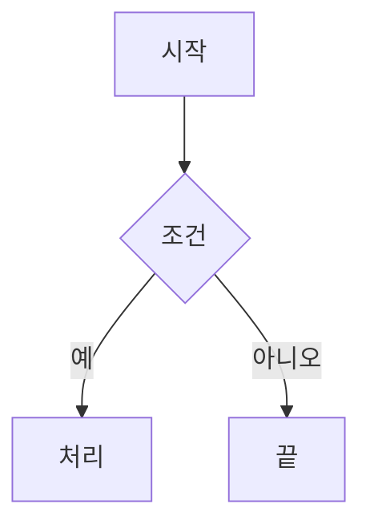

# MarkdownEditorMac

Markdown Editor for Mac

MarkdownEditor는 Markdown 원문을 왼쪽에서 편집하고 결과를 오른쪽에서 실시간으로 확인하는 한국어 macOS·Windows 데스크톱 프로그램입니다. Python과 PySide6로 작성되었으며, 문서와 같은 폴더에 있는 이미지·CSV·JSON·HTML 링크, 복잡한 HTML 표, 문서 내부 앵커와 Mermaid 다이어그램을 처리합니다.

Mac에서는 **macOS**에서 실행합니다. 아래 사용법의 `Ctrl`은 Mac에서 `Command(⌘)`를 사용하며, 바꾸기·줄로 이동·다시 실행 등은 [단축키 표](#주요-단축키)를 참고하세요.

## 주요 기능

- 문서 탭으로 여러 Markdown 문서를 동시에 열기(탭마다 편집기·미리보기 한 쌍)
- 파일 탐색기에서 편집기·미리보기·탭 표시줄·빈 화면으로 파일을 끌어다 놓아 열기
- 줄 번호와 구문 강조가 있는 원문 편집기
- `보기 > 글간격 크게/작게`로 편집기 글자 사이 간격 조절(80~150%, 5%씩)
- `Tab`을 공백 2칸으로 입력하고 줄바꿈 때 들여쓰기·인용·목록·번호를 이어 쓰는 편집 지원
- 보기 메뉴에서 전환하는 라이트·다크 모드와 모드별 가독성 높은 구문 색상
- 편집기와 미리보기에 함께 적용되는 글자 크기 조절(`Ctrl`+마우스 휠, 상태 표시줄 `-`/`+`)
- 원문 줄 번호를 기준으로 편집기와 미리보기를 양방향으로 맞추는 `Sync Scroll`
- 편집기 위치로 미리보기를 즉시 재정렬하는 `Sync Scroll 위치맞춤` 버튼
- 편집기와 미리보기에 포함된 Pretendard 글꼴 적용
- 제목·강조·목록·링크·이미지·표·코드·Mermaid 툴바
- CommonMark/GFM, YAML front matter, 원문 HTML 표 실시간 미리보기
- 문서 폴더 기준 로컬 이미지와 링크 처리
- 인터넷 없이 로컬 Mermaid 렌더링과 라이트·다크 모드별 고대비 다이어그램 색상
- 원본을 보존하는 `_YYYYMMDD` 날짜 저장
- UTF-8, UTF-16, CP949와 BOM·줄바꿈 보존
- 문서 스크립트와 위험 링크 차단

## 요구 환경

- macOS 13 이상(Apple Silicon·Intel), 또는 Windows 11 권장
- [uv](https://docs.astral.sh/uv/) 0.10 이상
- 프로젝트 Python 3.12(uv가 별도 설치하므로 시스템 Python을 바꿀 필요 없음)
- 최초 설치 시 Python과 PySide6 패키지를 받을 인터넷 연결

## 설치 및 실행

### macOS

터미널에서 프로젝트 루트로 이동한 다음 실행합니다. Homebrew로 uv를 설치할 수 있습니다.

```bash
brew install uv
chmod +x run_markdowneditor.command
./run_markdowneditor.command
```

Finder에서 `run_markdowneditor.command`를 두 번 눌러도 실행됩니다. 처음 실행할 때 프로젝트 전용 Python·패키지를 다운로드합니다. 다른 운영체제에서 만든 `.venv`는 재사용하지 않습니다.

```bash
./run_markdowneditor.command "samples/설문지_기업 인공지능 활용 실태조사.md" "samples/차세대무역플랫폼 구축 사업 1단계 제안요청서.md"
```

Python 없이 실행하는 Mac 앱을 만들려면 다음을 실행합니다.

```bash
export UV_CACHE_DIR="$PWD/.uv-cache"
export UV_PYTHON_INSTALL_DIR="$PWD/.uv-python"
uv sync --locked
uv run --locked python scripts/build_macos.py
open dist/MarkdownEditor.app
```

빌드한 `MarkdownEditor.app`은 Finder의 `연결 프로그램`이나 Dock 아이콘으로 전달된 문서를 탭으로 엽니다. 자세한 실행·배포 절차는 [macOS 실행 가이드](docs/macOS_실행_가이드.md)를 참고하세요.

### Windows

PowerShell에서 프로젝트 루트로 이동한 다음 실행합니다.

```powershell
$env:UV_CACHE_DIR = "$PWD\.uv-cache"
$env:UV_PYTHON_INSTALL_DIR = "$PWD\.uv-python"
uv python install 3.12
uv sync --locked
uv run --locked markdowneditor
```

문서를 바로 지정할 수 있습니다. 여러 파일을 주면 각각 탭으로 열립니다.

```powershell
uv run --locked markdowneditor "samples\설문지_기업 인공지능 활용 실태조사.md" "samples\차세대무역플랫폼 구축 사업 1단계 제안요청서.md"
```

비개발자는 `run_markdowneditor.bat`를 두 번 누르거나 Markdown 파일(여러 개도 가능)을 배치 파일 위에 끌어다 놓아 실행할 수 있습니다.

다른 Windows PC에 배포할 때는 `build/MarkdownEditor-Setup-0.1.0-Windows-x64.exe` 또는 휴대용 ZIP을 사용합니다. 대상 PC에는 Python이나 uv가 필요하지 않습니다. 빌드 및 설치 구조는 [Windows 배포 가이드](docs/Windows_배포_가이드.md)를 참고하십시오.

## 기본 사용법

1. `파일 > 열기`(`Ctrl+O`)로 문서를 엽니다. 대화상자에서 여러 파일을 한 번에 고를 수 있고, 파일 탐색기에서 창으로 끌어다 놓아도 됩니다.
2. 왼쪽 편집기에서 원문을 수정합니다.
3. 입력을 멈추면 오른쪽 미리보기가 자동으로 갱신됩니다.
4. `Ctrl+S`를 누르면 원본과 같은 폴더에 날짜가 붙은 새 파일을 저장합니다. 저장은 현재 보고 있는 탭에만 적용됩니다.

`보기 > 다크 모드`로 전체 화면 테마를 바꿀 수 있습니다. 라이트 모드의 편집기는 흰색, 다크 모드의 편집기는 검은색이며 편집기 스크롤바는 두 모드에서 같은 밝은 색을 사용합니다. 오른쪽 위 `Sync Scroll`을 체크하면 어느 쪽을 스크롤해도 다른 쪽이 같은 원문 줄을 기준으로 이동합니다. 위치가 어긋났거나 즉시 다시 맞추려면 체크 상태와 관계없이 `Sync Scroll 위치맞춤`을 누릅니다.

편집기에서 `Tab`을 누르면 탭 문자가 아닌 공백 2칸이 입력됩니다. `편집 > 들여쓰기`가 체크되어 있으면 `Enter`를 누를 때 현재 줄의 앞쪽 공백을 유지합니다. 인용(`>`), 글머리 목록(`-`, `+`, `*`), 번호 목록(`1.`, `1)`) 표식은 들여쓰기 설정과 관계없이 다음 줄에도 이어지고 번호는 1씩 증가합니다.

예를 들어 `보고서.md`를 2026년 9월 19일에 저장하면 `보고서_20260919.md`가 만들어집니다. 원본은 덮어쓰지 않습니다. 같은 이름이 이미 있으면 덮어쓰기, 번호 붙여 저장, 취소 중 하나를 선택합니다. 저장할 파일이 다른 탭에 열려 있으면 덮어쓰기는 제공하지 않고 번호 붙여 저장과 취소만 고를 수 있습니다.

## 문서 탭

- 파일을 새로 열 때마다 탭이 하나씩 추가되고, 기존 탭은 그대로 남습니다. 열려 있는 문서의 저장 여부를 묻지 않습니다.
- 이미 열려 있는 파일을 다시 열면 새 탭을 만들지 않고 그 탭으로 이동합니다. 실제 파일이 같은지 확인하므로 Mac의 대소문자 구별 볼륨에 있는 서로 다른 파일도 올바르게 처리합니다.
- 탭 제목은 파일 이름이며, 수정한 탭에는 ` *`가 붙습니다. 탭에 마우스를 올리면 전체 경로가 보이고, 이름이 같은 파일이 여러 개면 폴더 이름을 함께 표시합니다. 현재 탭은 위쪽 파란 막대와 굵은 글씨로 구분합니다.
- 탭을 끌어서 순서를 바꿀 수 있습니다. `Ctrl+Tab`/`Ctrl+Shift+Tab`으로 다음·이전 탭으로 이동합니다.
- 탭의 `×`, `Ctrl+W`, 또는 탭을 마우스 가운데 단추로 눌러 탭을 닫습니다. 수정한 탭이면 파일 이름과 함께 [저장] [저장 안 함] [취소]를 묻고, 취소하거나 저장에 실패하면 닫지 않습니다. 마지막 탭을 닫으면 최근 파일 목록이 있는 시작 화면으로 돌아갑니다.
- 탭을 마우스 오른쪽 단추로 누르면 `탭 닫기`, `다른 탭 닫기`, `모든 탭 닫기`, `파일 위치 열기`, `전체 경로 복사`를 쓸 수 있습니다. `다른 탭 닫기`와 `모든 탭 닫기`는 `파일` 메뉴에도 있으며, 수정한 탭에서 [취소]를 누르면 그 자리에서 멈춥니다.
- 프로그램을 닫을 때 수정한 탭마다 저장 여부를 묻고, 도중에 취소하면 모든 탭이 그대로 남습니다.
- 다크 모드, 글자 크기, 글간격, 들여쓰기, 자동 줄바꿈, 보기 모드(`편집+미리보기`·`편집만`·`미리보기만`), 외부 이미지 표시, `Sync Scroll` 설정은 모든 탭에 함께 적용되고, 외부 이미지 표시를 뺀 나머지는 다음 실행 때도 유지됩니다. 커서·선택·실행 취소 기록·스크롤 위치는 탭마다 따로 유지됩니다.

## 글간격

`보기 > 글간격 크게` / `보기 > 글간격 작게`는 왼쪽 편집기의 글자 사이 간격을 5%씩 바꿉니다. 기본값은 100%이고 80~150% 사이에서 조절되며, 끝에 닿으면 해당 메뉴가 비활성화됩니다. 현재 값은 상태 표시줄 오른쪽 `간격 100%`에 표시되고 다음 실행 때 복원됩니다. `보기 > 글간격 기본값`은 100%로 되돌립니다. 오른쪽 미리보기와 줄 번호의 간격은 바뀌지 않습니다.

## 끌어다 놓기로 열기

- 파일 탐색기의 Markdown 파일(`.md`, `.markdown`, `.mdown`, `.mkd`, `.mkdn`)을 편집기, 미리보기, 탭 표시줄, 시작 화면 어디에 놓아도 새 탭으로 열립니다. 여러 파일을 한 번에 놓으면 순서대로 열립니다.
- 원본 파일은 읽기만 하며 이동하거나 바꾸지 않습니다. 편집기 본문에 파일 경로가 입력되지도 않습니다.
- 폴더, 그림 같은 다른 파일, 인터넷 주소는 열지 않고 상태 표시줄에 이유를 보여 줍니다. 편집기 안에서 글자를 끌어 옮기거나 다른 프로그램의 글을 끌어다 놓는 동작은 전과 같습니다.

## 연결된 파일

상대 경로는 Markdown 파일이 있는 폴더를 기준으로 계산합니다. 문서와 `_assets`, `_validation` 폴더를 함께 이동해야 이미지와 검증 보고서 링크가 유지됩니다. 없는 이미지와 파일은 문제 목록에 표시됩니다.

외부 HTTP 이미지는 개인정보 보호를 위해 기본적으로 차단됩니다. `보기 > 외부 이미지 표시`에서 사용자가 직접 허용할 수 있습니다. 일반 웹 링크도 자동으로 열리지 않으며 클릭한 경우에만 기본 브라우저로 전달됩니다.

## Mermaid

다음과 같은 fenced code block을 입력합니다.

````markdown

````

Mermaid JavaScript는 프로그램에 포함되어 실행 중 인터넷 연결이 필요하지 않습니다. 라이트 모드에는 Mermaid 기본 팔레트, 다크 모드에는 어두운 배경용 팔레트를 적용합니다. 다크 모드의 flowchart 연결선·화살표·레이블과 sequenceDiagram 메시지 선·글자는 배경과 최소 4.5:1 이상 대비가 나도록 검증합니다. 문법이 잘못된 다이어그램은 해당 위치에 오류 상자로 표시됩니다.

## 주요 단축키

| 기능 | macOS | Windows |
|---|---|---|
| 열기 | `⌘O` | `Ctrl+O` |
| 탭 닫기 | `⌘W` | `Ctrl+W`, `Ctrl+F4` |
| 다음 탭 / 이전 탭 | `Control+Tab` / `Control+Shift+Tab` | `Ctrl+Tab` / `Ctrl+Shift+Tab` |
| 날짜 붙여 저장 | `⌘S` | `Ctrl+S` |
| 다른 이름으로 저장 | `⇧⌘S` | `Ctrl+Shift+S` |
| 찾기 / 바꾸기 | `⌘F` / `⇧⌘H` | `Ctrl+F` / `Ctrl+H` |
| 다음 찾기 | `⌘G` | `F3` |
| 굵게 / 기울임 | `⌘B` / `⌘I` | `Ctrl+B` / `Ctrl+I` |
| 링크 | `⌘K` | `Ctrl+K` |
| 실행 취소 / 다시 실행 | `⌘Z` / `⇧⌘Z` | `Ctrl+Z` / `Ctrl+Y` |
| 공백 2칸 들여쓰기 | `Tab` | `Tab` |
| 줄로 이동 | `⌘L` | `Ctrl+G` |
| 미리보기 새로 고침 | `F5`(키보드에 따라 `fn+F5`) | `F5` |
| 글자 크게 / 작게 | `⌘+` / `⌘-` 또는 Command+마우스 휠 | `Ctrl`+`+` / `Ctrl`+`-` 또는 Ctrl+마우스 휠 |
| 종료 | `⌘Q` | `Alt+F4` |

Mac의 탭 이동에는 Command가 아닌 Control 키를 사용합니다. 탭은 두 운영체제 모두 마우스 가운데 단추로도 닫을 수 있습니다.

## 진단 CLI

```powershell
uv run --locked markdowneditor-cli check "문서.md"
uv run --locked markdowneditor-cli check "문서.md" --json
uv run --locked markdowneditor-cli render "문서.md" --out "preview.html"
```

## 개발 검증

```powershell
uv run --locked pytest -m "not gui"
uv run --locked pytest -m gui
uv run --locked ruff check .
uv run --locked ruff format --check .
uv run --locked python scripts/verify_samples.py
uv build
```

검증 보고서는 `reports/`, 화면 캡처는 `reports/screenshots/`에 생성됩니다. GUI 검사는 실제 macOS 또는 Windows 로그인 세션에서 실행해야 합니다. 위 `uv` 명령은 Mac 터미널에서도 동일하게 사용할 수 있습니다.

사람이 확인해야 하는 두 항목은 이미 만든 보고서에 결과를 기록합니다. 기록할 때 해당 캡처·증거 파일의 SHA-256이 보고서에 함께 저장됩니다.

```powershell
# 보고서의 캡처(S14)를 직접 열어 본 뒤
uv run --locked python scripts/verify_samples.py --confirm-visual reports\verification_YYYYMMDD_HHMMSS.json --visual-note "확인한 내용"
# 파일 탐색기에서 실제로 끌어다 놓아 본 뒤(S29)
uv run --locked python scripts/verify_samples.py --confirm-explorer-drop reports\verification_YYYYMMDD_HHMMSS.json --explorer-drop-note "확인한 내용" --explorer-drop-evidence 캡처.png
```

최신 검증 결과와 보고서 경로는 `docs/PROGRESS.md`에 기록합니다. 샘플 검증기는 앱 기능 실패(`FAIL`)와 사용자가 교체한 샘플 기준선(`BASELINE_CHANGED`)을 분리해 보고하며, 프로젝트의 원본 샘플은 수정하지 않습니다.

## 문제 해결

### 오른쪽 미리보기가 검게 보임

GPU 드라이버나 원격 데스크톱 환경에서 발생할 수 있습니다.

```powershell
uv run --locked markdowneditor --disable-gpu
```

### 이미지가 보이지 않음

- Markdown 파일과 연결된 `_assets` 폴더를 함께 복사했는지 확인합니다.
- 경로의 대소문자, 공백, 한글 파일명을 확인합니다.
- 상태 표시줄의 연결 문제 수 또는 문제 패널을 확인합니다.

### 끌어다 놓아도 열리지 않음

- 프로그램을 **관리자 권한으로 실행하지 마십시오.** Windows 보안 정책 때문에 일반 권한의 파일 탐색기에서 관리자 권한 프로그램으로는 끌어다 놓을 수 없습니다.
- Markdown 확장자인지 확인합니다. 다른 파일을 놓으면 상태 표시줄에 열 수 없는 이유가 표시됩니다.
- 메일 첨부처럼 디스크에 없는 항목은 먼저 폴더에 저장한 뒤 끌어다 놓습니다.

### 한글이 깨짐

UTF-8·UTF-16·CP949만 자동 판별합니다. 다른 인코딩은 UTF-8로 변환한 뒤 여십시오. CP949 문서에 이모지처럼 표현할 수 없는 글자를 입력하면 UTF-8 저장 여부를 묻습니다.

### 배치 파일 실행 시 명령 일부가 따로 실행됨

`'sync'은(는) ...`처럼 짧은 문자열이 명령으로 인식되면 오래된 `run_markdowneditor.bat`가 LF 줄바꿈으로 저장된 사본일 수 있습니다. 프로젝트의 최신 배치 파일을 사용하십시오. 최신 파일은 Windows용 CRLF와 UTF-8(무 BOM)을 사용하며 자동 테스트로 형식을 확인합니다.

### 큰 문서가 느림

미리보기는 입력을 멈춘 뒤 약 300ms 후 갱신됩니다. GPU 문제가 있으면 `--disable-gpu`도 시험하십시오.

## 알려진 제한

- WYSIWYG, 공동 편집, HWP/DOCX 가져오기는 지원하지 않습니다.
- 프로그램을 다시 실행할 때 이전 탭을 복원하지 않습니다. Windows 바로 가기나 터미널에서 새로 실행하면 별도 창이 열립니다. macOS 앱 번들은 Finder/Dock의 파일 열기 요청을 실행 중인 창의 탭으로 전달합니다.
- 탭마다 미리보기(QtWebEngine)가 따로 있어 탭이 많을수록 메모리를 더 씁니다. 탭 수 제한은 두지 않았습니다.
- 혼합 줄바꿈 문서를 편집하면 대표 줄바꿈 형식으로 통일될 수 있습니다.
- 외부 URL이 실제로 유효한지는 자동 검사하지 않습니다.

자세한 절차는 [사용설명서](docs/사용설명서.md), 내부 구조는 [아키텍처 문서](docs/ARCHITECTURE.md)를 참고하십시오.

## 라이선스

이 프로젝트는 [Apache License 2.0](LICENSE)으로 배포합니다. 포함된 외부 구성요소의 라이선스는 [THIRD_PARTY_NOTICES.md](THIRD_PARTY_NOTICES.md)를 참고하십시오.
