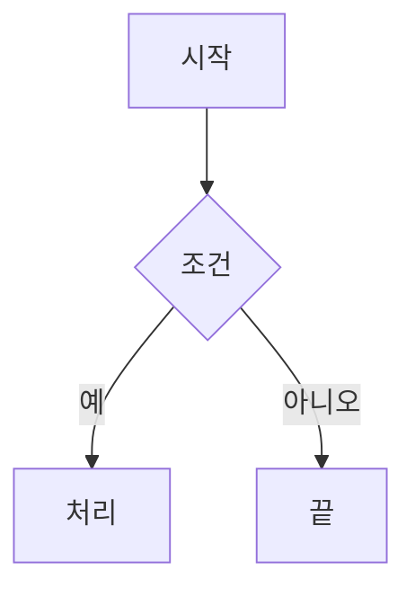

# MarkdownEditor(마크다운 뷰어·편집기) GUI 프로그램 개발 프롬프트 (Claude 보완판 v0.2)

> **문서 정보**
> - 작성: 2026-09-19 · 버전: v0.2 · 기준 PRD: `MarkdownEditor_PRD 초안_v0.1_20260919.md`
> - 프로젝트 루트: `F:\38.AICowork\202609_MarkdownEditor`
> - 사용법: 코딩 에이전트를 프로젝트 루트에서 실행하고 "이 프롬프트 파일을 읽고 §17의 M0부터 진행하라"고 지시한다. 여러 세션에 걸쳐 개발하므로 §2.4의 진행 기록 파일로 이어서 작업한다.
> - 우선순위 표기: **[필수]** 없으면 완료로 인정하지 않음 · **[권장]** 기본 구현 대상, 생략하면 이유 기록 · **[선택]** 필수·권장을 끝낸 뒤 여유가 있을 때. **표기가 없는 요구사항은 [필수]다.**
> - 사실 표기: **(실측)**은 2026-09-19 이 PC에서 명령으로 확인한 내용, **(확인 필요)**는 개발 시점에 설치된 버전으로 다시 확인할 내용이다.

## 0. 한눈에 보기

- **만들 것**: 마크다운 파일 1개를 열어 왼쪽 편집기(위쪽에 마크다운 툴바)에서 고치고, 오른쪽 미리보기에서 연결된 이미지·표·링크·mermaid 다이어그램까지 실시간으로 보여 주며, 저장할 때 원본을 건드리지 않고 **파일명에 날짜를 붙인 새 파일**로 저장하는 Windows용 PySide6 GUI 프로그램 `MarkdownEditor`(Python 패키지 `mdeditor`).
- **처리 흐름**: 마크다운 파일 입력 검증 → 원문을 편집기에 표시하고 미리보기 렌더링(연결 요소를 문서 폴더 기준으로 해석) → 편집(툴바·단축키, 실시간 반영) → 날짜 붙여 저장(원본 보존, 고치지 않은 부분의 바이트 보존).
- **핵심 난제**: ① 공백(`%20`)·한글 파일명이 섞인 상대 경로로 연결된 이미지·파일, ② 병합 셀·중첩 표가 있는 HTML 표 224개짜리 460KB 문서의 실시간 미리보기, ③ 인터넷 없이 그리는 mermaid, ④ 수정하지 않은 부분의 바이트 보존.
- **미리보기 엔진**: QtWebEngine(Chromium). mermaid는 JavaScript로만 그려지므로 `QTextBrowser`로는 요구사항을 충족할 수 없다.
- **검증은 정직하게**: 실행하지 못한 검사는 `NOT_CHECKED`. 가상 결과나 과장된 통과 표시를 하지 않는다. 직접 열어 보지 않은 스크린샷을 근거로 `PASS`를 주지 않는다.
- **환경**: uv로 Python·패키지를 재현한다(`.python-version`, `pyproject.toml`, `uv.lock`). mermaid 같은 웹 자산은 저장소에 동봉해 실행 중 인터넷이 필요 없게 한다.
- **시작점**: §17의 M0(착수·환경 확인). 각 마일스톤은 실제 실행 증거로 완료를 판단한다.

## 1. 배경, 목표, 범위

### 1.1 배경

AI와 작업하려고 마크다운 문서를 보고 고칠 일이 많지만, 웹이나 기존 마크다운 편집기는 불편하다. 특히 문서에 연결된 이미지나 파일이 있으면 웹 페이지에서는 제대로 보이지 않는다.

대표 사례는 사용자가 만든 `HWPtoMarkdown`(`F:\38.AICowork\202609_HWPtoMD`)의 변환 결과다. 본문 `.md` 옆에 `<문서명>_assets/`(이미지, 표 CSV/JSON)와 `<문서명>_validation/`(검증 보고서)을 두고, 공백을 `%20`으로 인코딩한 상대 경로로 연결한다. 병합 셀이 있는 원문 HTML 표, `<a id="sec-001"></a>` 앵커, `<!-- hwp2md:... -->` HTML 주석 표식, YAML front matter를 많이 쓴다(형식 명세: 위 프로젝트의 `Prompt_HwptoMarkdown_dev_Cluade 보완_20260918.md` §6.5–6.6). 검증 샘플 두 개가 모두 이 형식이다(부록 A).

### 1.2 목표

1. 연결된 이미지·파일·문서 내부 앵커가 있는 마크다운을 원본 폴더 기준으로 정확히 보여 주는 뷰어.
2. 마크다운 문법을 잘 몰라도 툴바로 쉽게 고칠 수 있는 편집기와 실시간 미리보기.
3. 인터넷 없이 mermaid flowchart를 그리는 미리보기.
4. 원본을 보존하는 날짜 붙여 저장과 고치지 않은 부분의 바이트 보존.
5. 비개발자도 쓸 수 있는 한국어 GUI.
6. 다른 PC에서 재현할 수 있는 uv 기반 설치·실행.

### 1.3 범위 밖

- 여러 파일 동시 편집(탭), 폴더 트리 탐색기, 새 문서 만들기(빈 문서에서 시작).
- WYSIWYG(미리보기에서 직접 편집), 공동 편집, 클라우드 동기화, git 연동.
- 맞춤법 검사, AI 기능(요약·작성 보조), 외부 API 호출.
- HWP·DOCX 가져오기와 내보내기. (**[선택]** HTML·PDF 내보내기는 §7.2)
- macOS·Linux 지원 보장. 코드는 이식할 수 있게 쓰되 검증 대상은 Windows 11이다.
- 문서 속 스크립트 실행, 외부 URL의 접속 가능 여부 자동 점검.

### 1.4 사용자 요구사항 원문 (PRD v0.1)

> - 처리 흐름: 마크다운 파일 입력 검증 → 마크다운 파일 내용 화면 출력 → 마크다운 내용 수정 → 마크다운 파일 저장.
> - 검증은 정직하게: 실행하지 못한 검사는 `NOT_CHECKED`. 가상 결과나 과장된 통과 표시를 하지 않는다.
> - 환경: uv로 Python·패키지를 재현한다(`.python-version`, `pyproject.toml`, `uv.lock`).
> - 입력 항목: 조회나 수정을 위한 마크다운 파일 1개.
> - Windows Python 기반 GUI 프로그램.
> - 화면은 크게 2개. 왼쪽은 마크다운 원문을 보여 주는 에디터이고, 위쪽에 에디팅을 도와주는 마크다운 툴바가 필요하다. 오른쪽은 왼쪽 마크다운을 실시간으로 보여 주는 Viewer이며, 연결된 이미지나 요소들이 잘 보여야 하고 mermaid flowchart도 잘 보여야 한다.
> - 메뉴에서 마크다운 파일 저장 기능. 저장 시 기존 파일명에 날짜를 붙여서 저장한다.
> - 작성 후 샘플 마크다운 파일로 프로그램의 동작을 검증한다.

### 1.5 PRD 해석과 확정 사항

PRD에서 모호하거나 사실과 다른 부분을 아래처럼 정했다. 바꿔야 하면 `docs/DECISIONS.md`에 기록한다.

| 항목 | PRD 원문 | 이 프롬프트의 결정 | 근거 |
|---|---|---|---|
| 프로그램 이름 | §0 `MarkdownEditor`, §1.2 `MarkdownEditor` | 표시 이름 `MarkdownEditor`, 패키지 `mdeditor`, 실행 명령 `markdowneditor`. 이름은 상수 한 곳에만 둔다 | §1.2가 명명 규칙을 직접 지정 |
| 두 번째 샘플 경로 | `F:\38.AICowork\202609_MarkdownEditor\차세대무역플랫폼 구축 사업 1단계 제안요청서.md` | `F:\38.AICowork\202609_MarkdownEditor\Samples\차세대무역플랫폼 구축 사업 1단계 제안요청서.md` | 루트에는 없고 `Samples\`에 있다(실측) |
| 날짜 형식 | "기존 파일명에 날짜를 붙여서" | `_YYYYMMDD`(예: `_20260919`), 저장 시점의 로컬 날짜 | 사용자의 기존 파일명 관례(`…_20260919.md`) |
| 저장 위치·원본 | 명시 없음 | 원본과 같은 폴더에 새 파일로 쓰고, 원본은 덮어쓰지 않는다. 같은 폴더라 상대 링크가 유지된다 | "붙여서 저장"을 원본 보존으로 해석 |
| 이미 날짜가 붙은 파일명 | 명시 없음 | 끝의 `_YYYYMMDD`(와 순번 `_N`)를 오늘 날짜로 바꾸고 날짜를 누적하지 않는다 | §11.1 예시 표 |
| mermaid 검증 | "mermaid flowchart도 잘 보여야 함" | 두 샘플에 mermaid 블록이 없으므로 테스트용 fixture를 만들어 검증한다 | 부록 A(실측) |
| 실시간 | "실시간으로 보여주는" | 입력이 멈추고 짧은 지연(기본 300ms) 뒤 갱신, 목표 수치는 §12.1 | 460KB 문서를 키 입력마다 전부 다시 그리면 비효율 |
| 연결 요소 | "이미지나 요소들" | 이미지, 로컬 파일 링크(CSV·JSON·HTML·다른 md), 문서 내부 앵커, 외부 URL, front matter의 경로 값 | 샘플 실측 |
| 입력 개수 | "1개의 마크다운 파일" | 한 번에 한 파일만 연다. 다른 파일을 열면 현재 문서를 교체한다 | PRD |

### 1.6 요구사항 추적표

최종 보고 때 각 행의 구현 상태(완료·부분·미구현)와 증거를 채워 제출한다.

| ID | 요구사항 | 주요 절 | 마일스톤 |
|---|---|---|---|
| R1 | 마크다운 파일 1개 입력과 검증 | §6 | M1 |
| R2 | Windows Python GUI(한국어) | §7, §12 | M1–M4 |
| R3 | 왼쪽: 원문 편집기 | §8.1 | M2 |
| R4 | 왼쪽 위: 마크다운 툴바 | §8.2 | M4 |
| R5 | 오른쪽: 실시간 미리보기 | §9.1, §9.6 | M2, M4 |
| R6 | 연결된 이미지·요소 표시 | §9.3, §9.7, §10 | M3 |
| R7 | mermaid flowchart 표시 | §9.5 | M3 |
| R8 | 메뉴 저장, 날짜 붙인 파일명 | §11 | M2 |
| R9 | 샘플 2개로 동작 검증 | §14.4 | M5 |
| R10 | 정직한 검증(`NOT_CHECKED`) | §2.5, §14.5 | 전 단계 |
| R11 | uv 재현(`.python-version`, `pyproject.toml`, `uv.lock`) | §5 | M0, M6 |
| R12 | 한국어 사용자 문서 | §16 | M6 |

## 2. 역할과 작업 방식

### 2.1 역할

너는 AI, Python, 문서 포맷, Windows 자동화, 데스크톱 GUI에 능숙한 시니어 개발자다. 설명이나 설계 제안에서 멈추지 말고, 이 프롬프트를 충족하는 실행 가능한 프로그램, 의미 있는 테스트, 한국어 사용자 문서까지 구현한다. 프로그램 이름은 `MarkdownEditor`, Python 패키지는 `mdeditor`로 한다. Qt(PySide6)·QtWebEngine, CommonMark/GFM, 웹 프런트엔드(JS·CSS) 지식을 함께 쓴다.

### 2.2 자율 진행과 사용자 확인

- 불명확한 사항은 합리적인 기본값으로 진행하고 `docs/DECISIONS.md`에 기록한다.
- 다음은 **사용자 확인을 받은 뒤에만** 수행한다. 확인을 기다리는 동안에도 막히지 않은 작업은 계속한다.
  1. 시스템 설정 변경: `.md` 파일 연결(기본 프로그램), 레지스트리, 바탕 화면·시작 메뉴 바로 가기, PATH. 스크립트는 만들되 실행은 확인 후.
  2. uv가 관리하지 않는 소프트웨어 설치(글꼴 포함).
  3. `Samples\` 원본과 사용자 파일의 수정·삭제·이동. 테스트는 사본만 쓴다.
  4. git 저장소 초기화(M0에서 묻는다).
  5. 실행 파일 배포처럼 라이선스 판단이 필요한 재배포.
- 이 프롬프트로 미리 허용하는 것: 개발 중 uv로 PyPI 패키지 설치, npm 공식 레지스트리나 jsDelivr(npm 미러)에서 mermaid 배포 파일 받기(버전·URL·SHA-256 기록), 테스트용 임시 폴더 생성.

### 2.3 코드 규칙

- 식별자·모듈명은 영어, 사용자에게 보이는 문자열·보고서·문서는 한국어로 쓴다. UI 문자열은 한 모듈(예: `mdeditor/ui_text.py`)에 모은다.
- 타입 힌트를 쓰고 `ruff` 린트·포맷을 통과시킨다.
- Qt에 의존하지 않는 순수 로직(입력 검증, 인코딩·줄바꿈, 저장 파일명, 렌더링, 연결 요소 해석, 툴바 텍스트 변환)은 `core/`에 두고 단위 테스트한다. GUI는 이 로직을 호출만 한다.
- 날짜·시각, 외부 프로그램 열기, 파일 대화상자는 주입할 수 있게 만들어 테스트에서 고정·모의한다.
- 웹 자산(HTML·CSS·JS)은 패키지 안 `assets/`에 파일로 두고, 경로는 `importlib.resources`로 찾는다(작업 디렉터리 기준 금지).

### 2.4 진행 기록

- `CLAUDE.md`: 프로젝트 개요, 설치·실행·테스트·린트 명령, 디렉터리 구조, 코딩 규칙, 이 프롬프트 파일 경로. 다음 세션이 가장 먼저 읽는 파일이다.
- `docs/PROGRESS.md`: 마일스톤별 상태, 완료 증거(실행 명령·결과 요약), 다음 작업, 막힌 부분.
- `docs/DECISIONS.md`: 결정, 대안, 근거, 날짜.
- `docs/environment_report.md`: M0 환경 확인 결과. 확인한 사실·추정·미확인을 구분한다.
- **[권장]** git: 현재 루트는 git 저장소가 아니다. M0에서 초기화 여부를 묻고, 초기화하면 마일스톤마다 커밋한다. `.venv/`, 캐시, `reports/`의 스크린샷 등 생성물, 테스트 임시 파일은 커밋하지 않는다. `Samples/`의 커밋 여부도 묻는다(문서 내용이 민감할 수 있다).
- PRD 파일, 프롬프트 기록 파일(`Prompt_MarkdownEditor_20260919.md`), 이 프롬프트 파일과 이후 버전(예: `Prompt_MarkdownEditor Dev_GPT_v0.3_20260919.md`)은 수정·이동하지 않는다. 사양을 바꿔야 하면 DECISIONS.md에 기록한다.

### 2.5 정직성 규칙

- 실행하지 않은 테스트·검사를 통과로 보고하지 않는다. 건너뛴(skip) 테스트는 따로 센다.
- 화면 확인은 에이전트가 스크린샷 이미지를 실제로 열어 본 경우에만 근거로 쓰고, 본 내용을 한두 문장으로 기록한다.
- 라이브러리 동작·버전·라이선스를 확인하지 못했으면 모른다고 쓴다. §15의 기술 메모도 설치된 버전에서 다시 확인한다.
- 성능 목표를 못 맞추면 측정값과 함께 `WARN` 또는 `FAIL`로 보고한다. 측정하지 않은 수치를 쓰지 않는다.
- 코드에 남긴 `TODO`는 PROGRESS.md의 미완료 목록과 일치시킨다.

## 3. 핵심 원칙

1. **원문 보존**: 사용자가 고친 부분 외에는 한 바이트도 바꾸지 않는다(인코딩, BOM, 줄바꿈, 탭, NBSP, 끝 줄바꿈). 열어서 고치지 않고 저장한 파일은 원본과 바이트 단위로 같아야 한다.
2. **원본 불변**: 저장은 날짜를 붙인 새 파일로 한다. 원본 파일은 사용자가 명시적으로 고르고 확인한 경우(§11.1–11.2)에만 덮어쓴다.
3. **문서 폴더 기준 해석**: 상대 경로는 열린 `.md`가 있는 폴더를 기준으로 해석한다. 작업 디렉터리나 앱 설치 폴더를 기준으로 삼지 않는다.
4. **숨기지 않는 표시**: 미리보기가 보여 주지 못하는 요소(없는 이미지, 끊긴 링크, 잘못된 mermaid)는 빈칸으로 두지 않고 눈에 띄게 표시하며 목록으로 알린다.
5. **로컬·오프라인 우선**: 실행 중 앱이 스스로 인터넷에 접속하지 않는다. 문서가 참조한 외부 이미지 표시만 예외이며 설정으로 끌 수 있다.
6. **문서는 데이터**: 문서 속 스크립트·이벤트 핸들러를 실행하지 않고, 문서 속 링크를 자동으로 열지 않는다(사용자가 누를 때만).
7. **UI 멈춤 없음**: 큰 문서에서도 입력이 끊기지 않게 렌더링을 입력 처리와 분리한다.
8. **검증 정직성**: 실제로 확인한 것만 `PASS`다.

## 4. 금지 사항

- `Samples\` 원본이나 사용자 파일을 수정·삭제하거나 그 폴더에 임시 파일 만들기.
- `setPlainText()`로 문서 전체를 바꿔 실행 취소 기록과 스크롤 위치를 없애는 방식의 툴바·찾아 바꾸기 구현.
- `toPlainText()`로 저장할 내용 얻기(NBSP 손실, §15-1).
- 실행 중 CDN에서 스크립트 불러오기, `mermaid.min.js`를 `setHtml()` 문자열에 인라인하기(2MB 한도 초과, §15-4).
- 문서 속 `<script>`, `on*` 이벤트 속성, `javascript:` URL 실행 허용.
- 링크 클릭이나 파일 끌어다 놓기로 미리보기 페이지 자체가 다른 페이지로 이동하게 두기.
- 테스트 중 실제 외부 프로그램(엑셀, 브라우저 등) 열기. 모의 객체를 쓴다.
- 실행하지 않은 검사를 `PASS`로 표시하기, 스크린샷을 보지 않고 "정상 표시"로 기록하기, 성능 수치를 추정해 적기.
- `.venv` 복사로 이식하기, 전역 Python에 패키지 설치하기, conda Python으로 실행하기.
- 라이선스를 확인하지 않은 글꼴·아이콘·바이너리 동봉, GPL 계열 Qt 바인딩(PyQt) 사용. PySide6(LGPL-3.0)를 쓴다.

## 5. 개발 환경과 uv 재현성

### 5.1 프로젝트 루트

- 루트는 `F:\38.AICowork\202609_MarkdownEditor`다. `pyproject.toml`, `uv.lock`, `.python-version`, `src/`, `tests/`, `docs/`를 이 폴더에 바로 둔다(하위 프로젝트 폴더를 만들지 않는다).
- 현재 루트에는 PRD, 프롬프트 기록 파일, 이 프롬프트, `Samples\`만 있다(이후 보완 프롬프트가 추가될 수 있다). 모두 그대로 둔다.
- 루트 경로에 `.`이 있고 샘플 경로에 한글·공백이 있다. 경로 처리 테스트의 실제 사례로 쓴다.

### 5.2 개발 PC 사전 실사 (2026-09-19, 읽기 전용 점검)

M0에서 다시 확인하고 `docs/environment_report.md`에 갱신한다.

| 항목 | 결과 | 영향 |
|---|---|---|
| OS | Windows 11 Pro 10.0.26200, 한국어, 2560×1440, 150% 배율(144 DPI) | 고배율 표시를 확인한다 |
| uv | 0.11.2, 캐시 `F:\.uv-cache`(환경변수 `UV_CACHE_DIR`) | 프로젝트와 같은 드라이브라 hardlink 가능 |
| Python | uv 관리 3.12.13·3.12.12·3.13.12·3.14.3, PATH의 `python`은 3.14.3 | `.python-version`으로 3.12 고정 |
| PySide6(uv 캐시) | `pyside6`·`pyside6-addons`·`pyside6-essentials` 6.11.1, `pyside6-essentials`·`shiboken6` 6.11.2 | 첫 `uv sync`가 캐시를 재사용할 수 있다. QtWebEngine은 Addons에 있다 |
| Qt 한국어 번역 | 6.11.1 wheel에 `qtbase_ko.qm`, `qtwebengine_ko.qm` 있음 | 표준 대화상자·편집 메뉴를 한국어로 표시할 수 있다 |
| markdown-it-py | 4.2.0, mdit-py-plugins 0.6.1(형제 프로젝트 `202609_HWPtoMD`의 잠금 버전과 같음) | 렌더 속도 실측은 부록 A |
| Node.js·npm | v22.17.0 | 개발 시점에 mermaid 배포 파일을 받을 수 있다 |
| mermaid(npm) | `latest` 12.0.0(2026-09-10 공개), 11.x 최신 11.17.2(2026-08-25). 둘 다 `dist/mermaid.min.js` 제공(5.6MB / 3.6MB) | 버전 선택은 §9.5 |
| 글꼴 | 맑은 고딕, Consolas, 나눔고딕·나눔스퀘어, Pretendard 있음. D2Coding 없음 | 기본값은 Windows 기본 글꼴(맑은 고딕, Consolas) |
| Edge WebView2 | 153 설치 | 사용하지 않는다(대안 기록용) |
| Git | 2.51.1, 루트는 저장소 아님 | §2.4 |
| 긴 경로 | `LongPathsEnabled=1` | 다른 PC는 다를 수 있다 |

### 5.3 uv 프로젝트 구성

- Python은 **3.12**를 기본으로 한다. `uv python pin 3.12`로 `.python-version`을 만든다. 3.13 이상으로 바꾸려면 PySide6 wheel 제공과 앱 동작을 확인하고 DECISIONS.md에 기록한다.
- `requires-python = ">=3.12,<3.13"`처럼 실제로 검증한 범위의 상한을 둔다. uv는 `requires-python` 범위 전체를 대상으로 잠금 파일을 풀기 때문에, 상한이 없으면 Python 상한이 있는 패키지와 충돌하거나 오래된 버전이 선택될 수 있다.
- `src/mdeditor/` 패키지 구조와 명시적 `build-system`(예: hatchling)을 쓰고 진입점을 선언한다.
  - `[project.gui-scripts]`의 `markdowneditor`: Windows에서 콘솔 창 없이 GUI 실행. `python -m mdeditor`도 동작하게 한다.
  - **[권장]** `[project.scripts]`의 `markdowneditor-cli`: 진단·검증용 CLI. `check <파일>`(입력 검증과 연결 요소 점검 결과를 한국어 요약 또는 `--json`으로), `render <파일> --out <html>`(미리보기 HTML 내보내기, 디버그용), `--version`.
- `uv.lock`은 실제 `uv lock`으로 만들고 루트에 포함한다. 설치해 보지 않은 버전을 추측해 고정하지 않는다.
- 가상환경은 프로젝트 안 `.venv`다. 이식할 때 복사하지 않고 대상 PC에서 `uv sync`로 다시 만든다.
- 재현·배포 명령에는 `--locked`를 쓴다.
- uv 캐시와 프로젝트가 다른 드라이브에 있으면 hardlink 실패 경고가 난다. 이때는 `UV_LINK_MODE=copy` 또는 `[tool.uv] link-mode = "copy"`를 쓴다. 현재 PC는 둘 다 F: 드라이브다.

### 5.4 의존성 구성

```toml
# 예시 골격이다. 패키지 선택과 버전은 실제 설치 결과로 확정한다.
[project]
name = "markdowneditor"
requires-python = ">=3.12,<3.13"
dependencies = [
  "PySide6",          # Essentials + Addons 메타 패키지. QtWebEngine·QtWebChannel은 Addons에 있다
  "markdown-it-py",   # CommonMark 파서. 토큰의 원문 줄 범위(map)로 스크롤 동기화
  "mdit-py-plugins",  # front matter, 각주, 작업 목록, 제목 앵커
  "linkify-it-py",    # URL 자동 링크(linkify를 켤 때)
  "Pygments",         # 코드 블록 구문 강조
  "PyYAML",           # front matter 표 표시(safe_load만 사용)
  "platformdirs",     # 설정·최근 파일·로그 위치
]

[project.gui-scripts]
markdowneditor = "mdeditor.app:main"

[project.scripts]
markdowneditor-cli = "mdeditor.cli:main"

[dependency-groups]
dev = ["pytest", "pytest-qt", "ruff"]
```

- 의존성 라이선스를 확인해 `THIRD_PARTY_NOTICES.md`(§16)에 반영한다.
- 웹 자산(mermaid 등)은 Python 의존성이 아니므로 `src/mdeditor/assets/vendor/`에 동봉하고, 버전·출처 URL·SHA-256·라이선스를 `VERSION`, `LICENSE` 파일로 남긴다.

### 5.5 실행 명령

실제로 동작시킨 명령만 README에 적는다.

```powershell
# 개발 환경 최초 구성
uv python install 3.12
uv python pin 3.12
uv lock
uv sync --locked                     # uv 기본 동작으로 dev 그룹 포함

# 실행
uv run --locked markdowneditor
uv run --locked markdowneditor "Samples\설문지_기업 인공지능 활용 실태조사.md"
uv run --locked markdowneditor-cli check "Samples\차세대무역플랫폼 구축 사업 1단계 제안요청서.md"

# 개발 검증
uv run --locked pytest -m "not gui"  # Qt 창을 띄우지 않는 테스트
uv run --locked pytest -m gui        # 실제 데스크톱 세션에서 창을 띄우는 테스트
uv run --locked ruff check .
uv run --locked ruff format --check .
uv run --locked python scripts/verify_samples.py   # 샘플 인수 검증 → reports\

# 사용자 PC(개발 도구 제외)
uv sync --locked --no-dev
uv run --locked --no-dev markdowneditor
```

- 루트의 `run_markdowneditor.bat`: uv가 있는지 확인하고, 없으면 공식 설치 방법을 한국어로 안내한다(설치 스크립트를 자동 실행하지 않는다). 이어서 bat가 있는 폴더를 프로젝트로 지정해(`--project "%~dp0"`) `uv sync --locked --no-dev`와 `markdowneditor %*`를 실행한다. `.md` 파일을 이 bat 위에 끌어다 놓으면 그 파일을 연다. 경로에 공백·한글이 있어도 동작해야 한다.
- bat 파일의 한국어 안내문은 콘솔 코드 페이지(한국어 Windows 기본 949) 때문에 깨지기 쉽다. 저장 인코딩과 `chcp` 처리를 정하고 실제 `cmd` 창에서 확인한다.

### 5.6 이식 절차

- **다른 Windows PC**: 프로젝트 폴더를 복사(`.venv`, 캐시, `reports\` 제외) → uv 설치 → `run_markdowneditor.bat`. 첫 실행 때 PySide6(QtWebEngine 포함)를 수백 MB 내려받으므로 인터넷이 필요하다고 안내한다.
- 그래픽 드라이버·원격 데스크톱·가상 머신에서 미리보기가 검거나 비면 `--disable-gpu` 대체 경로(§15-6)를 안내한다.
- **[선택]** 망분리(오프라인) PC: 인터넷 PC에서 Python 배포본과 wheel을 미리 받아 옮기는 절차를 조사해 문서화한다. 실측하지 못했으면 "미검증"으로 표시한다.
- **[선택]** 실행 파일 패키징(PyInstaller 등): QtWebEngine 리소스(`QtWebEngineProcess.exe`, `resources`, `translations`)와 앱 자산이 들어가는지 실제 빌드·실행으로 확인한다. 배포할 때는 Qt·Chromium 제3자 고지를 함께 넣는다.

## 6. 입력: 파일 열기와 검증

### 6.1 여는 방법

- 메뉴 `파일 > 열기`(Ctrl+O), 최근 파일(최대 10개, 없어진 파일은 알리고 목록에서 뺀다), 명령줄 인자(`markdowneditor <파일>`), 창에 파일 끌어다 놓기(편집기·미리보기 어디든), `run_markdowneditor.bat` 위에 끌어다 놓기.
- 한 번에 1개만 연다. 다른 파일을 열면 현재 문서를 교체하고, 저장하지 않은 변경이 있으면 먼저 묻는다(§11.4). 미리보기의 링크로 다른 `.md`를 열 때도 같다.
- 파일 없이 시작하면 빈 화면 대신 안내 화면("마크다운 파일을 열거나 끌어다 놓으세요", 열기 버튼, 최근 파일)을 보인다.

### 6.2 입력 검증 규칙

| 검사 | 기준 | 실패·경고 처리(메시지 예) |
|---|---|---|
| 존재·종류 | 파일이 있고 폴더가 아님 | 중단: "파일을 찾을 수 없습니다: <경로>" |
| 확장자 | `.md`, `.markdown`, `.mdown`, `.mkd`, `.mkdn`(대소문자 무시) | 그 밖의 확장자는 확인 후 열기: "마크다운 파일이 아닐 수 있습니다. 그래도 열까요?" |
| 크기 | 20MB 이하는 바로 열기, 0바이트는 빈 문서로 열기 | 20MB 초과는 확인: "파일이 큽니다(35MB). 미리보기가 느릴 수 있습니다. 열까요?" |
| 이진 파일 | 앞 8KB에 NUL 바이트(UTF-16 BOM 파일 제외) | 중단: "텍스트 파일이 아닙니다" |
| 인코딩 | §6.3 순서로 판별 | 중단: "인코딩을 판별할 수 없습니다(UTF-8·UTF-16·CP949가 아님)" |
| 읽기 권한·잠금 | 읽기 실패 | 중단: 원인을 함께 표시 |
| 경로 | 한글·공백·`.`·긴 경로(260자 초과)·네트워크 경로(UNC) 허용 | — |

- 판별 결과(인코딩, BOM, 줄바꿈, 크기, 줄 수)는 상태 표시줄에 보이고, 경고가 있어도 편집할 수 있게 연다.
- 열기 직후 연결 요소 점검(§10)을 실행해 요약을 보인다(예: "연결 요소 436개: 정상 436, 문제 0").
- 검증 로직은 `core/`의 순수 함수로 만들고, 결과를 값 객체(예: `OpenResult`)로 돌려준다.

### 6.3 인코딩·줄바꿈 보존

- 판별 순서: ① BOM(UTF-8 BOM, UTF-16 LE/BE BOM) ② UTF-8 엄격 디코딩 ③ CP949 엄격 디코딩(상태 표시줄에 "CP949(EUC-KR)로 열었습니다") ④ 실패하면 거부. 추측 라이브러리로 다른 인코딩을 조용히 고르지 않는다.
- 줄바꿈: CRLF·LF·CR 개수를 세어 기록한다. 편집기에는 `\n`으로 바꿔 넣고, 저장할 때 원래 방식으로 되돌린다. 섞여 있으면 가장 많은 방식으로 통일된다는 사실을 열 때 알린다.
- 끝 줄바꿈 유무와 BOM 유무를 기록하고 저장할 때 복원한다.
- 탭, NBSP(U+00A0), 전각 공백, 폭 없는 문자, 사용자 정의 영역(PUA) 문자를 바꾸지 않는다. 원문에 U+2028·U+2029가 있으면 편집기 내부 표현과 구분할 수 없으므로(§15-1) 열 때 알린다.
- 저장 인코딩은 원래 인코딩이다. 원래 인코딩으로 표현할 수 없는 글자(예: CP949 파일에 넣은 이모지)가 있으면 글자와 위치를 보여 주고 [UTF-8로 저장] [취소]를 고르게 한다.
- 이 정보는 값 객체(예: `DocumentFormat(encoding, bom, newline, trailing_newline)`)로 관리하고 단위 테스트한다.

## 7. 화면 구성

### 7.1 전체 배치

```text
창 제목: MarkdownEditor - 차세대무역플랫폼 구축 사업 1단계 제안요청서.md *
메뉴: 파일(F)  편집(E)  서식(O)  보기(V)  도움말(H)
+-------------------------------------+-------------------------------------+
| 마크다운 툴바 (왼쪽 영역 맨 위)      | 미리보기 (QtWebEngine)               |
|-------------------------------------|  > 문서 정보 (front matter, 접힘)    |
|   1 | ---                           |  # 제목                              |
|   2 | source_file: "...hwp"         |  본문, 이미지, 표, 링크,              |
|   … | (원문 편집기: 줄 번호,          |  mermaid 다이어그램                   |
|     |  구문 강조)                    |                                     |
+-------------------------------------+-------------------------------------+
[권장] 개요 패널 · 문제 패널 (도킹, 숨길 수 있음)
상태 표시줄: 경로 | UTF-8 · LF | 줄 120, 칸 5 | 연결 요소 정상 436 · 문제 0 | 렌더 85ms
```

- 좌우 분할(`QSplitter`), 기본 50:50, 비율을 기억한다. 보기 모드: 편집+미리보기(기본), 편집만, 미리보기만.
- 마크다운 툴바는 **왼쪽 편집기 바로 위**에 두어 편집기와 한 묶음으로 보이게 한다. 파일 명령은 메뉴에 둔다.
- **[권장]** 개요(목차) 패널: 제목 목록을 보이고, 누르면 편집기와 미리보기가 함께 이동한다. 제안요청서 샘플은 제목이 61개다.
- 문제 패널: 연결 요소 점검과 문법 경고 목록(§10).
- 창 크기·위치, 분할 비율, 보기 모드, 글꼴 크기, 자동 줄바꿈, 스크롤 동기화, 외부 이미지 표시 설정을 기억한다(`platformdirs` 설정 폴더의 INI 파일).

### 7.2 메뉴와 단축키

| 메뉴 | 항목(단축키) |
|---|---|
| 파일 | 열기(Ctrl+O), 최근 파일, **저장 — 날짜 붙여 새 파일로**(Ctrl+S), 다른 이름으로 저장(Ctrl+Shift+S), 파일 위치 열기(탐색기), **[선택]** HTML로 내보내기·PDF로 내보내기, 끝내기 |
| 편집 | 실행 취소(Ctrl+Z), 다시 실행(Ctrl+Y), 잘라내기·복사·붙여넣기, 모두 선택, 찾기(Ctrl+F), 바꾸기(Ctrl+H), 다음 찾기(F3), 줄로 이동(Ctrl+G) |
| 서식 | 툴바와 같은 명령(굵게 Ctrl+B, 기울임 Ctrl+I, 링크 Ctrl+K 등) |
| 보기 | 편집+미리보기 / 편집만 / 미리보기만, 스크롤 동기화, 자동 줄바꿈, 글꼴 크게·작게·기본(Ctrl+= / Ctrl+- / Ctrl+0, Ctrl+휠), 미리보기 새로 고침(F5), 외부 이미지 표시, 개요 패널, 문제 패널 |
| 도움말 | 사용 설명서(`docs/사용설명서.md`를 MarkdownEditor로 열어 보여 준다), **[선택]** 마크다운 문법 요약, 정보(버전·라이선스 고지) |

- 위에 없는 단축키는 서로 겹치지 않게 정해 메뉴와 툴팁에 표시하고, 겹침이 없는지 테스트한다.
- **[권장]** 저장 메뉴의 툴팁이나 상태 표시줄에 "저장하면: <파일명>_20260919.md"처럼 저장될 이름을 미리 보여 준다.

### 7.3 상태 표시줄

파일 경로, 인코딩·BOM·줄바꿈, 줄·칸, 전체 줄 수·글자 수, 수정 여부, 연결 요소 요약(누르면 문제 패널), 마지막 렌더 시간(ms), 저장 결과 메시지.

### 7.4 한국어·글꼴·접근성

- 메뉴, 버튼, 대화상자, 오류 메시지, 툴팁은 모두 한국어로 쓴다.
- Qt 표준 문구(파일 대화상자, 메시지 상자 버튼, 편집기 기본 오른쪽 클릭 메뉴)는 `qtbase_ko.qm`, `qtwebengine_ko.qm`을 불러와 한국어로 보인다(§5.2에서 파일 존재 확인).
- 미리보기의 오른쪽 클릭 메뉴는 필요한 항목(복사, 모두 선택, 링크 주소 복사, 이미지 열기 등)만 한국어로 다시 구성한다. 기본 메뉴의 뒤로·새로 고침·페이지 저장·소스 보기는 셸 페이지를 깨뜨릴 수 있으므로 보이지 않는다.
- 글꼴: UI와 미리보기는 맑은 고딕, 편집기는 Consolas와 맑은 고딕(한글 대체). **[권장]** 설정에서 바꿀 수 있다.
- 개발 PC의 150% 배율에서 아이콘·글자가 흐리거나 잘리지 않는지 확인한다. 상태를 색만으로 구분하지 않고 아이콘·글자를 함께 쓴다. 주요 기능은 키보드만으로 쓸 수 있다.

## 8. 편집기(왼쪽)

### 8.1 기본 기능

- `QPlainTextEdit` 기반. 줄 번호, **[권장]** 현재 줄 강조, 자동 줄바꿈 켬·끔(기본 켬, 샘플의 가장 긴 줄은 1,747자).
- 마크다운 구문 강조(`QSyntaxHighlighter`, 여러 줄 구문은 블록 상태로 처리): 제목, 굵게·기울임·취소선, 인라인 코드, 코드 펜스, 링크·이미지(주소 부분 구분), HTML 태그, **HTML 주석은 흐리게**(제안요청서 샘플에 436개), front matter, 인용, 목록 기호, 표 구분자.
- 찾기·바꾸기: 대소문자 구분, 단어 단위, 정규식, 모두 바꾸기(실행 취소 한 번으로 되돌림), 찾은 개수 표시. 창을 가리지 않는 찾기 막대로 만든다.
- 줄로 이동(Ctrl+G), 글꼴 크기 조절(Ctrl+휠 포함).
- **[권장]** 목록 이어 쓰기: 목록 항목 끝에서 Enter를 누르면 같은 기호로 다음 항목을 만들고(번호는 1 증가), 빈 항목에서 Enter를 누르면 목록을 끝낸다. Tab·Shift+Tab은 선택한 줄을 들여쓰기·내어쓰기 한다. 불러온 문서의 기존 탭·공백은 바꾸지 않는다.
- **[권장]** 이미지 끌어다 놓기·붙여넣기: 이미지 파일을 편집기에 놓으면 문서 폴더 기준 상대 경로로 ``를 넣는다(공백은 `%20`). 클립보드 이미지는 `<문서명>_assets/images/pasted_YYYYMMDD_HHMMSS.png`로 저장한 뒤 넣는다. 폴더를 새로 만들 때는 알린다.
- 한글 IME 조합 중인 글자를 툴바 명령이나 목록 이어 쓰기가 깨뜨리지 않게 한다(§15-14).
- 툴바 명령, 찾아 바꾸기, 붙여넣기는 모두 한 동작이 실행 취소 한 단계다.

### 8.2 마크다운 툴바

| 버튼 | 동작 | 단축키 | 선택 영역이 없을 때 |
|---|---|---|---|
| 굵게 | `**…**`로 감싸기·풀기 | Ctrl+B | `**굵은 글씨**`를 넣고 안쪽 글자를 선택 |
| 기울임 | `*…*` | Ctrl+I | 같은 방식 |
| 취소선 | `~~…~~` | | 같은 방식 |
| 인라인 코드 | `` `…` `` | | 같은 방식 |
| 제목(H1~H6 선택) | 줄 앞 `#` 수준 설정·교체·해제 | | 현재 줄에 적용 |
| 인용 | 선택한 모든 줄 앞 `> ` 추가·제거 | | 현재 줄 |
| 글머리 목록 | `- ` | | 현재 줄 |
| 번호 목록 | `1. `, `2. ` … 순번 | | 현재 줄 |
| 작업 목록 | `- [ ] ` | | 현재 줄 |
| 링크 | 대화상자(표시 글자·주소·[파일 선택]) → `[글자](주소)` | Ctrl+K | 선택 글자를 표시 글자로 |
| 이미지 | 파일 선택 → ``. 문서 폴더 밖 파일이면 **[권장]** `<문서명>_assets/images/`로 복사할지 묻는다 | | |
| 표 | 행·열 수 대화상자 → GFM 표 틀(머리행+구분행) | | **[선택]** 선택한 탭·쉼표 구분 글을 표로 변환 |
| 코드 블록 | 언어를 고르고 ```` ``` ```` 펜스로 감싸기 | | 빈 펜스 |
| Mermaid | flowchart 예시 틀 삽입(아래) | | |
| 구분선 | `---`(앞뒤 빈 줄을 보장해 setext 제목으로 해석되지 않게) | | |
| 실행 취소·다시 실행 | | Ctrl+Z / Ctrl+Y | |

Mermaid 버튼이 넣는 틀:

````markdown

````

- 이미 감싸진 선택 영역에 같은 명령을 쓰면 푼다(토글). 줄 단위 명령은 선택이 걸친 모든 줄에 적용한다.
- 링크·이미지의 로컬 경로는 문서 폴더 기준 상대 경로로 계산하고 공백 등은 퍼센트 인코딩한다(샘플과 같은 방식).
- 구현: (영향받는 줄들의 글, 선택 범위) → (교체 범위, 교체 글, 새 선택 범위)를 돌려주는 순수 함수(`core/md_actions.py`)로 만들어 단위 테스트하고, GUI는 결과를 `QTextCursor` 편집 블록(`beginEditBlock`/`endEditBlock`)으로 적용한다.
- 아이콘: 라이선스가 확인된 SVG 아이콘(예: Lucide(ISC), Material Symbols(Apache-2.0))을 동봉하고 고지에 넣거나, 글자 버튼(B, I, H 등)을 쓴다. 150% 배율에서 선명해야 한다.
- 모든 버튼에 한국어 툴팁(이름, 단축키, 짧은 설명)을 단다.

## 9. 미리보기(오른쪽)

### 9.1 렌더링 구조

```text
편집기 변경 ─(입력 멈춤 300ms)→ 렌더 작업(작업 스레드, revision 번호)
   markdown-it-py 토큰 → HTML(블록마다 원문 줄 번호 data-line) + 연결 요소 목록
 ─(가장 최근 revision만)→ QWebChannel 또는 runJavaScript로 셸 페이지에 전달
 ─→ JS가 바뀐 블록만 교체 → mermaid 렌더 → 완료 신호(렌더 시간, 문제 수)
```

- **셸 페이지**: 앱 자산(CSS, JS, mermaid)을 불러오는 작은 HTML. 문서를 열 때(문서 폴더가 바뀔 때) 한 번 로드한다. **기준 URL은 문서 폴더에 끝 구분자를 붙인 것**(`QUrl.fromLocalFile(folder + "\\")`)으로 해서 상대 이미지·링크가 문서 폴더 기준으로 해석되게 한다(§15-2 실측).
- 앱 자산은 `file://` 절대 URL이나 사용자 정의 URL 스킴(`QWebEngineUrlSchemeHandler`)으로 참조한다. `mermaid.min.js`를 HTML 문자열에 넣지 않는다(§15-4).
- 문서 내용이 바뀔 때마다 `setHtml()`로 다시 로드하지 않는다(스크롤·이미지·다이어그램이 초기화되고 깜박인다). 셸 페이지 안의 본문 컨테이너를 JS로 갱신한다.
- **[권장]** 블록 단위 부분 갱신: 최상위 블록을 (시작 줄, 내용 해시)로 비교해 바뀐 블록만 교체한다. 이미지와 mermaid SVG를 다시 만들지 않아 깜박임이 없다.
- 렌더 작업에 revision 번호를 붙이고, 늦게 끝난 옛 결과는 버린다. 작업 스레드의 예외는 UI에 오류로 알리고 앱을 멈추지 않는다.
- **[권장]** WebEngine 프로필은 디스크 캐시·쿠키를 남기지 않는 off-the-record 프로필을 쓴다.

### 9.2 지원 문법

- CommonMark + GFM: 표, 취소선, 작업 목록(체크 상자는 읽기 전용), 각주(`[^1]`, HWPtoMarkdown 형식 명세에 포함), **[권장]** 자동 링크(linkify).
- 원문 HTML(`html=True`): `<table>`(rowspan·colspan·중첩), `<br>`, `<a id>`, ``, `<details>`·`<summary>`, `<sup>`·`<sub>`, `<kbd>` 등. HTML 주석은 보이지 않는다.
- **YAML front matter**: 문서 맨 앞 `---` 블록은 본문으로 렌더링하지 않고, 미리보기 맨 위에 접을 수 있는 "문서 정보" 표로 보여 준다(기본 접힘). YAML을 읽지 못하면 원문을 고정폭 상자에 그대로 보인다. 저장할 때는 원문 그대로다. front matter 처리가 없으면 첫 `---`는 구분선, 나머지 줄은 H2 제목으로 렌더링된다(두 샘플 모두 해당, 실측).
- 제목 앵커: 명시적 `<a id>`는 그대로 쓴다. 제목마다 GitHub 방식 slug id를 자동으로 붙여(한글 유지, 중복이면 `-1`, `-2`) `[…](#제목-글자)` 링크가 동작하게 한다.
- 코드 블록: **[권장]** Pygments 구문 강조와 언어 표시.
- 백슬래시 이스케이프(샘플의 `\.`, `\_`, `\*`, `\-`, `\[`)는 CommonMark대로 처리한다.
- **[권장]** HWPtoMarkdown 표식: `<!-- page: 12 -->`(또는 `label="10"`)는 옅은 쪽 구분선("— 12쪽 —")으로 보인다(보기 메뉴에서 끌 수 있음). **[선택]** `hwp2md:generated` 구간은 옅은 배경으로 원문과 구분한다.
- **[선택]** 수식(`$…$`, `$$…$$`): KaTeX를 동봉하는 경우.

### 9.3 연결 요소 표시

- 이미지 문법: ``, 참조식 `![대체][ref]`, 원문 HTML ``.
- 경로 형태: `%20` 인코딩, 인코딩하지 않은 공백의 `<…>` 괄호형, 한글 파일명, 하위 폴더, `../` 상위 폴더, 절대 경로(`C:\…`, `file:///…`), 쿼리·조각(`?`, `#`), `/`와 `\` 혼용. 형식은 PNG, JPG, GIF, SVG, WebP, BMP.
- 크기: 미리보기 폭보다 크면 줄이고(`max-width:100%; height:auto`), 원본보다 키우지 않는다. **[권장]** 이미지를 누르면 원본 크기로 보는 창 또는 OS 기본 뷰어로 연다.
- **없는 이미지**: 빈칸 대신 눈에 띄는 대체 상자("이미지를 찾을 수 없음: <경로>")를 보이고 문제 패널에 올린다.
- **[권장]** 대체 글자(alt)는 툴팁으로 보인다. 제안요청서 샘플의 alt에는 원본 이미지 이름·크기 정보가 들어 있다.
- 외부 URL 이미지(`https://`)는 "외부 이미지 표시" 설정(기본 켬)에 따라 보이고, 끄면 자리 표시 상자를 보인다.
- **[권장]** 로컬 파일 링크는 툴팁이나 상태 표시줄에 해석된 절대 경로와 존재 여부를 보인다. 끊긴 링크는 경고 색과 아이콘으로 구분한다.
- **[선택]** front matter의 `validation_report` 같은 경로 값은 파일이 있으면 링크로 보인다.

### 9.4 표

- 원문 HTML 표와 GFM 표 모두에 테두리, 안쪽 여백, 머리행 강조를 적용한다. 샘플의 HTML 표에는 테두리 속성이 없어서 CSS가 없으면 선 없이 보인다.
- 병합 셀(rowspan·colspan), 중첩 표, 빈 셀, 셀 안 `<br>` 줄바꿈이 원래 구조대로 보여야 한다. 제안요청서 샘플의 HTML 표는 224개, colspan 892개, rowspan 274개이며 중첩 표가 있다.
- 넓은 표는 페이지 전체가 아니라 표 단위로 가로 스크롤한다(GitHub 방식: `display:block; overflow:auto; max-width:100%`). 좁은 창에서 글자가 한 글자씩 세로로 쪼개지지 않게 한다.
- 셀은 위쪽 정렬한다. **[권장]** 표 글자는 본문보다 조금 작게 한다.

### 9.5 Mermaid

- 대상: 정보 문자열이 `mermaid`인 펜스 코드 블록(```` ``` ````와 `~~~`). **[선택]** 원문 HTML의 `<pre class="mermaid">`.
- 엔진: `mermaid.min.js`를 `assets/vendor/mermaid/`에 동봉한다(버전, 출처 URL, SHA-256, LICENSE(MIT) 기록). 기본은 **11.x 최신(2026-09-19 기준 11.17.2)**이다. 12.0.0(2026-09-10 공개, 주 버전 변경)은 API·출력 차이를 확인한 뒤 올리고 DECISIONS.md에 기록한다.
- 설정: `startOnLoad:false`, `securityLevel:'strict'`, 한글 글꼴(`fontFamily`에 맑은 고딕), 폭 맞춤(`useMaxWidth`).
- 필수 지원: `flowchart`·`graph`(TD, LR, BT, RL), 노드 모양(사각, 둥근, 마름모, 원 등), 화살표 라벨, `subgraph`, `classDef`·`style`, 한글 라벨, `<br>` 줄바꿈 라벨. **[권장]** sequence, class, state, gantt, pie, ER 등 mermaid가 지원하는 다른 형식도 그대로 그린다.
- 오류: 문법이 틀린 블록 자리에는 한국어 오류 상자(오류 메시지, 원문 줄 번호, 원문 코드)를 보이고, 다른 블록과 문서는 정상으로 보인다. 입력 중(미완성 코드)에도 미리보기가 멈추거나 전체가 깨지지 않는다.
- 성능: 원문이 같은 다이어그램은 다시 그리지 않는다(원문 해시 → SVG 캐시).
- 큰 다이어그램은 폭에 맞춰 줄인다. **[권장]** 누르면 확대·이동할 수 있는 보기로 연다.
- 한글 라벨의 글자 잘림(글자 폭 계산 문제)이 없는지 스크린샷으로 확인한다.

### 9.6 실시간 갱신과 스크롤 동기화

- 입력이 멈추고 300ms(설정 가능) 뒤 갱신한다. 붙여넣기와 툴바 명령도 같은 경로를 탄다.
- 갱신하는 동안에도 미리보기에서 읽던 위치를 유지하고(한 블록 이내), 깜박이지 않는다.
- 스크롤 동기화(기본 켬, 끌 수 있음): 편집기 → 미리보기 방향으로 편집기 맨 위에 보이는 줄(또는 커서 줄)에 해당하는 블록으로 미리보기를 이동한다(`data-line`과 블록 사이 보간). **[권장]** 미리보기 → 편집기 역방향. 양방향이 서로 되먹여 흔들리지 않게 한다.
- **[권장]** 미리보기에서 요소를 두 번 누르면 편집기가 해당 원문 줄로 이동한다.
- 원문 HTML 블록 안에는 속성을 주입하지 않는다(표 구조를 깨뜨릴 수 있다). 블록 앞에 표식 요소를 두는 식으로 구조를 깨지 않는 방법을 쓴다(§15-11).

### 9.7 링크 클릭 동작

| 대상 | 동작 |
|---|---|
| `#앵커` | 미리보기 안에서 해당 위치로 스크롤(한글 id는 디코딩해서 찾음). 없으면 상태 표시줄에 "문서 안에서 '#…'를 찾을 수 없습니다" |
| 다른 `.md` 파일(`#앵커` 포함) | 확인 후 MarkdownEditor에서 연다(저장하지 않은 변경 확인). **[권장]** 앵커 위치로 이동 |
| 그 밖의 로컬 파일(CSV, JSON, HTML, PDF, 이미지 등) | OS 기본 프로그램으로 연다(`QDesktopServices`). 없으면 경고 |
| 로컬 폴더 | 탐색기로 연다 |
| `http(s)://`, `mailto:` | 기본 브라우저·메일 프로그램으로 연다. **[권장]** 처음 한 번 확인 |
| `javascript:`, 알 수 없는 스킴 | 열지 않고 경고 |

- 어떤 경우에도 미리보기 페이지 자체가 다른 페이지로 이동하지 않는다. JS에서 클릭을 가로채고, `acceptNavigationRequest`(또는 `navigationRequested`)로 셸 페이지 밖으로의 이동을 막는다. 미리보기에 파일을 끌어다 놓아도 이동하지 않고 파일 열기로 처리한다.
- **[권장]** 링크에 마우스를 올리면 해석된 대상(절대 경로 또는 URL)을 상태 표시줄에 보인다.
- 링크 처리기는 주입할 수 있게 만들어 테스트에서 외부 프로그램을 열지 않고 호출 인자만 확인한다.

### 9.8 보안

- 셸 페이지에 CSP 메타 태그를 둔다: `script-src 'nonce-…'`(앱 스크립트만), `object-src 'none'`, `base-uri 'none'`, `frame-src 'none'`, `form-action 'none'`, 이미지는 `file:`·`data:`(외부 이미지 표시가 켜져 있으면 `https:` 추가). 이 방식으로 문서 속 인라인 스크립트, `onerror` 같은 이벤트 속성, `<base href>`가 모두 차단되고 상대 이미지는 계속 보이는 것을 확인했다(§15-3 실측). QWebChannel을 쓰면 `qwebchannel.js`의 출처도 CSP에 허용한다.
- 앱↔페이지 통로(QWebChannel 등)에는 필요한 최소 기능(링크 열기 요청, 스크롤 위치, 렌더 완료 신호)만 노출한다. 문서 HTML이 이 통로를 부를 수 없게 한다.
- **[권장]** 방어를 겹친다: 렌더 결과에서 `script`, `iframe`, `object`, `embed`, `base`, `meta`, `form` 요소, `on*` 속성, `javascript:` URL을 제거하는 정화 단계를 둔다.
- WebEngine 설정(`LocalContentCanAccessFileUrls`, `LocalContentCanAccessRemoteUrls` 등)은 필요한 최소로 정하고 값을 DECISIONS.md에 적는다.
- mermaid는 `securityLevel:'strict'`를 유지한다.

## 10. 연결 요소 점검과 문제 패널

- 열 때와 렌더할 때마다 문서의 연결 요소를 모은다: 마크다운 이미지·링크, 참조식 링크 정의, 원문 HTML의 `src`·`href`, **[선택]** front matter의 경로 값.

| 종류 | 확인 방법 | 상태 |
|---|---|---|
| 로컬 파일(이미지·링크) | 문서 폴더 기준으로 해석(퍼센트 디코딩) 후 존재 확인 | 정상 / 없음 |
| 문서 내부 앵커 | 명시 id와 자동 제목 id에서 찾기 | 정상 / 대상 없음 |
| 다른 md 파일의 앵커 | 파일 존재 확인(앵커 확인은 **[선택]**) | 정상 / 없음 / 앵커 확인 안 함 |
| 외부 URL | 접속하지 않음 | 확인 안 함(외부) |
| 위험·알 수 없는 스킴 | — | 차단 |

- 문제 패널: 종류, 대상, 해석된 경로, 상태, 원문 줄 번호. 항목을 두 번 누르면 편집기가 그 줄로 이동한다. 상태 표시줄에 요약(예: "연결 요소: 정상 436 · 없음 0 · 외부 0")을 보인다.
- 경로 정규화: 대소문자 무시(Windows), `/`·`\` 혼용, `..`, UTF-8 퍼센트 인코딩, `file://` URL, 공백. 문서 폴더 밖을 가리키는 경로도 허용하되 표시한다.
- **[권장]** 문법 경고: 닫히지 않은 코드 펜스(뒤쪽 문서 전체가 코드로 보임), 중복 id, mermaid 오류, 비어 있는 링크 대상, 원문 HTML 표의 여닫기 불균형.
- 같은 점검 로직을 CLI `markdowneditor-cli check`에서도 쓴다(**[권장]**, `--json` 출력).

## 11. 저장

### 11.1 날짜 붙여 저장 (파일 > 저장, Ctrl+S)

- 저장 파일명은 `{기준 이름}_{YYYYMMDD}{원래 확장자}`이고, 원본과 **같은 폴더**에 쓴다. `YYYYMMDD`는 저장 시점의 로컬 날짜다.
- 기준 이름은 현재 파일 이름(확장자 제외)에서 끝의 `_YYYYMMDD`(실제 날짜로 유효한 8자리)와 그 뒤 순번 `_N`을 뗀 것이다. 날짜가 누적되지 않게 한다. 다른 형태(`-20260919`, `(20260919)`)는 날짜로 보지 않고 그대로 둔다.
- 대상 파일 처리:
  1. 현재 파일이 이번 실행에서 앱이 오늘 날짜로 저장한 파일(또는 덮어쓰기를 승인받은 파일)이면 그 파일에 저장한다(같은 날 반복 저장).
  2. 대상 파일이 없으면 새로 만든다.
  3. 대상 파일이 이미 있으면 묻는다: [덮어쓰기] [번호 붙여 저장(`_2`, `_3` …)] [취소]. 원본 이름이 이미 오늘 날짜여서 대상이 원본 자신인 경우도 여기에 해당한다.
- 저장한 뒤 현재 편집 파일은 새 파일이 된다(창 제목, 최근 파일, 상태 표시줄 갱신). 원본은 그대로 남는다.

예시(오늘 = 2026-09-19):

| 현재 파일 | 상황 | 결과 |
|---|---|---|
| `설문지_기업 인공지능 활용 실태조사.md` | 첫 저장 | `설문지_기업 인공지능 활용 실태조사_20260919.md`를 새로 만든다 |
| `…실태조사_20260919.md`(이번 실행에서 만든 파일) | 다시 저장 | 같은 파일에 덮어쓴다 |
| `…실태조사_20260919.md`(예전에 만든 파일을 연 경우) | 저장 | 대상이 자기 자신이므로 3번 대화상자 |
| `MarkdownEditor_PRD 초안_v0.1_20260918.md` | 저장 | `MarkdownEditor_PRD 초안_v0.1_20260919.md` |
| `보고서_20260918_2.md` | 저장 | `보고서_20260919.md` |
| `보고서.v2.MD` | 저장 | `보고서.v2_20260919.MD`(점이 여러 개, 확장자 대소문자 유지) |
| `회의록_20261345.md` | 저장 | `회의록_20261345_20260919.md`(유효한 날짜가 아님) |
| `메모_2026.md` | 저장 | `메모_2026_20260919.md` |
| 자정을 넘겨 계속 편집 | 9월 20일에 저장 | `…_20260920.md`를 새로 만든다 |

- 파일명 규칙은 날짜를 주입받는 순수 함수(`core/naming.py`)로 만들고 위 표를 모두 단위 테스트한다.
- 같은 폴더에 쓰므로 상대 링크(`_assets`, `_validation`)가 유지된다. 저장 후 새 파일의 연결 요소 점검 결과가 저장 전과 같은지 자동 테스트로 확인한다.
- 폴더에 쓰기 권한이 없으면 원인을 알리고 다른 이름으로 저장을 제안한다.

### 11.2 다른 이름으로 저장 (Ctrl+Shift+S)

- 기본 제안 이름은 §11.1 규칙의 이름, 기본 폴더는 문서 폴더다.
- 이미 있는 파일을 고르면 덮어쓰기를 확인한다. 원본 경로를 고르면 "원본 파일을 덮어씁니다"를 강조해 경고한다.
- 다른 폴더에 저장하면 상대 경로 연결 요소가 끊길 수 있다. 저장 전에 새 위치 기준으로 점검해 끊길 개수를 알리고 [그대로 저장] [취소]를 고르게 한다. **[선택]** 새 위치 기준으로 상대 경로를 고쳐 쓰는 기능(원문의 다른 부분은 바꾸지 않음).
- **[선택]** 저장 인코딩 선택(기본은 원래 인코딩).

### 11.3 저장 안전성

- 같은 폴더의 임시 파일에 쓰고 flush·fsync한 뒤 `os.replace`로 원자적으로 교체한다. 실패하면 기존 파일을 그대로 두고 원인을 알린다. 임시 파일이 남지 않게 정리한다.
- 저장 내용은 `document().toRawText()`의 U+2029를 `\n`으로 바꾼 뒤 원래 줄바꿈·BOM·인코딩을 적용해 만든다(§6.3). `toPlainText()`는 쓰지 않는다(§15-1).
- 고치지 않고 저장하면 원본과 바이트 단위로 같다. 두 샘플과 인코딩 fixture로 자동 테스트한다.
- 다른 프로그램이 대상 파일을 열어 두어 교체가 실패하면(Windows 공유 위반) 이유를 알리고 다시 시도하거나 다른 이름을 고르게 한다.
- 저장에 성공하면 상태 표시줄에 "저장했습니다: <파일명>"을 보인다. **[권장]** 파일 위치 열기 링크를 함께 보인다.

### 11.4 저장하지 않은 변경

- 창 제목에 `*`를 붙여 수정 상태를 보인다.
- 다른 파일 열기, 끝내기, 최근 파일 선택, 미리보기 링크로 다른 md 열기 때 [저장] [저장 안 함] [취소]를 묻는다.
- **[권장]** 열어 둔 파일이 다른 프로그램에서 바뀌면 알리고 [다시 불러오기] [무시]를 고르게 한다.
- **[선택]** 비정상 종료 대비 복구 사본을 사용자 데이터 폴더(`platformdirs`)에 주기적으로 남기고, 다음 실행 때 복구를 제안한다. 원본 폴더에는 복구 파일을 만들지 않는다.

## 12. 비기능 요구사항

### 12.1 성능 목표 (개발 PC, 제안요청서 샘플 460KB 기준)

| 항목 | 목표 | 측정 방법 |
|---|---|---|
| 마크다운 → HTML(Python 측) | 150ms 이하 | 렌더 함수 시간. 참고 실측: markdown-it-py 4.2.0 기본 렌더 약 43ms(부록 A) |
| 앱 기동 → 창 표시 | 5초 이하 | QtWebEngine 첫 초기화 시간을 따로 기록 |
| 파일 열기 → 미리보기 첫 완료 | 3초 이하 | 열기부터 렌더 완료 신호까지 |
| 입력 멈춤 → 미리보기 반영 | 1초 이하(지연 300ms 포함) | 편집부터 렌더 완료 신호까지 |
| 입력 중 UI 멈춤 | 100ms 이상 멈춤 없음 | 짧은 주기 타이머로 이벤트 루프 지연 측정 |
| 메모리 | 목표 없음 | 측정값만 기록 |

- 측정값을 검증 보고서에 남긴다. 목표를 못 맞추면 `WARN`과 원인 분석을 적는다.

### 12.2 안정성

- 깨진 HTML, 닫히지 않은 펜스, 틀린 mermaid, 아주 긴 줄, 빈 파일을 열어도 앱이 죽지 않는다.
- 처리되지 않은 예외는 한국어 오류 대화상자와 로그 위치로 알리고, 편집 중인 내용을 잃지 않게 한다.
- 로그는 `platformdirs` 사용자 로그 폴더에 남기고, 문서 본문은 기록하지 않는다(경로, 크기, 오류만).

### 12.3 오프라인·개인정보

- 실행 중 앱이 스스로 네트워크 요청을 하지 않는다(외부 이미지 표시 설정 제외). 자동 업데이트·사용 통계 전송이 없다.
- **[권장]** 외부 이미지 표시를 끈 상태에서 미리보기의 네트워크 요청이 0건인지 `QWebEngineUrlRequestInterceptor`로 기록해 확인한다.

### 12.4 호환성

- Windows 11(개발 PC)에서 검증한다. **[권장]** Windows 10 22H2.
- 150% 배율, 원격 데스크톱·가상 머신의 GPU 문제에 대비한 `--disable-gpu` 대체 경로(§15-6).

## 13. 아키텍처와 프로젝트 구조

구현에 맞게 조정하되 실제 모듈 책임과 렌더 파이프라인을 `docs/architecture.md`에 설명한다.

```text
F:\38.AICowork\202609_MarkdownEditor\
├── MarkdownEditor_PRD 초안_v0.1_20260919.md          # PRD(수정 금지)
├── Prompt_MarkdownEditor_20260919.md                  # 프롬프트 기록(수정 금지)
├── Prompt_MarkdownEditor Dev_Claude_v0.2_20260919.md  # 이 프롬프트(수정 금지)
├── Prompt_MarkdownEditor Dev_*_v0.3 이후.md           # 이후 보완 프롬프트(생기는 경우, 수정 금지)
├── Samples\                                           # 인수 검증 샘플(읽기 전용)
├── CLAUDE.md
├── README.md                                          # 한국어 사용자 문서
├── THIRD_PARTY_NOTICES.md
├── run_markdowneditor.bat
├── pyproject.toml · uv.lock · .python-version · .gitignore
├── docs\
│   ├── 사용설명서.md                                  # 도움말 메뉴에서 MarkdownEditor로 열림
│   ├── architecture.md
│   └── PROGRESS.md · DECISIONS.md · environment_report.md
├── scripts\
│   └── verify_samples.py                              # 샘플 인수 검증 → reports\
├── reports\                                           # 검증 보고서·스크린샷(생성물)
├── src\mdeditor\
│   ├── __init__.py · __main__.py · app.py · cli.py
│   ├── ui_text.py                                     # 한국어 UI 문자열
│   ├── core\        # Qt 비의존: file_io(검증·인코딩·줄바꿈), naming(날짜 파일명),
│   │                #   render(markdown→HTML, data-line), links(연결 요소 해석·점검),
│   │                #   md_actions(툴바 변환), settings
│   ├── gui\         # main_window, editor(줄 번호·구문 강조·찾기), toolbar,
│   │                #   preview(뷰·페이지·채널·링크 처리), panels(개요·문제), dialogs
│   └── assets\
│       ├── preview\ # shell.html, preview.css, preview.js
│       ├── icons\
│       └── vendor\mermaid\                            # mermaid.min.js, LICENSE, VERSION
└── tests\
    ├── unit\
    ├── gui\
    └── fixtures\                                      # 직접 만든 작은 자료(§14.3)
```

## 14. 테스트와 검증

### 14.1 자동 테스트 (Qt 창 없음)

- 입력 검증: 없는 파일, 폴더, 확장자, 0바이트, 이진 파일(NUL), 20MB 초과(모의), 권한 오류.
- 인코딩·줄바꿈: UTF-8, UTF-8 BOM, UTF-16 LE/BE BOM, CP949, 판별 불가. LF, CRLF, CR, 혼합. 끝 줄바꿈 유무. NBSP, 탭, 전각 공백, PUA 보존. 열고 그대로 저장하면 바이트가 같다.
- 날짜 파일명: §11.1 예시 표 전부와 번호 증가, 자정 경계.
- 렌더링: front matter가 본문(구분선·H2)으로 나오지 않음, 원문 HTML 표 보존, `<br>`, 각주, 작업 목록, 제목 slug(한글, 중복), mermaid 펜스가 다이어그램 컨테이너로 바뀜(원문은 이스케이프), 코드 블록, `data-line` 부여, 닫히지 않은 펜스 같은 깨진 입력에서도 예외 없음.
- 연결 요소: `%20`, 괄호형 공백, 한글, 하위·상위 폴더, 절대 경로, `file://`, 쿼리·조각, 대소문자, 없는 파일, 앵커 있음·없음, 외부 URL은 "확인 안 함", 위험 스킴은 "차단".
- 툴바 변환: 감싸기·풀기, 여러 줄 접두어, 제목 수준 교체, 번호 목록 순번, 표 틀, 링크·이미지 상대 경로 계산(공백 인코딩), 구분선 앞뒤 빈 줄.
- 샘플 수치: 렌더 결과와 연결 요소 점검 결과가 부록 A의 제목 수, 이미지 수, 표 수, 앵커 수, 링크 수와 같다.

### 14.2 GUI 통합 테스트 (pytest-qt, 표시 `gui`)

- 실제 데스크톱 세션에서 창을 띄워 실행한다. `offscreen` 플랫폼에서 QtWebEngine이 동작한다고 가정하지 않는다(§15-18).
- 미리보기 판정은 JS로 DOM을 조회해 객관적으로 한다: 모든 `img`의 `complete && naturalWidth > 0`, 대체 상자 수, `table` 수, mermaid SVG 수와 오류 상자 수, 앵커 이동 후 대상 위치, 스크롤 위치.
- 시나리오: 열기 → 렌더 완료, 입력 → 반영 시간, 툴바 명령 → 편집기·미리보기, 앵커 클릭 스크롤, 로컬 파일 링크 클릭 → 외부 열기 호출 인자(모의), 외부 링크(모의), Ctrl+S → 날짜 파일(날짜 주입)과 바이트 비교, 저장하지 않은 변경 대화상자, 파일 끌어다 놓기, 문서 속 스크립트 미실행(`window.__pwned`가 정의되지 않음), 미리보기 이동 차단.
- GUI 테스트는 샘플을 `tmp_path`로 복사해서 쓴다(`_assets`, `_validation` 폴더 포함).

### 14.3 테스트 자료 (`tests/fixtures`, 직접 작성)

- `mermaid_flowchart.md`: `flowchart TD`(한글 라벨, 마름모 분기, 화살표 라벨, `subgraph`, `classDef`, `<br>` 라벨), `flowchart LR`(노드 30개 이상), `graph TD`(구 문법), `sequenceDiagram` 1개, 일부러 틀린 다이어그램 1개, 같은 다이어그램 2번(캐시 확인). **[선택]** 목록 안에 들여쓴 mermaid 펜스.
- `links/`: 한글·공백이 들어간 폴더와 파일명의 이미지(PNG, JPG, GIF, SVG), `%20`·`<…>`·`../`·절대 경로·참조식·`` 형태, 없는 이미지, 다른 md 링크와 앵커, CSV 링크, 외부 URL, 한글 제목 앵커 링크. 절대 경로 사례는 테스트 실행 중 임시 폴더로 만든다.
- `security.md`: `<script>`, ``, `<a href="javascript:…">`, `<iframe>`, `<base href>`, `<meta http-equiv="refresh">`, `<form>`.
- `syntax_all.md`: GFM 전 요소, 각주, 작업 목록, 여러 언어 코드 블록, 긴 줄, 이스케이프, HTML 주석, `<!-- page: 3 -->` 표식, front matter.
- `broken.md`: 닫히지 않은 펜스, 여닫기가 맞지 않는 표, 잘못된 front matter, 1만 자짜리 줄.
- 인코딩별 파일은 테스트 코드에서 `tmp_path`에 만든다. 이미지 fixture는 직접 생성한다(예: `QImage`). 재배포 권리가 확인된 자료만 저장소에 둔다.

### 14.4 샘플 인수 검증 (`scripts/verify_samples.py`)

대상은 다음 세 문서다. 1·2는 읽기 전용이며 실행 전후 SHA-256이 같아야 한다.

1. `Samples\설문지_기업 인공지능 활용 실태조사.md`
2. `Samples\차세대무역플랫폼 구축 사업 1단계 제안요청서.md`
3. `tests\fixtures\mermaid_flowchart.md`(두 샘플에 mermaid가 없으므로)

각 문서를 임시 폴더 사본(부속 폴더 포함)으로 열어 확인한다. 기대값은 부록 A에서 온다.

| ID | 검사 | 기준 |
|---|---|---|
| S1 | 입력 검증 | 두 샘플 모두 UTF-8(BOM 없음), LF, 경고 없음 |
| S2 | front matter | 본문에 `source_file:` 글이나 가짜 H2가 없고 "문서 정보" 상자로 보임 |
| S3 | 이미지 | 제안요청서: `img` 7개 모두 로드(`naturalWidth > 0`), 고유 파일 3개. 설문지: 이미지 없음 → `NOT_APPLICABLE` |
| S4 | 연결 요소 점검 | 제안요청서: 로컬 432개(이미지 7 포함) 정상, 없음 0, 내부 앵커 4개 정상. 설문지: 로컬 1개 정상 |
| S5 | 표 | DOM의 `table` 수 = 원문 HTML 표 + GFM 표: 제안요청서 238(224+14), 설문지 23(1+22). 표 태그가 글자(`&lt;table`)로 보이지 않음. 다르면 원인을 조사해 기록 |
| S6 | 앵커 이동 | 제안요청서 목차 링크 4개(`#sec-002` 등)를 누르면 대상이 미리보기 위쪽에 옴 |
| S7 | 로컬 파일 링크 | CSV·JSON·`report.html` 링크를 누르면 외부 열기 요청(모의)이 올바른 절대 경로로 호출됨 |
| S8 | 편집 반영 | 제안요청서 중간(약 3,000번째 줄)을 고치면 미리보기에 반영되고, 반영 시간을 기록하며, 읽던 위치가 유지됨 |
| S9 | 툴바 | 굵게, 제목, 표, mermaid 삽입의 결과와 실행 취소 1단계 |
| S10 | mermaid | fixture의 정상 블록 수 = SVG 수, 틀린 블록 1개 = 오류 상자 1개, 나머지는 정상 |
| S11 | 날짜 저장 | 사본에서 Ctrl+S → `<이름>_YYYYMMDD.md` 생성, 원본 불변, 고치지 않았으면 바이트 동일, 저장본의 연결 요소 점검 결과 동일 |
| S12 | 성능 | §12.1 표의 측정값 |
| S13 | 화면 | 문서별 창 전체 스크린샷(편집기+미리보기), 미리보기 영역이 비어 있지 않음(픽셀 분산), 에이전트가 이미지를 열어 본 소견 |
| S14 | 보안 | `security.md`에서 스크립트·이벤트가 실행되지 않고 미리보기가 이동하지 않음 |
| S15 | 원본 불변 | `Samples` 두 파일의 SHA-256이 실행 전후 같고 부록 A 값과 같음 |

- 결과는 `reports/verification_YYYYMMDD.md`(한국어)와 같은 이름의 `.json`, 스크린샷은 `reports/screenshots/`에 둔다.
- 항목마다 ID, 제목, 기준(무엇을 무엇과 비교했는지), 상태, 사유, 필수 여부, 측정값, 증거 경로를 적는다.

### 14.5 검증 상태와 보고서

HWPtoMarkdown 검증 보고서와 같은 상태 어휘를 쓴다.

- `PASS`: 해당 검사를 실제로 수행했고 기준에 맞음.
- `WARN`: 동작하지만 기준 미달(예: 성능 목표 초과)이거나 판단이 불확실해 검토가 필요함.
- `FAIL`: 기준 미달이 확인됨.
- `NOT_CHECKED`: 도구·환경·시간 부족 등으로 실행하지 못함. 사유 필수.
- `NOT_APPLICABLE`: 대상이 없음(예: 이미지가 없는 문서의 이미지 검사). 판단 근거 기록.

- 전체 상태: 필수 검사에 `FAIL`이 있으면 `FAIL`, `FAIL`은 없지만 `NOT_CHECKED`나 `WARN`이 있으면 `WARN`("검증 일부 미완료"), 적용 가능한 필수 검사가 모두 `PASS`일 때만 `PASS`.
- 화면 확인(S13)은 에이전트가 스크린샷을 직접 열어 보고 소견을 적은 경우에만 `PASS`다. 캡처가 검게 나오는 등 실패하면 `NOT_CHECKED`와 사유를 적는다.
- pytest 결과는 통과·실패·건너뜀 수를 따로 보고한다.

## 15. 기술 메모 (함정과 실측)

(실측)은 2026-09-19에 PySide6 6.11.1·markdown-it-py 4.2.0으로 확인한 결과다. 개발 시점의 설치 버전으로 다시 확인한다.

1. **(실측)** `QPlainTextEdit.toPlainText()`는 NBSP(U+00A0)를 일반 공백으로 바꾸고 CR을 없앤다. `setPlainText('a b\tc\r\nd\n')` 뒤 `toPlainText()`는 `'a b\tc\nd\n'`, `document().toRawText()`는 `'a\xa0b\tc
d
'`였다. 저장 내용은 `toRawText()`에서 U+2029를 `\n`으로 바꿔 얻는다.
2. **(실측)** `setHtml(html, QUrl.fromLocalFile(<문서 폴더> + "\\"))`로 로드하면 `%20`과 한글이 섞인 샘플의 상대 이미지 경로가 로드된다(`BIN0003.png`의 `naturalWidth` 1388). 없는 이미지는 `complete=true`, `naturalWidth=0`이므로 대체 상자 판정에 쓸 수 있다. 끝 구분자가 없으면 기준이 상위 폴더가 된다.
3. **(실측)** 아무 조치가 없으면 문서 속 `<script>`가 실행된다. 셸 페이지에 CSP `script-src 'nonce-…'`를 넣었을 때 앱 스크립트(`file://` src와 nonce 인라인)는 실행되고, 문서 인라인 스크립트, `onerror` 속성, `<base href>`는 차단되었으며 상대 이미지는 계속 로드되었다. innerHTML로 넣은 `<script>`는 원래 실행되지 않지만 이벤트 속성은 CSP가 막아야 한다.
4. **(문서·실측)** `QWebEnginePage.setHtml()`은 2MB를 넘는 내용을 표시하지 못한다(data URL로 바꾸기 때문). `mermaid.min.js`는 11.17.2가 3.6MB, 12.0.0이 5.6MB이므로 파일이나 URL 스킴으로 불러온다. 제안요청서의 렌더 HTML은 약 351KB지만 문서 크기에는 제한이 없으므로 본문은 JS·QWebChannel로 넘긴다.
5. **(문서)** `QtWebEngineWidgets`는 `QApplication`을 만들기 전에 import하거나 `Qt.AA_ShareOpenGLContexts`를 먼저 설정한다.
6. **(확인 필요)** GPU 드라이버·원격 데스크톱·가상 머신에서 미리보기가 검거나 비면 `QTWEBENGINE_CHROMIUM_FLAGS="--disable-gpu"` 같은 대체 경로를 앱 옵션(`--disable-gpu`)과 설정으로 제공하고 README에 적는다.
7. **(확인 필요)** 한글·공백이 들어간 폴더에 프로젝트를 둘 때 `QtWebEngineProcess`가 정상 동작하는지 확인하고 결과를 README에 적는다.
8. 미리보기에 파일을 끌어다 놓거나 링크를 누르면 WebEngine이 그 대상으로 페이지를 이동한다. `acceptNavigationRequest` 재정의, JS 클릭 가로채기, 드롭 처리로 막는다. 조각(`#`) 이동이 `acceptNavigationRequest`를 거치는지는 버전마다 다를 수 있으므로 JS에서 처리한다.
9. WebEngine 기본 오른쪽 클릭 메뉴(뒤로, 새로 고침, 소스 보기)는 셸 페이지를 깨뜨릴 수 있으므로 다시 구성한다(§7.4).
10. `runJavaScript`로 큰 문자열을 넘길 때는 `json.dumps`로 JS 문자열 리터럴을 만든다. QWebChannel을 쓰면 `qrc:///qtwebchannel/qwebchannel.js`를 CSP에서 허용한다.
11. markdown-it-py 토큰의 `map`(0부터 세는 [시작, 끝) 줄)으로 `data-line`을 붙인다. front matter를 떼고 파싱하면 줄 번호가 밀리므로 원문 전체를 파싱하거나 오프셋을 보정한다. `html_block` 토큰 안에는 속성을 넣을 수 없다.
12. CommonMark의 HTML 블록은 빈 줄에서 끝난다. 원문 HTML 표 중간에 빈 줄이 있으면 일부가 문단으로 해석될 수 있으므로 S5(표 수 비교)로 확인한다.
13. `QSyntaxHighlighter`는 처음에 문서 전체(4,720줄)를 강조한다. 정규식은 미리 컴파일하고, 여러 줄 구문은 블록 상태로 처리하며, 긴 줄(1,747자)에서 역추적이 폭발하지 않게 쓴다.
14. 한글 IME 조합 중인 글자는 문서에 확정되지 않은 상태다. 렌더링과 목록 이어 쓰기는 문서 변경 신호를 기준으로 하고, 조합 중 커서 조작을 피한다.
15. Windows에서 `os.replace`는 대상 파일을 다른 프로그램이 열어 두면 실패할 수 있다(공유 위반). §11.3대로 처리한다.
16. 로컬 파일을 OS 기본 프로그램으로 열 때는 `QDesktopServices.openUrl(QUrl.fromLocalFile(path))`를 쓴다. 퍼센트 인코딩된 링크 문자열을 그대로 넘기지 않는다.
17. **(확인 필요)** `QWidget.grab()`이 WebEngine 영역을 제대로 담는지 확인한다. 검게 나오면 다른 캡처 방법을 찾고, 끝내 안 되면 S13을 `NOT_CHECKED`로 둔다.
18. **(확인 필요)** `QT_QPA_PLATFORM=offscreen`에서 QtWebEngine 렌더링이 되는지 보장되지 않는다. GUI 테스트는 실제 데스크톱 세션에서 실행한다.
19. 자산 파일은 `importlib.resources`로 찾는다. wheel 빌드(`uv build`) 결과에 `assets/`가 들어가는지 확인한다.

## 16. 한국어 사용자 문서

- `README.md`: 프로그램 소개, 설치(uv 설치 → `run_markdowneditor.bat`), 실행, 화면 설명(스크린샷), 툴바, **저장 규칙**(원본 보존, 날짜 파일명, §11.1 예시), 연결 요소 표시와 점검, mermaid 작성법, 단축키 표, 문제 해결(미리보기가 검게 나옴, 이미지가 안 보임 → `.md`와 `_assets` 폴더를 함께 옮기기, 한글이 깨짐 → CP949, 느림), 알려진 제한, 실제로 수행한 테스트 범위.
- `docs/사용설명서.md`: 비개발자를 위한 단계별 안내. 도움말 메뉴에서 MarkdownEditor로 열어 보여 주므로 앱의 렌더링 확인 자료도 된다.
- `THIRD_PARTY_NOTICES.md`: PySide6·Qt(LGPL-3.0, 동적 링크와 교체 가능성 고지), mermaid(MIT), markdown-it-py(MIT), mdit-py-plugins(MIT), linkify-it-py(MIT), Pygments(BSD-2-Clause), PyYAML(MIT), platformdirs(MIT), 아이콘. 라이선스는 설치된 패키지 메타데이터로 확인하고, 가능하면 스크립트로 만든다.
- 정보 대화상자: 버전, 라이선스 고지.

## 17. 마일스톤과 완료 기준

| 단계 | 목표 | 주요 산출물 | 완료 기준(증거) |
|---|---|---|---|
| M0 | 착수·환경 확인 | `environment_report.md`, `CLAUDE.md`, `PROGRESS.md`, `DECISIONS.md`, git 여부 확인 | §5.2 재확인 결과, 샘플 SHA-256 기록(부록 A 값과 비교) |
| M1 | 골격·입력 | uv 프로젝트와 `uv.lock`, 메인 창, 파일 열기·검증, 인코딩·줄바꿈 보존, **[권장]** CLI `check` | 새 환경에서 `uv sync --locked` 성공, 두 샘플 열기, 입력·인코딩 단위 테스트 통과 |
| M2 | 편집기·기본 미리보기·저장 | 편집기(줄 번호, 구문 강조, 찾기), 셸 페이지와 렌더 파이프라인, front matter, 날짜 붙여 저장 | 두 샘플 표시, 고치지 않은 저장의 바이트 동일, 파일명 규칙 테스트 통과 |
| M3 | 연결 요소·표·mermaid·보안 | 경로 해석, 대체 상자, 문제 패널, 링크 클릭 처리, 표 CSS, mermaid 동봉과 오류 처리, CSP | S3–S7, S10, S14 자동 확인 |
| M4 | 툴바·실시간·동기화 | 툴바 전체, 지연 갱신과 부분 갱신, 스크롤 동기화, **[권장]** 개요 패널 | S8, S9, §12.1 측정값 |
| M5 | 인수 검증 | `scripts/verify_samples.py`, 검증 보고서, 스크린샷 확인 | 보고서의 S1–S15 상태와 증거 |
| M6 | 문서·이식 | README, 사용설명서, THIRD_PARTY_NOTICES, `run_markdowneditor.bat`, 깨끗한 복사본 재현 | 새 폴더에서 `uv sync --locked`와 실행 확인, 추적표(§1.6) 갱신, 최종 보고 |

- 각 마일스톤 끝에 `PROGRESS.md`를 갱신하고 사용자에게 짧게 보고한다(한 일, 증거, 다음 단계, 필요한 결정). §2.2의 확인 사항이 없으면 다음 마일스톤으로 계속한다.
- 순서를 바꿔야 하면 이유를 DECISIONS.md에 적는다.

## 18. 완료 판단과 최종 보고

### 18.1 완료 판단

다음을 실제 결과로 확인한다.

1. `uv sync --locked`로 새 환경을 만들고 GUI를 실행할 수 있다.
2. 두 샘플을 열면 이미지·표·앵커·로컬 링크가 문서 폴더 기준으로 정확히 보이고 동작한다.
3. mermaid fixture의 flowchart가 인터넷 없이 그려지고, 틀린 다이어그램은 오류 상자로 보인다.
4. 툴바·단축키로 편집하면 1초 안에 미리보기에 반영된다(측정값 제시).
5. Ctrl+S가 원본을 건드리지 않고 `_YYYYMMDD` 파일을 만들며, 고치지 않은 부분의 바이트가 보존된다.
6. 문서 속 스크립트가 실행되지 않고 미리보기가 다른 페이지로 이동하지 않는다.
7. 검증 보고서의 S1–S15 모두에 상태와 근거가 있고, `NOT_CHECKED`를 숨기지 않는다.
8. 한국어 README와 사용설명서에 설치, 사용, 저장 규칙, 문제 해결이 있다.
9. `Samples` 원본의 SHA-256이 처음과 같다.

### 18.2 최종 보고 형식

한국어로 간결하게 쓴다.

- 구현한 기능과 실제 파일 경로
- uv 설치·실행 명령
- 실제 테스트 결과(실행 명령, 통과·실패·건너뜀 수)
- 검증 보고서 요약(상태별 개수, 전체 상태)과 보고서 경로
- 요구사항 추적표(§1.6) 갱신본
- 성능 측정값
- 실행하지 못한 검사와 이유, 남은 제한, 사용자가 해야 할 일

기능이 필요한 곳을 `TODO`나 가상의 성공 결과로 남긴 채 완성되었다고 말하지 않는다.

## 부록 A. 샘플 문서 특성 (2026-09-19 실측)

| 항목 | `설문지_기업 인공지능 활용 실태조사.md` | `차세대무역플랫폼 구축 사업 1단계 제안요청서.md` |
|---|---|---|
| 크기·줄 수 | 53,799바이트 · 781줄 | 460,277바이트 · 4,720줄 |
| SHA-256 | `199c443b79e03fbe4c080cbd71addb0af559232607c8c03303f808bb974ea506` | `7af22c18bcffc0bedf3868ba39c5261c1c06f03636005fa17b9c3f289ea93895` |
| 인코딩·줄바꿈 | UTF-8(BOM 없음) · LF · 끝 줄바꿈 있음 | 같음 |
| front matter | 있음(`source_file`, `source_sha256`, `converter`, `structure_basis`, `validation_status`, `validation_report`, `pdf_pages`) | 같은 7개 키 |
| 제목(H1/H2/H3) | 1 / 8 / 1 (계 10) | 6 / 24 / 31 (계 61) |
| 이미지 참조 | 0 | 7개(고유 3: `BIN0001.png` 폭 552px, `BIN0002.jpg`, `BIN0003.png` 폭 1388px) |
| 원문 HTML 표(`<table` 시작 태그) | 1 | 224(colspan 892, rowspan 274, 중첩 표 포함) |
| GFM 표 | 22 | 14 |
| 렌더 결과의 `<table>` 수 | 23 | 238 |
| `<a id>` 앵커 | 34 | 85 |
| 문서 내부 링크 | 0 | 4(`#sec-002` 등, 대상 모두 있음) |
| 로컬 파일 링크 | 1(검증 보고서) | 425(표 CSV 212, JSON 212, 검증 보고서 1) |
| 로컬 연결 요소 합계(이미지 포함) | 1, 모두 존재 | 432, 모두 존재 |
| HTML 주석(`hwp2md` 표식) | 6 | 436 |
| 쪽 표식(`<!-- page: N -->`) | 0 | 0 |
| mermaid 블록 | 0 | 0 |
| 가장 긴 줄 | 292자 | 1,747자 |
| 특이 사항 | 탭 145개(①~⑧ 선택지 구분), `\_` 밑줄 칸, `□`, `～` | 목차 링크 글 안의 탭, `\.`·`\*`·`\-`·`\[` 이스케이프, `%20` 인코딩 + 한글 경로 |
| 부속 폴더 | `_validation/`(파일 5개) | `_assets/images/`(3), `_assets/tables/`(424), `_validation/`(5) |
| 렌더 시간(참고) | 약 12ms, HTML 35,558바이트 | 약 43ms, HTML 350,953바이트 |

- 렌더 시간은 markdown-it-py 4.2.0(commonmark 프리셋 + table·strikethrough + front_matter, `html=True`)으로 5회 실행한 중앙값이다. 앱의 실제 렌더 경로(플러그인, 후처리)에서 다시 잰다.
- front matter 플러그인 없이 렌더링하면 두 샘플 모두 `<hr>` 다음에 front matter 전체가 `<h2>`로 나왔다.

## 부록 B. 참고 자료

기술 선택과 제약을 확인하는 출발점이다. 개발할 때 설치된 버전과 최신 문서를 다시 확인한다.

Qt·PySide6

- [QWebEnginePage(setHtml 2MB 제한, acceptNavigationRequest)](https://doc.qt.io/qt-6/qwebenginepage.html) · [QWebChannel](https://doc.qt.io/qt-6/qwebchannel.html) · [QWebEngineUrlSchemeHandler](https://doc.qt.io/qt-6/qwebengineurlschemehandler.html) · [QWebEngineUrlRequestInterceptor](https://doc.qt.io/qt-6/qwebengineurlrequestinterceptor.html)
- [Qt WebEngine 플랫폼 참고(GPU 등)](https://doc.qt.io/qt-6/qtwebengine-platform-notes.html) · [Qt WebEngine 디버깅(Chromium 플래그)](https://doc.qt.io/qt-6/qtwebengine-debugging.html)
- [QTextDocument::toRawText](https://doc.qt.io/qt-6/qtextdocument.html#toRawText) · [QPlainTextEdit](https://doc.qt.io/qt-6/qplaintextedit.html) · [QSyntaxHighlighter](https://doc.qt.io/qt-6/qsyntaxhighlighter.html)
- [Qt 라이선스](https://doc.qt.io/qt-6/licensing.html) · [pytest-qt](https://pytest-qt.readthedocs.io/)

Markdown·mermaid·웹

- [CommonMark 0.31.2: HTML 블록](https://spec.commonmark.org/0.31.2/#html-blocks) · [GFM 명세](https://github.github.com/gfm/)
- [markdown-it-py](https://markdown-it-py.readthedocs.io/) · [mdit-py-plugins](https://mdit-py-plugins.readthedocs.io/)
- [mermaid 사용법(API·설정)](https://mermaid.js.org/config/usage.html) · [mermaid flowchart 문법](https://mermaid.js.org/syntax/flowchart.html) · [npm mermaid](https://www.npmjs.com/package/mermaid)
- [Content Security Policy(MDN)](https://developer.mozilla.org/en-US/docs/Web/HTTP/CSP)

uv

- [uv 프로젝트 관리](https://docs.astral.sh/uv/guides/projects/) · [진입점(gui-scripts)](https://docs.astral.sh/uv/concepts/projects/config/#entry-points) · [잠금·동기화](https://docs.astral.sh/uv/concepts/projects/sync/)

사용자 자료

- HWPtoMarkdown 개발 프롬프트(출력 형식 명세 §6.5–6.6, 검증 상태 §15): `F:\38.AICowork\202609_HWPtoMD\Prompt_HwptoMarkdown_dev_Cluade 보완_20260918.md`

## 부록 C. PRD 대비 보완 내역

- 이름 불일치(`MarkdownEditor`/`MarkdownEditor`)와 두 번째 샘플 경로 오류를 정리했다(§1.5).
- 저장 규칙을 구체화했다: 원본 보존, 같은 폴더, `_YYYYMMDD`, 같은 날 반복 저장, 충돌 처리, 날짜 누적 방지, 예시 표(§11.1).
- 샘플 실측을 요구사항에 반영했다: front matter, HTML 표 224개와 병합 셀, `%20` + 한글 경로, 앵커, HTML 주석 436개, UTF-8·LF(§9, 부록 A).
- 샘플에 mermaid가 없어 fixture 검증을 추가하고, mermaid 버전(11.17.2 기본, 12.0.0 검토), 오프라인 동봉, 2MB 한도를 정했다(§9.5, §15-4).
- 미리보기 엔진을 QtWebEngine으로 정하고 핵심 동작을 실측했다: 상대 경로 이미지, CSP 차단, `toPlainText()`의 NBSP 손실(§15).
- 보안(CSP, 이동 차단, 통로 최소화), 링크 클릭 동작 표, 연결 요소 점검과 문제 패널을 추가했다(§9.7–9.8, §10).
- 편집기·툴바 세부를 정했다: 순수 함수 설계, 실행 취소 한 단계, IME, 상대 경로 삽입(§8).
- 실시간 갱신·스크롤 동기화 방식과 성능 목표를 정했다(§9.6, §12.1).
- 검증 체계를 추가했다: S1–S15, HWPtoMarkdown과 같은 상태 어휘, 스크린샷 확인 규칙, 원본 SHA-256 확인(§14).
- 진행 기록, 마일스톤, 완료 기준, 최종 보고 형식을 넣었다(§2.4, §17, §18).
- uv 구성을 정했다: Python 3.12 고정, `gui-scripts`, `--locked`, `.bat` 실행기, 캐시 재사용, 이식 절차(§5).
