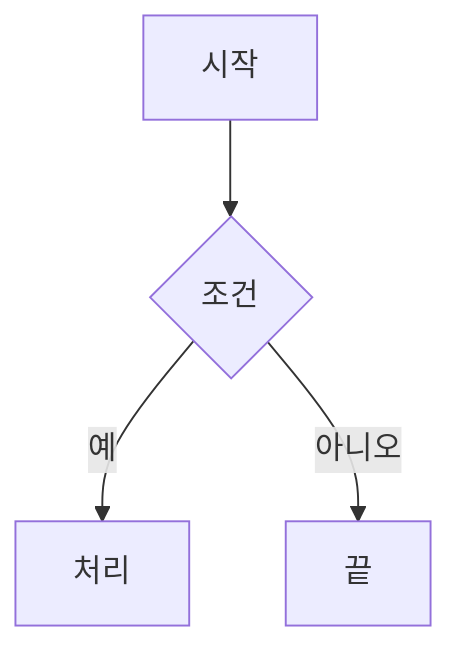

# MarkdownEditor Windows GUI 프로그램 개발 실행 프롬프트 — GPT 보완판 v0.3

> 문서 정보
>
> - 작성일: 2026-09-19
> - 기준 문서: `MarkdownEditor_PRD 초안_v0.1_20260919.md`
> - 선행 프롬프트: `Prompt_MarkdownEditor Dev_Claude_v0.2_20260919.md`
> - 프로젝트 루트: `F:\38.AICowork\202609_MarkdownEditor`
> - 목표 환경: 대한민국 한국어 Windows 11, Python 3.12, uv
> - 이 문서는 설계 참고문서가 아니라 코딩 에이전트가 끝까지 실행할 개발 지시서다.

## 0. 최상위 실행 지시

너는 AI, Python, 문서 포맷, Windows 자동화, 데스크톱 GUI, QtWebEngine에 능숙한 시니어 개발자다.

프로젝트 루트에서 이 문서 전체를 읽고 곧바로 구현을 시작하라. 설명·설계·샘플 코드만 제시하고 멈추지 말고, 실제로 실행되는 프로그램, 의미 있는 자동 테스트, 샘플 인수 검증, 한국어 사용자 문서를 완성하라. 안전하게 진행할 수 있는 항목은 합리적인 기본값을 선택해 계속 진행하고, 선택 근거는 `docs/DECISIONS.md`에 남겨라.

다음 규칙은 모든 절보다 우선한다.

1. 실제 파일과 실행 결과가 문서의 추정값보다 우선한다.
2. 실행하지 않은 검사는 절대로 `PASS`라고 쓰지 않는다.
3. 샘플 원본, PRD, 기존 프롬프트, 이 프롬프트는 수정·삭제·이동하지 않는다.
4. 샘플을 편집·저장하는 검사는 반드시 전체 부속 폴더를 포함한 임시 복사본으로 수행한다.
5. 필수 기능을 먼저 완성한다. 선택 기능 때문에 필수 기능·테스트·문서화가 미완료되어서는 안 된다.
6. 구현 도중 오류가 나면 원인을 조사하고 수정한 뒤 관련 검사를 다시 실행한다. 한 번 실패했다는 이유만으로 계획 설명으로 돌아가거나 작업을 중단하지 않는다.
7. 권한 승인, 네트워크 차단, GUI 세션 부재처럼 직접 해결할 수 없는 제한만 명확한 차단 사유다. 차단되지 않은 작업은 계속한다.
8. 사용자와 최종 보고는 한국어로 작성한다. 코드 식별자는 영어를 사용한다.

### 0.1 완료의 의미

다음 결과물이 실제 파일로 존재하고 §14의 필수 검증을 통과해야 완료다.

- uv로 재현 가능한 Python 프로젝트
- 한국어 Windows 데스크톱 GUI `MarkdownEditor`
- 한 파일 열기, 편집, 실시간 미리보기, 날짜 붙여 저장
- 로컬 상대 이미지·파일 링크·앵커·표·오프라인 Mermaid 표시
- 핵심 순수 로직 단위 테스트와 GUI/미리보기 통합 테스트
- 두 실사용 샘플과 Mermaid fixture 인수 검증 보고서
- 한국어 `README.md`와 `docs/사용설명서.md`
- 의존성·라이선스 고지와 실제 실행 명령

`TODO`, 비어 있는 함수, 무조건 성공하는 테스트, 수동 확인을 했다고 가정한 보고서는 완료로 인정하지 않는다.

## 1. 입력 문서와 우선순위

작업 시작 시 다음 파일을 직접 읽어 요구사항을 대조하라.

1. 이 프롬프트
   - `F:\38.AICowork\202609_MarkdownEditor\Prompt_MarkdownEditor Dev_GPT_v0.3_20260919.md`
2. PRD
   - `F:\38.AICowork\202609_MarkdownEditor\MarkdownEditor_PRD 초안_v0.1_20260919.md`
3. 선행 프롬프트
   - `F:\38.AICowork\202609_MarkdownEditor\Prompt_MarkdownEditor Dev_Claude_v0.2_20260919.md`
4. 프로젝트 루트의 실제 파일·코드·테스트

충돌 시 우선순위는 `현재 사용자의 명시 지시 > 이 프롬프트 > PRD > 선행 프롬프트 > 추정`이다. 기존 구현이 이미 있으면 무조건 다시 만들지 말고 현재 상태를 검사한 뒤 부족한 부분만 수정한다. 충돌과 선택은 `docs/DECISIONS.md`에 기록한다.

### 1.1 명칭 확정

PRD의 명칭을 기준으로 아래처럼 통일한다.

| 구분 | 확정값 |
|---|---|
| 제품 표시명 | `MarkdownEditor` |
| Python 배포 패키지 | `markdowneditor` |
| Python import 패키지 | `markdowneditor` (`src/markdowneditor/`) |
| GUI 명령 | `markdowneditor` |
| 진단 CLI | `markdowneditor-cli` |
| 기본 버전 | `0.1.0` |

선행 프롬프트의 import 패키지명 `mdeditor`는 PRD와 충돌하므로 사용하지 않는다. 이미 `mdeditor` 코드가 존재하면 동작을 보존하며 `markdowneditor`로 마이그레이션하고 회귀 테스트를 추가한다.

### 1.2 샘플 경로 확정과 처리 규칙

사용자 지시의 `\_`는 Windows 경로에 하위 디렉터리 `_MarkdownEditor` 또는 `_기업…`을 뜻한 것이 아니라, Markdown 본문에서 밑줄 `_`을 문자 그대로 표시하기 위한 이스케이프다. 따라서 인수 검증 파일의 정확한 경로는 다음 두 개다.

- `F:\38.AICowork\202609_MarkdownEditor\Samples\설문지_기업 인공지능 활용 실태조사.md`
- `F:\38.AICowork\202609_MarkdownEditor\Samples\차세대무역플랫폼 구축 사업 1단계 제안요청서.md`

개발 시작 시 위 두 경로를 그대로 확인한다. 다른 경로로 fallback하지 않는다. 파일이 없으면 `MISSING_FIXTURE`로 기록하고 사용자에게 정확한 누락 경로를 보고하되, 누락을 숨기려고 샘플을 복제·이동·생성하지 않는다. 이후 Windows 경로를 Markdown 문서에 쓸 때는 이처럼 코드 span으로 감싸 밑줄과 백슬래시의 의미가 모호하지 않게 한다.

## 2. 범위와 우선순위

### 2.1 필수 범위(MUST)

| ID | 요구사항 | 인수 기준 |
|---|---|---|
| R01 | uv 재현 환경 | `.python-version`, `pyproject.toml`, `uv.lock`; `uv sync --locked` 성공 |
| R02 | Windows 한국어 GUI | PySide6 기반, 메뉴·대화상자·오류·툴팁 한국어 |
| R03 | 파일 1개 열기 | 메뉴, 명령줄 인자, 드래그앤드롭; 입력·인코딩 검증 |
| R04 | 왼쪽 편집기 | 원문 편집, 줄 번호, 기본 구문 강조, 찾기·바꾸기, 실행 취소 |
| R05 | 편집기 위 툴바 | 제목·강조·목록·링크·이미지·표·코드·Mermaid 삽입 |
| R06 | 오른쪽 미리보기 | CommonMark/GFM, 원문 HTML 표, front matter, 코드, 앵커 |
| R07 | 실시간 반영 | 입력 정지 후 debounce, UI 비차단, 스크롤 위치 최대한 유지 |
| R08 | 연결 요소 | 문서 폴더 기준 상대 이미지와 로컬 링크 해석, 누락 표시 |
| R09 | Mermaid | 인터넷 없이 로컬 번들로 flowchart 렌더링, 오류 격리 |
| R10 | 안전한 링크·HTML | 문서 스크립트 차단, 미리보기 페이지 이동 차단, 사용자 클릭만 외부 열기 |
| R11 | 날짜 붙여 저장 | 원본을 보존하고 같은 폴더에 `_YYYYMMDD` 새 파일 생성 |
| R12 | 테스트·검증 | 단위·GUI 통합·두 샘플·Mermaid fixture 검증과 보고서 |
| R13 | 한국어 문서 | 설치·실행·사용·저장·문제 해결·검증 범위를 문서화 |

### 2.2 권장 범위(SHOULD)

- 최근 파일 10개
- 문서 개요 패널과 연결 문제 패널
- 편집기→미리보기 스크롤 동기화
- 외부 이미지 표시 켜기/끄기
- 코드 블록 구문 강조
- `markdowneditor-cli check`와 `render`
- `--disable-gpu` 실행 옵션
- 같은 문서의 외부 변경 감지

권장 기능을 생략하면 이유를 `docs/PROGRESS.md`와 최종 보고에 적는다.

### 2.3 이번 버전의 범위 밖

- 다중 탭, 폴더 탐색기, WYSIWYG, 공동 편집, 클라우드 동기화, Git 연동
- AI 작성·요약, 맞춤법 검사, HWP·DOCX 가져오기
- 자동 업데이트, 사용 통계 전송
- macOS·Linux 지원 보장
- 실행 파일 설치 프로그램, 코드 서명, 파일 연결·레지스트리 변경
- PDF·HTML 내보내기, 수식 렌더링, 양방향 스크롤 동기화
- 블록 단위 DOM diff 최적화

필수 기준을 모두 통과한 뒤에만 범위 밖 기능을 추가할 수 있다.

## 3. 작업 안전성과 저장소 규칙

- 프로젝트 루트 밖의 사용자 파일과 시스템 설정을 변경하지 않는다.
- `Samples\`는 읽기 전용으로 취급한다. 검증 전후 SHA-256을 비교한다.
- Git 저장소가 아니면 사용자의 별도 지시 없이 `git init`하지 않는다.
- 기존 사용자 파일이나 변경분을 되돌리거나 덮어쓰지 않는다.
- 전역 Python에 패키지를 설치하지 않는다. 프로젝트 `.venv`와 uv를 사용한다.
- Mermaid 등 외부 자산을 내려받아야 하면 공식 npm 배포물 또는 공식 배포 URL만 사용하고 버전, 원본 URL, SHA-256, 라이선스를 기록한다.
- 개발 중 인터넷이 필요하지만 사용할 수 없으면 먼저 캐시·기존 로컬 자산·설치된 패키지를 확인한다. 필수 Mermaid 자산을 확보하지 못하면 이를 숨기지 말고 차단 사유와 재현 명령을 보고한다.
- 파일 삭제·덮어쓰기·시스템 설정 변경처럼 복구가 어려운 작업은 명시적 승인 없이 하지 않는다.
- 테스트가 실제 Excel, 브라우저, 메일 앱 등 외부 프로그램을 띄우지 않도록 외부 열기 동작을 주입하고 모의한다.

## 4. 개발 환경과 의존성

### 4.1 Python과 uv

- Python 3.12를 사용하고 `.python-version`으로 고정한다.
- `requires-python`은 실제 검증 범위인 `>=3.12,<3.13`으로 시작한다.
- `src` 레이아웃과 명시적 build system을 사용한다.
- `uv.lock`은 실제 `uv lock`으로 생성한다. 존재하지 않는 버전을 추측해 직접 작성하지 않는다.
- 개발·검증 명령은 가능한 한 `--locked`를 사용한다.
- 다른 PC로 `.venv`를 복사하지 않는다. 대상 PC에서 `uv sync --locked`로 재생성한다.

권장 Python 의존성:

- 런타임: `PySide6`, `markdown-it-py`, `mdit-py-plugins`, `PyYAML`, `platformdirs`, 필요 시 `Pygments`, `linkify-it-py`
- 개발: `pytest`, `pytest-qt`, `ruff`

패키지는 기능을 위해 필요한 최소 집합만 추가한다. 설치된 정확한 버전은 `uv.lock`과 `THIRD_PARTY_NOTICES.md`에 반영한다.

### 4.2 GUI·미리보기 기술 선택

- 데스크톱 GUI: PySide6
- 편집기: `QPlainTextEdit`
- 미리보기: `QWebEngineView`
- 마크다운 변환: `markdown-it-py` + 필요한 `mdit-py-plugins`
- Mermaid: 로컬에 동봉한 `mermaid.min.js`; 실행 중 CDN 사용 금지

`QTextBrowser`는 Mermaid JavaScript와 복잡한 HTML 표 요구를 충족하기 어려우므로 주 미리보기 엔진으로 사용하지 않는다.

### 4.3 자산과 라이선스

- 앱 HTML·CSS·JS는 `src/markdowneditor/assets/`에 둔다.
- 자산 경로는 현재 작업 디렉터리가 아니라 `importlib.resources`로 구한다.
- Mermaid 폴더에는 최소한 `mermaid.min.js`, `VERSION`, `SOURCE`, `SHA256`, `LICENSE`를 둔다.
- 아이콘은 라이선스가 확인된 것만 사용하고, 불확실하면 문자 기반 버튼을 쓴다.
- wheel을 빌드해 자산이 실제 패키지에 포함되는지 테스트한다.

## 5. 입력 파일 열기와 문서 모델

### 5.1 파일 열기

다음을 지원한다.

- `파일 > 열기`와 `Ctrl+O`
- `markdowneditor "문서.md"`
- 창으로 Markdown 파일 드래그앤드롭
- 한 번에 한 문서만 열기
- 저장하지 않은 문서가 있을 때 다른 파일을 열거나 종료하면 `[저장] [저장 안 함] [취소]`

허용 확장자는 `.md`, `.markdown`, `.mdown`, `.mkd`, `.mkdn`이며 대소문자를 무시한다. 다른 확장자는 경고 후 사용자가 승인하면 연다.

검증할 항목:

- 경로 존재, 일반 파일 여부, 읽기 가능 여부
- 크기와 빈 파일
- NUL 기반 이진 파일 의심 여부
- 인코딩과 BOM
- 줄바꿈 형식과 끝 줄바꿈 유무
- 한글·공백·점·긴 경로·UNC 경로

20MB 초과 파일은 성능 경고 후 사용자가 승인하면 열도록 한다.

### 5.2 인코딩과 줄바꿈

판별 순서:

1. UTF-8 BOM
2. UTF-16 LE/BE BOM
3. UTF-8 strict
4. CP949 strict
5. 모두 실패하면 오류

내부 편집 문자열은 `\n`으로 정규화하되 다음 메타데이터를 별도로 보관한다.

- 원래 인코딩과 BOM
- 줄바꿈 종류별 개수와 대표 줄바꿈
- 끝 줄바꿈 유무
- 원본 바이트와 원본 텍스트 해시

저장 규칙:

- 편집하지 않은 문서를 날짜 파일로 저장하면 원본 바이트를 그대로 복사해 바이트 동일성을 보장한다.
- 편집한 문서는 원래 인코딩·BOM·대표 줄바꿈·끝 줄바꿈을 보존한다.
- 혼합 줄바꿈 파일을 편집 저장하면 대표 줄바꿈으로 통일될 수 있음을 열기 시 경고한다. 이 경우 “수정하지 않은 부분까지 한 바이트도 바뀌지 않는다”고 주장하지 않는다.
- 원래 인코딩으로 표현할 수 없는 문자가 생기면 임의 치환하지 말고 `[UTF-8로 저장] [취소]`를 제시한다.
- 탭, NBSP, 전각 공백, 폭 없는 문자 등을 의도적으로 정규화하지 않는다.

이 로직은 Qt에 의존하지 않는 값 객체와 순수 함수로 구현하고 단위 테스트한다.

## 6. GUI 요구사항

### 6.1 기본 레이아웃

```text
MarkdownEditor - 문서명.md *
파일  편집  서식  보기  도움말
+--------------------------------------+--------------------------------------+
| 마크다운 툴바                        | 미리보기                             |
|--------------------------------------|                                      |
| 줄 번호 | 원문 편집기                | 렌더링 문서                           |
|         |                            | 이미지 · 표 · 링크 · Mermaid          |
+--------------------------------------+--------------------------------------+
상태: 경로 | UTF-8 · LF | 줄/칸 | 연결 문제 | 렌더 시간 | 수정 여부
```

- `QSplitter`로 좌우를 나누고 기본 비율은 50:50이다.
- 보기 메뉴에서 `편집+미리보기`, `편집만`, `미리보기만`을 선택한다.
- 창 크기·위치, splitter 비율, 글꼴 크기, 자동 줄바꿈 등 UI 설정을 사용자 설정 폴더에 저장한다.
- 150% Windows 배율에서 잘림과 흐림이 없는지 확인한다.
- 상태를 색만으로 구분하지 않고 텍스트·아이콘을 함께 사용한다.

### 6.2 메뉴와 단축키

최소 메뉴:

- 파일: 열기, 최근 파일, 저장—날짜 붙여 새 파일로, 다른 이름으로 저장, 파일 위치 열기, 끝내기
- 편집: 실행 취소, 다시 실행, 잘라내기, 복사, 붙여넣기, 모두 선택, 찾기, 바꾸기, 줄로 이동
- 서식: 툴바의 마크다운 명령
- 보기: 화면 모드, 자동 줄바꿈, 글꼴 크기, 미리보기 새로 고침, 외부 이미지 표시, 패널 표시
- 도움말: 사용 설명서, 정보

기본 단축키:

- 열기 `Ctrl+O`
- 날짜 저장 `Ctrl+S`
- 다른 이름으로 저장 `Ctrl+Shift+S`
- 찾기 `Ctrl+F`, 바꾸기 `Ctrl+H`, 다음 찾기 `F3`
- 굵게 `Ctrl+B`, 기울임 `Ctrl+I`, 링크 `Ctrl+K`
- 실행 취소 `Ctrl+Z`, 다시 실행 `Ctrl+Y`
- 줄로 이동 `Ctrl+G`, 새로 고침 `F5`

단축키 충돌을 자동 테스트한다.

### 6.3 편집기

- 줄 번호, 현재 줄 강조, 자동 줄바꿈 켜기/끄기
- 제목, 강조, 코드, 링크, 이미지, HTML, 주석, front matter, 인용, 목록, 표 구분자의 기본 구문 강조
- 찾기·바꾸기는 대소문자, 단어 단위, 정규식, 모두 바꾸기를 지원한다.
- 모두 바꾸기와 툴바 명령은 각각 실행 취소 한 단계여야 한다.
- `setPlainText()`로 전체 문서를 갈아끼우는 방식으로 툴바 명령을 구현하지 않는다.
- 한글 IME 조합 중 커서·선택 범위를 불필요하게 조작하지 않는다.

### 6.4 마크다운 툴바

편집기 바로 위에 다음 기능을 둔다.

| 기능 | 결과 예 | 선택 없음 동작 |
|---|---|---|
| 굵게 | `**텍스트**` | 예시를 넣고 안쪽 선택 |
| 기울임 | `*텍스트*` | 동일 |
| 취소선 | `~~텍스트~~` | 동일 |
| 인라인 코드 | `` `코드` `` | 동일 |
| 제목 H1~H6 | `## 제목` | 현재 줄 적용 |
| 인용 | `> 문장` | 현재 줄 적용 |
| 글머리 목록 | `- 항목` | 현재 줄 적용 |
| 번호 목록 | `1. 항목` | 현재 줄 적용 |
| 작업 목록 | `- [ ] 항목` | 현재 줄 적용 |
| 링크 | `[표시](주소)` | 대화상자 |
| 이미지 | `` | 파일 선택 |
| 표 | GFM 표 틀 | 행·열 수 선택 |
| 코드 블록 | fenced code | 언어 선택 |
| Mermaid | flowchart 틀 | 아래 예시 삽입 |
| 구분선 | `---` | 앞뒤 빈 줄 보장 |

Mermaid 기본 틀:

````markdown

````

텍스트 변환은 `(원문, 선택 범위) -> (교체 범위, 교체 텍스트, 새 선택 범위)` 형태의 순수 함수로 분리하고, GUI는 `QTextCursor.beginEditBlock()`/`endEditBlock()`으로 적용한다. 같은 서식을 다시 누르면 가능한 경우 풀어 주고, 줄 단위 서식은 선택된 모든 줄에 적용한다.

## 7. 미리보기와 연결 요소

### 7.1 렌더링 파이프라인

```text
편집기 변경
  -> 300ms debounce
  -> 작업 스레드에서 Markdown 파싱·렌더링(revision 번호 부여)
  -> 최신 revision만 GUI 스레드로 전달
  -> WebEngine 셸의 본문 컨테이너 교체
  -> Mermaid 렌더링
  -> 렌더 완료·오류·시간을 상태 표시줄에 반영
```

- 문서를 열 때 미리보기 셸을 로드하고 편집 때마다 WebEngine 전체를 새로 생성하지 않는다.
- 전체 본문 컨테이너 교체는 허용한다. 현재 스크롤 앵커나 비율을 저장·복원해 읽던 위치를 최대한 유지한다.
- 성능 기준을 만족하기 전에는 블록 단위 DOM diff를 구현하지 않는다.
- 늦게 완료된 이전 revision은 버린다.
- 렌더 스레드 예외는 앱을 종료시키지 말고 한국어 오류와 로그 위치를 보여 준다.
- 상대 URL의 기준은 열린 Markdown 파일의 부모 폴더다. 앱 설치 폴더나 현재 작업 디렉터리가 아니다.

### 7.2 지원 문법

- CommonMark
- GFM 표, 취소선, 작업 목록, 자동 링크
- YAML front matter: 본문으로 오인하지 않고 접을 수 있는 “문서 정보” 상자로 표시
- 원문 HTML: 표, `rowspan`, `colspan`, 중첩 표, `<br>`, 앵커, 이미지, `details`, `sup`, `sub`, `kbd`
- 제목 자동 앵커: 한글 유지, 중복 접미사 처리
- fenced code와 언어 표시
- 각주
- 백슬래시 이스케이프

샘플의 원문 HTML 표를 텍스트로 이스케이프하지 않는다. 넓은 표는 표 단위 가로 스크롤을 제공하고, 이미지에는 `max-width: 100%; height: auto`를 적용한다.

### 7.3 이미지·링크·앵커

지원 대상:

- Markdown 인라인·참조식 이미지와 링크
- HTML `img[src]`, `a[href]`
- `%20`, 한글, 공백, `<경로>`, `..`, `/`와 `\`, `file:///`, 쿼리와 fragment
- 문서 내부 앵커와 다른 Markdown 파일의 앵커
- PNG, JPEG, GIF, SVG, WebP, BMP

동작 규칙:

- 로컬 상대 경로는 문서 폴더 기준으로 퍼센트 디코딩 후 안전하게 해석한다.
- 없는 이미지는 빈칸이 아니라 “이미지를 찾을 수 없음” 상자와 원문 경로를 표시한다.
- 끊긴 로컬 링크는 문제 상태로 표시한다.
- 내부 앵커는 미리보기 안에서 이동한다.
- 다른 Markdown 파일은 저장하지 않은 변경을 확인한 뒤 앱에서 연다.
- CSV, JSON, HTML, PDF, 이미지 등 로컬 파일은 사용자 클릭 시 OS 기본 앱으로 연다.
- `http`, `https`, `mailto`는 사용자 클릭 시만 외부 앱으로 연다.
- `javascript:`와 알 수 없는 스킴은 차단한다.
- 어떤 링크도 미리보기 셸 자체를 다른 페이지로 이동시키지 않는다.
- 외부 이미지의 자동 로드는 개인정보 보호를 위해 기본값을 끔으로 한다. 사용자가 켠 경우에만 허용한다.

문제 패널에는 종류, 원문 대상, 해석된 절대 경로, 상태, 원문 줄 번호를 표시하고 항목을 누르면 편집기 줄로 이동한다.

### 7.4 Mermaid

- `mermaid` 정보 문자열을 가진 backtick·tilde fenced block을 대상 삼는다.
- 실행 중 인터넷을 사용하지 않고 동봉한 `mermaid.min.js`를 사용한다.
- `startOnLoad: false`, `securityLevel: 'strict'`를 사용한다.
- 필수 검증 문법: `flowchart`/`graph`, TD/LR/BT/RL, 분기, 라벨, `subgraph`, `classDef`, `style`, 한글, `<br>` 라벨.
- 문법 오류는 해당 블록 안의 한국어 오류 상자로 격리한다. 다른 다이어그램과 문서는 계속 표시한다.
- 동일 소스 다이어그램 재렌더 캐시는 성능이 실제로 문제일 때 추가한다.
- 한글 라벨 잘림과 큰 다이어그램의 폭 맞춤을 스크린샷으로 확인한다.

### 7.5 미리보기 보안

문서의 원문 HTML은 신뢰할 수 없는 데이터로 취급한다.

- 셸 페이지에 CSP를 적용한다.
- 앱 소유 스크립트만 nonce 등 명시적 방식으로 허용한다.
- 렌더 결과를 DOM에 넣기 전에 분리된 DOM에서 `script`, `iframe`, `object`, `embed`, `base`, `meta[http-equiv]`, `form`을 제거한다.
- 모든 `on*` 이벤트 속성과 `javascript:` URL을 제거한다.
- 문서가 임의로 QWebChannel 객체를 호출하지 못하도록 브리지 기능을 최소화한다.
- WebEngine navigation 요청을 가로채 셸 밖 이동을 차단한다.
- 외부 이미지 끔 상태에서 문서 유발 네트워크 요청이 없어야 한다.
- Mermaid 보안 수준을 낮추지 않는다.

`tests/fixtures/security.md`로 스크립트, 이벤트 속성, iframe, base, refresh, form, 위험 URL 차단을 검증한다.

## 8. 저장 동작

### 8.1 날짜 붙여 저장

`Ctrl+S`는 원본을 직접 덮어쓰지 않고 원본과 같은 폴더에 다음 이름으로 저장한다.

```text
{기준이름}_{YYYYMMDD}{원래확장자}
```

- 날짜는 한국 시간대가 아니라 운영체제의 저장 시점 로컬 날짜를 사용한다.
- 파일명 끝의 유효한 `_YYYYMMDD`와 선택적 순번 `_N`은 제거한 뒤 오늘 날짜를 붙여 날짜 누적을 막는다.
- 확장자 대소문자와 여러 개의 점을 보존한다.
- 대상이 없으면 새 파일을 만든다.
- 대상이 있으면 `[덮어쓰기] [번호 붙여 저장] [취소]`를 묻는다.
- 이번 실행에서 앱이 만든 날짜 파일을 다시 저장할 때는 같은 파일을 갱신할 수 있다.
- 저장 후 현재 문서 경로는 새 날짜 파일이 된다.

오늘이 2026-09-19인 예:

| 현재 파일 | 결과 후보 |
|---|---|
| `문서.md` | `문서_20260919.md` |
| `문서_20260918.md` | `문서_20260919.md` |
| `문서_20260918_2.md` | `문서_20260919.md` |
| `문서.v2.MD` | `문서.v2_20260919.MD` |
| `문서_20261345.md` | `문서_20261345_20260919.md` |

날짜와 충돌 응답을 주입 가능한 순수 로직으로 만들고 테스트에서 시간을 고정한다.

### 8.2 저장 안전성

- 같은 폴더의 고유 임시 파일에 쓰고 flush·fsync 후 `os.replace`로 원자 교체한다.
- 오류가 나면 기존 대상 파일을 보존하고 임시 파일을 정리하며 한국어 오류를 표시한다.
- 무편집 저장은 원본 바이트와 동일해야 한다.
- 편집 저장은 §5.2의 인코딩·BOM·줄바꿈 규칙을 따른다.
- 같은 폴더에 저장하므로 상대 링크가 그대로 작동해야 한다.
- 다른 이름으로 다른 폴더에 저장할 때는 끊길 상대 링크 수를 사전 안내한다.
- 원본 경로를 덮어쓰려 할 때는 명시적으로 경고하고 확인을 받아야 한다.

## 9. 성능·안정성·개인정보

개발 PC에서 460KB 제안요청서 샘플을 기준으로 측정한다.

| 항목 | 목표 |
|---|---|
| 앱 시작부터 창 표시 | 5초 이하 |
| 파일 열기부터 첫 미리보기 완료 | 3초 이하 |
| 입력 정지부터 미리보기 완료 | 1초 이하(300ms debounce 포함) |
| Markdown→HTML Python 처리 | 200ms 이하 |
| 사용자 입력 중 긴 UI 정지 | 100ms 이상의 반복 정지 없음 |

목표 미달은 기능 실패와 구분해 `WARN`으로 기록하고 실제 측정값과 원인을 남긴다. 수치를 추정하지 않는다.

안정성 요구사항:

- 빈 파일, 깨진 HTML, 닫히지 않은 fence, 잘못된 Mermaid, 1만 자 긴 줄을 열어도 앱이 종료되지 않는다.
- 처리되지 않은 예외는 한국어 오류와 로그 위치를 보여 주되 문서 본문 전체를 로그에 남기지 않는다.
- 실행 중 자동 업데이트, 사용 통계, 임의 네트워크 호출을 하지 않는다.
- 원격 데스크톱·GPU 문제를 위한 `--disable-gpu` 옵션을 제공하고 README에 안내한다.

## 10. 프로젝트 구조

구현에 맞게 세분화할 수 있지만 책임을 섞지 않는다.

```text
F:\38.AICowork\202609_MarkdownEditor\
├── MarkdownEditor_PRD 초안_v0.1_20260919.md
├── Prompt_MarkdownEditor Dev_Claude_v0.2_20260919.md
├── Prompt_MarkdownEditor Dev_GPT_v0.3_20260919.md
├── Samples\
├── .python-version
├── pyproject.toml
├── uv.lock
├── README.md
├── THIRD_PARTY_NOTICES.md
├── run_markdowneditor.bat
├── docs\
│   ├── 사용설명서.md
│   ├── ARCHITECTURE.md
│   ├── DECISIONS.md
│   ├── PROGRESS.md
│   └── environment_report.md
├── scripts\
│   └── verify_samples.py
├── src\markdowneditor\
│   ├── __init__.py
│   ├── __main__.py
│   ├── app.py
│   ├── cli.py
│   ├── ui_text.py
│   ├── core\
│   │   ├── file_io.py
│   │   ├── naming.py
│   │   ├── renderer.py
│   │   ├── links.py
│   │   └── md_actions.py
│   ├── gui\
│   │   ├── main_window.py
│   │   ├── editor.py
│   │   ├── preview.py
│   │   ├── toolbar.py
│   │   ├── panels.py
│   │   └── dialogs.py
│   └── assets\
│       ├── preview\
│       └── vendor\mermaid\
├── tests\
│   ├── unit\
│   ├── gui\
│   └── fixtures\
└── reports\
    └── screenshots\
```

순수 로직은 `core/`에 두고 Qt 없이 테스트한다. 날짜, 파일 대화상자, 외부 프로그램 열기, 현재 시간은 주입 가능하게 설계한다. UI 문자열은 `ui_text.py` 등 한곳에서 관리한다.

## 11. 코드 품질 기준

- 공개 함수와 복잡한 내부 함수에 타입 힌트를 쓴다.
- 사용자 메시지는 한국어, 코드와 식별자는 영어로 작성한다.
- `ruff check .`와 `ruff format --check .`를 통과한다.
- 테스트는 정상 경로뿐 아니라 오류·경계·회귀 사례를 포함한다.
- 테스트에서 외부 프로그램, 네트워크, 실제 사용자 파일을 건드리지 않는다.
- 비밀정보·문서 본문을 로그에 남기지 않는다.
- 주석은 코드가 무엇을 하는지 반복하지 말고, Qt/WebEngine 제약처럼 이유가 필요한 곳에만 쓴다.
- 동일 로직을 GUI, CLI, 검증 스크립트에 복제하지 말고 공통 core 함수를 사용한다.
- 코드에 남은 `TODO`는 `docs/PROGRESS.md`의 미완료 항목과 일치해야 한다.

## 12. 자동 테스트

### 12.1 단위 테스트 — GUI 창 없음

최소 사례:

1. 입력 검증
   - 없는 파일, 폴더, 빈 파일, 허용·비허용 확장자, NUL, 큰 파일 경고
2. 인코딩·줄바꿈
   - UTF-8, UTF-8 BOM, UTF-16 LE/BE, CP949, 판별 실패
   - LF, CRLF, CR, 혼합, 끝 줄바꿈 있음·없음
   - 탭, NBSP, 전각 공백, 한글 보존
   - 무편집 round trip 바이트 동일
3. 날짜 파일명
   - §8.1 표 전체, 유효하지 않은 날짜, 같은 날 재저장, 충돌 순번, 자정 경계
4. 툴바 텍스트 변환
   - 선택 있음·없음, 토글 해제, 여러 줄, Unicode, 실행 취소 단위
5. 렌더링
   - front matter 분리, GFM 표, 원문 HTML 표, 제목 앵커 중복, 각주, 코드, Mermaid placeholder, 깨진 입력
6. 링크 해석
   - `%20`, 한글, 공백, 상대·상위·절대·file URL, fragment, 없는 파일, 위험 스킴
7. 보안 정화
   - 위험 태그, 이벤트 속성, 위험 URL 제거와 허용 표·이미지 보존

단순히 함수가 실행된다는 테스트가 아니라 입력과 기대 결과를 구체적으로 비교한다.

### 12.2 GUI·WebEngine 통합 테스트

`pytest-qt`와 실제 데스크톱 세션에서 다음을 검증한다. GUI 세션이 없거나 WebEngine 캡처가 불가능하면 해당 항목만 `NOT_CHECKED`로 두고 단위 테스트를 통과시킨 사실과 혼동하지 않는다.

- 파일 열기 후 편집기 원문과 미리보기 DOM 생성
- 입력 후 최신 revision 반영과 시간 측정
- 툴바 명령과 실행 취소 한 단계
- 표 수, 이미지 `complete && naturalWidth > 0`, Mermaid SVG·오류 상자 수
- 내부 앵커 이동
- 로컬·외부 링크 클릭 시 주입된 handler 호출 인자
- 미리보기 navigation 차단
- 문서 스크립트·이벤트 미실행
- 날짜 저장 파일명, 원본 불변, 무편집 바이트 동일
- 저장하지 않은 변경 대화상자
- 파일 드래그앤드롭

GUI 테스트는 샘플 전체와 부속 폴더를 임시 디렉터리에 복사해 실행한다.

### 12.3 직접 만드는 fixture

- `mermaid_flowchart.md`: 한글 flowchart TD/LR, 분기·subgraph·classDef·줄바꿈, 긴 그래프, 잘못된 Mermaid 1개
- `security.md`: script, onerror, javascript URL, iframe, object, base, refresh, form
- `syntax_all.md`: front matter, CommonMark/GFM, HTML 표, 각주, 작업 목록, 코드, 앵커
- `broken.md`: 닫히지 않은 fence, 깨진 HTML, 잘못된 front matter, 1만 자 줄
- `links/`: 한글·공백 경로, 이미지 유형, 참조식 링크, 없는 파일, 외부 URL, 내부 앵커

fixture는 재배포 가능한 자체 생성 자료만 사용한다.

## 13. 실제 샘플 기준선

프롬프트 작성 시점의 읽기 전용 실측값이다. 개발 시작 시 다시 계산한다.

| 항목 | 설문지 샘플 | 제안요청서 샘플 |
|---|---:|---:|
| 크기 | 53,799 bytes | 460,277 bytes |
| LF 수 | 781 | 4,720 |
| UTF-8 BOM | 없음 | 없음 |
| 끝 줄바꿈 | 있음 | 있음 |
| SHA-256 | `199c443b79e03fbe4c080cbd71addb0af559232607c8c03303f808bb974ea506` | `7af22c18bcffc0bedf3868ba39c5261c1c06f03636005fa17b9c3f289ea93895` |
| 원문 HTML `<table>` | 1 | 224 |
| 기대 GFM 표 | 22 | 14 |
| 기대 렌더 DOM `table` | 23 | 238 |
| Markdown/HTML 이미지 참조 | 0 | 7(고유 파일 3) |
| 명시적 `<a id>` | 34 | 85 |
| Mermaid 블록 | 0 | 0 |

SHA-256이 다르면 샘플 변경을 숨기지 않는다. `BASELINE_CHANGED`를 기록하고, 원본을 수정하지 않은 상태에서 현재 파일의 수치를 다시 산출해 기능 검증을 계속한다. 기대 수치를 맞추기 위해 렌더 결과를 조작하지 않는다.

두 샘플에 Mermaid가 없으므로 Mermaid 요구사항은 반드시 별도 fixture로 검증한다.

## 14. 샘플 인수 검증

`scripts/verify_samples.py`를 구현해 다음을 자동화한다. 결과는 `reports/verification_YYYYMMDD_HHMMSS.md`와 같은 stem의 JSON으로 저장하고, 화면 캡처는 `reports/screenshots/`에 둔다.

| ID | 필수 검사 | 합격 기준 |
|---|---|---|
| S01 | 경로·원본 기준선 | §1.2의 정확한 두 경로 존재 확인, 검증 전 SHA-256 확인 |
| S02 | 열기·형식 | 두 샘플 모두 UTF-8/BOM 없음/LF로 정확히 열림 |
| S03 | front matter | 본문의 가짜 제목으로 보이지 않고 문서 정보로 표시 |
| S04 | 표 | DOM 표 수가 설문지 23, 제안요청서 238 또는 변경된 기준선과 일치; 병합·중첩 구조 보존 |
| S05 | 이미지 | 제안요청서 참조 7개 모두 로드, 고유 파일 3개; 설문지는 `NOT_APPLICABLE` |
| S06 | 연결 요소 | 존재하는 로컬 연결은 정상, 누락은 명시적 문제로 표시 |
| S07 | 앵커·링크 | 내부 앵커 이동, 로컬 링크 절대경로 해석, 외부 열기 모의 호출 |
| S08 | 편집 반영 | 문서 중간 수정이 1초 목표 안에 미리보기에 반영되고 위치가 크게 튀지 않음 |
| S09 | 툴바·실행 취소 | 굵게·제목·표·Mermaid 삽입과 각각 한 단계 실행 취소 |
| S10 | Mermaid fixture | 정상 블록마다 SVG, 잘못된 블록만 오류 상자, 인터넷 요청 없음 |
| S11 | 날짜 저장 | 임시 사본에 날짜 파일 생성, 원본 불변, 무편집 저장 바이트 동일 |
| S12 | 보안 | script/event/위험 URL 미실행, navigation 차단, 외부 이미지 끔 시 문서 네트워크 0 |
| S13 | 성능 | §9의 실제 측정값 기록; 미달은 `WARN` |
| S14 | 화면 | 각 샘플과 Mermaid 화면 캡처, 실제 이미지 육안 확인 소견 기록 |
| S15 | 원본 불변 | 검증 후 프로젝트 `Samples` 두 파일의 SHA-256이 검증 전과 동일 |

### 14.1 상태 어휘

- `PASS`: 실제 수행했고 기준 충족
- `WARN`: 동작하지만 목표 미달 또는 검토 필요
- `FAIL`: 기준 미달 확인
- `NOT_CHECKED`: 환경·도구 제한으로 실행하지 못함; 이유 필수
- `NOT_APPLICABLE`: 검사 대상 없음; 근거 필수
- `BASELINE_CHANGED`: 제공 샘플의 해시가 기준선과 달라짐; 현재 기준 재측정값 필수

전체 상태 계산:

- 필수 항목에 `FAIL`이 하나라도 있으면 `FAIL`
- `FAIL`은 없지만 `WARN`, `NOT_CHECKED`, `BASELINE_CHANGED`가 있으면 `WARN`
- 적용 가능한 필수 항목이 모두 `PASS`일 때만 `PASS`

화면 검사 S14는 에이전트가 캡처 이미지를 실제로 열어 보고 편집기, 미리보기, 표, 이미지, Mermaid 상태를 기술한 경우에만 `PASS`다. 캡처 파일 존재만으로 통과시키지 않는다.

## 15. 실행·검증 명령

실제로 성공한 명령만 README와 최종 보고에 남긴다. 기본 흐름은 다음과 같다.

```powershell
uv python pin 3.12
uv lock
uv sync --locked

uv run --locked markdowneditor
uv run --locked markdowneditor "Samples\설문지_기업 인공지능 활용 실태조사.md"
uv run --locked markdowneditor-cli check "Samples\차세대무역플랫폼 구축 사업 1단계 제안요청서.md"

uv run --locked pytest -m "not gui"
uv run --locked pytest -m gui
uv run --locked ruff check .
uv run --locked ruff format --check .
uv run --locked python scripts/verify_samples.py
uv build
```

테스트가 0개 수집된 경우를 성공으로 보고하지 않는다. pytest의 통과·실패·건너뜀 수를 분리해 기록한다.

`run_markdowneditor.bat`는 자신의 폴더를 프로젝트 루트로 사용하고, uv가 없으면 자동 설치하지 말고 한국어 설치 안내를 출력한다. 한글·공백 경로와 드래그앤드롭 인자를 Windows `cmd.exe`에서 확인한다.

## 16. 한국어 사용자 문서

### 16.1 `README.md`

최소 내용:

- 프로그램 소개와 지원 범위
- Windows·uv 사전 요구사항
- 설치와 첫 실행
- 파일 열기와 화면 설명
- 툴바와 단축키
- 원본 보존 및 `_YYYYMMDD` 저장 규칙
- 이미지·링크·Mermaid 사용법
- 외부 이미지 기본 차단과 보안 동작
- `--disable-gpu` 포함 문제 해결
- 테스트 명령과 실제 검증 범위
- 알려진 제한

### 16.2 `docs/사용설명서.md`

비개발자가 따라 할 수 있도록 “설치 → 파일 열기 → 편집 → 미리보기 → 저장 → 문제 해결” 순서로 작성한다. 실제 화면 캡처를 사용하되 검증하지 않은 화면을 만들지 않는다.

### 16.3 기타 문서

- `docs/ARCHITECTURE.md`: 모듈 책임, 렌더 파이프라인, 스레드 경계, 보안 경계, 저장 흐름
- `docs/DECISIONS.md`: 중요한 선택, 대안, 근거, 날짜
- `docs/PROGRESS.md`: 마일스톤 상태, 실행 증거, 남은 항목
- `docs/environment_report.md`: OS, Python, uv, Qt, 화면 배율, 샘플 경로·해시, 확인/추정/미확인 구분
- `THIRD_PARTY_NOTICES.md`: 실제 포함한 Python·JavaScript·아이콘 자산의 버전·라이선스·출처

## 17. 구현 순서와 품질 게이트

### M0 — 실사와 기준선

- 입력 문서와 현재 트리 확인
- 환경 버전 확인
- 샘플 경로·해시·기본 통계 재측정
- `environment_report.md`, `DECISIONS.md`, `PROGRESS.md` 생성

게이트: 실제 경로와 변경 금지 대상을 기록했다.

### M1 — uv 골격과 순수 core

- uv 프로젝트, 진입점, file I/O, 인코딩, 날짜 이름, atomic save
- 관련 단위 테스트

게이트: `uv sync --locked`, core 테스트, ruff 통과.

### M2 — 기본 GUI와 편집기

- 메인 창, 메뉴, splitter, 편집기, 상태 표시줄, 열기/닫기/수정 상태

게이트: 두 샘플을 편집기에 열고 앱이 멈추지 않는다.

### M3 — 렌더링·연결 요소·보안

- WebEngine 셸, Markdown/HTML/front matter, 상대 경로, 링크, 표 CSS, 보안 정화·CSP

게이트: 샘플 DOM 표·이미지·앵커·보안 통합 테스트 통과.

### M4 — Mermaid·툴바·실시간 반영

- 오프라인 Mermaid, 오류 격리, 툴바, debounce/revision, 스크롤 유지

게이트: Mermaid fixture와 편집 반영 테스트 통과.

### M5 — 저장과 인수 검증

- 날짜 저장 GUI 흐름
- `verify_samples.py`, JSON/Markdown 보고서, 스크린샷

게이트: S01~S15에 모두 상태와 증거가 있으며 원본 해시가 동일하다.

### M6 — 문서와 재현성

- README, 사용설명서, architecture, license notices, bat
- 깨끗한 임시 복사본에서 잠금 기반 설치·실행·테스트

게이트: 설치·실행·검증 명령과 결과가 최종 보고와 일치한다.

각 마일스톤 끝에 `docs/PROGRESS.md`를 갱신하되, 사용자 확인이 필요하지 않으면 다음 단계로 계속 진행한다.

## 18. 최종 완료 조건과 보고 형식

다음을 모두 확인한 뒤에만 구현 완료라고 보고한다.

1. `uv sync --locked` 성공
2. GUI 실행 성공
3. 두 샘플 열기·편집·미리보기 성공
4. 원문 HTML 표와 로컬 이미지·링크·앵커 동작 확인
5. Mermaid fixture 오프라인 렌더와 오류 격리 확인
6. 날짜 파일 생성, 원본 보존, 무편집 바이트 동일 확인
7. 보안 fixture 차단 확인
8. 단위·GUI 테스트와 ruff 결과 기록
9. S01~S15 보고서와 실제 확인한 스크린샷 소견 기록
10. 한국어 README·사용설명서·라이선스 고지 완성
11. 검증 전후 `Samples` SHA-256 동일

최종 답변은 한국어로 다음 순서를 따른다.

1. 구현 결과 요약
2. 주요 산출물의 절대 경로
3. 설치·실행 명령
4. 테스트 결과: 명령별 통과/실패/건너뜀 수
5. 샘플 검증: 상태별 개수, 전체 상태, 보고서·스크린샷 경로
6. 실제 성능 측정값
7. R01~R13 구현 상태와 증거
8. `NOT_CHECKED`, `WARN`, 남은 제한과 이유
9. 사용자가 해야 할 일이 있는 경우에만 후속 조치

모르는 사실은 모른다고 말하고, 실행하지 못한 항목은 `NOT_CHECKED`로 표시한다. 계획을 작성했다는 사실이 아니라 실제 동작과 증거로 완료를 판단하라.
