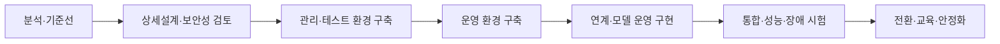
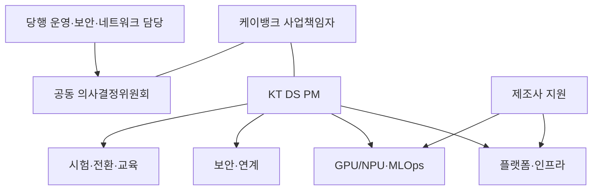
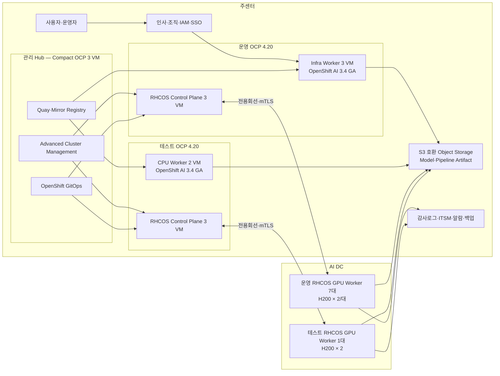
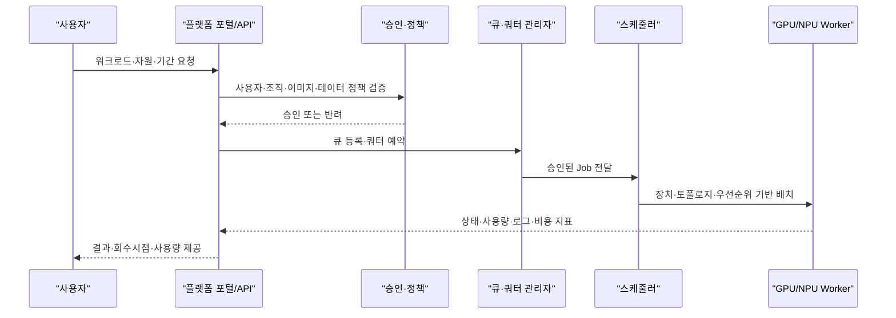
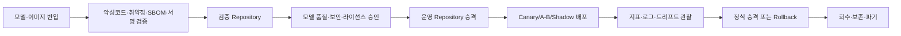
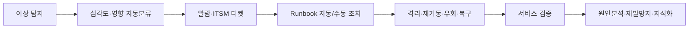
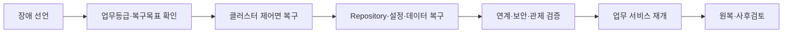

# 케이뱅크 GPU 플랫폼 구축 사업 제안서 — OpenShift AI 기반

| 구분 | 내용 |
|---|---|
| 제안사 | KT DS |
| 사업명 | 케이뱅크 GPU 플랫폼 구축 사업 |
| 문서 버전 | 2.0 — OpenShift AI 반영본 |
| 작성 기준일 | 2026-08-03 |
| 제안 범위 | I. 제안 개요, III. 관리 부문, IV. 수행 부문, V. 지원 부문 |
| 플랫폼 기준 | Red Hat OpenShift Container Platform 4.20 + Red Hat OpenShift AI Self-Managed 3.4 GA |
| 제외 범위 | II. 제안사 현황 |

---

# I. 제안 개요

## 1. 제안 배경 및 목적

### 1.1 사업 이해

케이뱅크는 운영 7대와 테스트 1대의 GPU Worker Node를 기반으로 AI 학습·추론 자원을 표준화하고, **Red Hat OpenShift Container Platform과 Red Hat OpenShift AI Self-Managed**를 통해 GPU 가동률과 금융권 운영 통제를 함께 높이고자 한다. 본 사업은 범용 Kubernetes 설치가 아니라 OpenShift의 보안·운영 기반과 OpenShift AI의 개발·학습·모델 서빙 기능을 하나의 제품지원 체계로 구현하는 사업이다.

1. **가속기 자원의 공동 활용**: GPU·NPU·CPU를 단일 정책 아래 등록·할당·회수하고 사용자·조직·업무별 쿼터와 우선순위를 적용한다.
2. **모델 운영의 표준화**: 모델과 컨테이너의 등록, 보안검증, 승인, 배포, 확장, 회수 이력을 표준 절차로 관리한다.
3. **금융권 보안 내재화**: 망분리, 최소권한, 이미지 공급망 보안, 감사로그, 데이터 보존·파기를 플랫폼 제어면에 내장한다.
4. **운영 자동화와 가시성**: 클러스터·노드·가속기·모델 서비스의 상태를 통합 관제하고 장애 감지부터 격리·복구·보고까지 연결한다.

### 1.2 구축 목적

| 관점 | 현행 과제 | 목표 상태 |
|---|---|---|
| 자원 | 업무별 전용·수동 배정으로 유휴·대기 발생 가능 | 중앙 큐·쿼터·우선순위 기반 동적 할당 |
| 플랫폼 | 환경별 설치·설정 편차 | OCP 4.20·OpenShift AI 3.4 GA 표준 구성과 OpenShift GitOps 형상관리 |
| 모델 | 모델·이미지 배포와 회수의 개별 처리 | OpenShift AI Model Registry·KServe 기반 등록–검증–승인–배포–관찰–회수 |
| 보안 | 반입·권한·감사 통제의 수작업 의존 | 서명·취약점·정책·권한·감사 통제의 자동 집행 |
| 운영 | 시스템·GPU·모델 지표의 분산 | 메트릭·로그·이벤트·가속기 지표 통합 관제 |
| 확장 | 신규 GPU/NPU 도입 시 개별 설계 | 벤더 Operator·Device Plugin–Hardware Profile–Kueue ResourceFlavor 확장 구조 |

### 1.3 성공 기준

RFP에 정량 기준이 없는 항목은 아래 기준을 1차 권고하며 착수 단계에서 케이뱅크와 확정한다.

| 성공 지표 | 1차 수용 기준 | 측정 방법 |
|---|---|---|
| 클러스터 정상성 | 모든 Node `Ready`, ClusterOperator `Available`, DataScienceCluster 구성요소 `Ready` | `oc get co,nodes,dsc`, Must-gather |
| Control Plane HA | Control Plane 1대 정지 시 API와 기존 워크로드 운영 지속 | 장애주입 시험 |
| GPU 인식 | 운영 14개, 테스트 2개 H200 장치가 정책에 맞게 식별 | 노드·장치 인벤토리, 시험 Job |
| 할당 통제 | 미승인 Hardware Profile·Kueue Quota 초과 차단, 승인 Workload 정상 배정 | ClusterQueue·LocalQueue 시험 |
| 모델 배포 | 승인 Model Registry 버전만 KServe RawDeployment로 배포되고 Rollback 이력 보존 | InferenceService 시험 |
| 관제 | 노드·Pod·GPU·추론 지표와 알람·감사로그 수집 | 대시보드·알람·로그 증적 |
| 복구 | 합의된 RTO/RPO 내 구성·메타데이터 복구 | 백업·복구 리허설 |
| 운영 인수 | 운영자가 표준 절차로 배포·장애·백업 작업 수행 | 실습 평가·인수 체크리스트 |

`RFP 확정사항:` 사업기간은 투입일로부터 3개월이다. `가정·협의사항:` 성능 KPI, RTO/RPO, 로그 보존기간, 동시 사용자·모델 수는 착수 후 2주 이내 확정한다. [RFP: 1. 제안 개요/가. 사업 개요]

## 2. 제안 범위

### 2.1 대상 인프라

| 환경 | 용도 | 위치 | RFP 사양 | OpenShift AI 적용안 | 수량 | 구분 |
|---|---|---|---|---|---:|---|
| 운영 | Control Plane VM | 주센터 | RHEL, 8 vCore, 16GB | **RHCOS**, 8 vCPU, 16GiB, 시스템 디스크 120GB 이상 | 3 | OS 변경 협의 필수 |
| 운영 | GPU Compute Node | AI DC | RHEL, 48 pCore/96 vCore, 512GB, H200 141GB × 2 | **RHCOS 권고**, 동일 CPU·Memory·GPU, CRI-O | 7 | RFP 자원 활용 |
| 운영 | Infra/Management Worker VM | 주센터 | 미제시 | RHCOS, 16 vCPU, 64GiB, 500GB | 3 | KT DS 추가 제안 |
| 테스트 | Control Plane VM | 주센터 | RHEL, 8 vCore, 16GB | **RHCOS**, 8 vCPU, 16GiB, 시스템 디스크 120GB 이상 | 3 | OS 변경 협의 필수 |
| 테스트 | GPU Compute Node | AI DC | RHEL, 48 pCore/96 vCore, 512GB, H200 141GB × 2 | **RHCOS 권고**, 동일 CPU·Memory·GPU, CRI-O | 1 | RFP 자원 활용 |
| 테스트 | Infra/CPU Worker VM | 주센터 | 미제시 | RHCOS, 8 vCPU, 32GiB, 300GB | 2 | OpenShift AI 최소 구성 보완 |
| 관리 Hub | Compact OCP Node VM | 주센터 | 관리 구성 제안 요청 | RHCOS, 16 vCPU, 64GiB, 500GB | 3 | KT DS 추가 제안 |
| 공통 | 설치 Bootstrap VM | 주센터 | 미제시 | RHCOS, 8 vCPU, 16GiB, 120GB, 클러스터별 순차 재사용 | 1 | 설치 후 회수 |
| 공통 | Mirror/Bastion VM | 보안 반입구역 | 미제시 | RHEL 9, 16 vCPU, 32GiB, 500GB 이상 | 1 | KT DS 추가 제안 |

OpenShift Container Platform 4.20은 모든 Control Plane에 RHCOS를 요구한다. 따라서 RFP의 Control Plane ‘RHEL VM’은 CPU·Memory 사양을 유지하되 OS를 RHCOS로 재프로비저닝해야 한다. Compute는 RHEL 사용이 가능한 설치 유형도 있으나, OS·CRI-O·GPU Driver까지 OpenShift가 일관되게 관리하도록 GPU Compute에도 RHCOS를 권고한다. 테스트 환경은 GPU Worker가 1대뿐이므로 OpenShift AI 설치 최소 구성과 플랫폼 Pod의 GPU 노드 분리를 위해 CPU Worker 2대를 추가한다. [OCP 4.20 아키텍처](https://docs.redhat.com/en/documentation/openshift_container_platform/4.20/html-single/architecture/architecture), [OpenShift AI 3.4 폐쇄망 설치 요구사항](https://docs.redhat.com/en/documentation/red_hat_openshift_ai_self-managed/3.4/html/installing_and_uninstalling_openshift_ai_self-managed_in_a_disconnected_environment/index)

관리 Hub 3대는 Control Plane과 Worker 역할을 함께 수행하는 Compact OCP로 구성하고 Red Hat Advanced Cluster Management, OpenShift GitOps, Quay, 정책·배포 제어기능을 배치한다. 운영 Infra Node에는 OpenShift AI 플랫폼 구성요소, Ingress, Monitoring, Logging을 배치해 H200을 AI 워크로드 전용으로 확보한다. 이미지·모델·로그 데이터는 행내 기업용 스토리지에 분리 저장하며 최종 사양은 Red Hat sizing과 부하시험으로 확정한다.

### 2.2 포함 범위

- 운영·테스트 OCP 4.20 클러스터와 Compact OCP 관리 Hub 구축
- RHCOS Control Plane 3중화, CRI-O, OVN-Kubernetes, OpenShift Data Foundation 또는 당행 CSI 연계
- OpenShift AI 3.4 GA Operator, DataScienceCluster, Dashboard, Workbench, Data Science Pipelines, Model Registry 구성
- NFD Operator·NVIDIA GPU Operator·ClusterPolicy·DCGM Exporter·Hardware Profile 구성
- Red Hat build of Kueue 기반 GPU·CPU Queue·Quota·Priority와 분산학습 제어
- KServe RawDeployment·Red Hat AI Inference(vLLM) 기반 모델 서빙과 Custom Metrics Autoscaler 기반 확장
- Quay·Model Registry·Object Storage 기반 이미지·모델·Pipeline Artifact 관리
- IAM·인사/조직정보·SSO/LDAP·감사로그·ITSM·GitLab·알람·백업 연계 설계 및 구현
- 메트릭·로그·이벤트·GPU 지표 관제와 장애대응 자동화
- 보안·감사·백업·DR·데이터 보존·파기 통제
- 시험, 이행, 안정화, 운영자 교육, 기술이전, 산출물 인계

### 2.3 조건부·제외 범위

| 항목 | 처리 원칙 |
|---|---|
| 신규 H/W 구매·증설 | RFP 제시 H/W 외 증설은 용량분석 후 별도 협의 |
| 전용회선 증설 | 회선은 당행 제공을 전제로 하며 대역폭·지연 부족 시 증설 협의 |
| DR 사이트 GPU | DR 인프라 정보 미제공으로 설계·절차·백업까지 포함, 추가 H/W는 별도 협의 |
| 상용제품 라이선스 | 최종 제품과 수량 확정 후 가격제안서·5년 TCO에 반영 `[KT DS 입력 필요]` |
| II. 제안사 현황 | 사용자 지시에 따라 본 문서에서 제외, 관련 증빙은 별도 제출 |

## 3. 사업 수행 전략

### 3.1 5대 추진 원칙

1. **표준 우선**: OpenShift Container Platform 4.20 및 Red Hat OpenShift AI Self-Managed 3.4 GA, OCI 이미지, CSI, CNI, OIDC/SAML, OpenTelemetry 등 공개 표준을 우선한다.
2. **보안 기본값**: 기본 거부, 최소권한, 승인된 이미지, 암호화 통신, 불변 감사로그를 초기 설치값으로 한다.
3. **코드 기반 운영**: 클러스터·정책·배포 설정을 Git으로 관리하고 Pull Request 승인 후 자동 반영한다.
4. **점진적 전환**: 테스트 환경에서 기준구성을 검증한 뒤 운영에 동일한 코드와 승인된 아티팩트를 승격한다.
5. **측정 가능한 인수**: 모든 요구사항을 시험항목·합격기준·산출물에 연결한다.

생산 기준선은 **OpenShift Container Platform 4.20 + OpenShift AI Self-Managed 3.4 최신 z-stream**으로 한다. 2026년 8월 기준 OpenShift AI 3.5 문서는 Early Access이므로 운영에 적용하지 않는다. OpenShift AI 3.4가 공식 지원하는 OCP 범위는 4.19~4.20이며 본 제안은 장기 운영성과 llm-d 선택 가능성을 고려해 4.20을 선정한다. KServe는 RawDeployment를 사용하고, 폐기 방향인 KServe Serverless와 ModelMesh는 신규 운영 기준에서 제외한다. 최종 설치 버전은 구축 시점의 Red Hat Supported Configuration과 Errata를 재확인해 변경승인을 받는다. [OpenShift AI 3.4 GA 릴리스 노트](https://docs.redhat.com/en/documentation/red_hat_openshift_ai_self-managed/3.4/html-single/release_notes/release_notes), [OpenShift AI 3.4 모델 배포](https://docs.redhat.com/en/documentation/red_hat_openshift_ai_self-managed/3.4/html/deploying_models/deploying_models)

### 3.2 단계별 접근

테스트 환경에서 설치 코드, 정책, 표준 이미지, 연계 모의시험을 선행하고, 검증된 버전과 이미지 digest만 운영으로 승격한다. 운영 반영은 변경승인, 백업, 사전점검, 적용, 검증, 롤백 판단의 단일 Runbook으로 수행한다.

## 4. 제안 특장점

| 특장점 | 적용 방식 | 기대효과 | 검증 방법 |
|---|---|---|---|
| 금융권 통제 내재화 | 정책코드, 이미지 서명, RBAC, 감사로그, 폐쇄망 반입 게이트 | 사후 점검이 아닌 배포시점 통제 | 미승인 이미지·권한·통신 차단 시험 |
| 가속기 활용 최적화 | 큐·쿼터·Gang Scheduling·MIG/전용 GPU 정책 | 대기시간과 유휴자원 가시화 | 동시 Job·우선순위·격리 시험 |
| 이기종 확장 | OpenShift AI 지원 Matrix·Hardware Profile·ResourceFlavor | 신규 NPU 도입 시 플랫폼 영향 최소화 | 신규 Hardware Profile 등록 시험 |
| 운영 자동화 | Red Hat OpenShift GitOps(Argo CD)·자동 설치·구성 Drift 탐지·Runbook | 반복 작업 오류와 복구시간 축소 | 재설치·Drift·롤백 시험 |
| 모델 라이프사이클 | 등록·검증·승인·Canary·회수 이력 | 배포 신뢰성과 감사 가능성 확보 | 승인·배포·Rollback 시나리오 |
| 종단 관제 | 인프라·GPU·모델·감사 지표 상관분석 | 장애 영향과 원인 파악 시간 단축 | 장애주입과 알람·티켓 연계 |

`[KT DS 입력 필요]` KT DS의 유사 금융권 구축사례, 제조사 파트너십, 투입인력 자격 및 제품 인증은 증빙 확인 후 본 절의 근거로 추가한다.

---

# III. 관리 부문

## 1. 수행조직 및 인력투입 계획

### 1.1 추진체계

### 1.2 역할과 책임

| 역할 | 주요 책임 | 필수 Skill | 투입 구간 | 비고 |
|---|---|---|---|---|
| PM | 범위·일정·위험·변경·보고·검수 총괄 | 금융권 SI, PMP 수준 관리역량 | 전 기간 | `[KT DS 인력 입력 필요]` |
| 총괄 아키텍트 | 목표·논리·물리·보안 아키텍처 정합성 | Kubernetes, 금융 인프라 | 전 기간 | 1명 이상 권고 |
| Kubernetes 엔지니어 | 클러스터·OVN-Kubernetes CNI·CSI·Red Hat OpenShift GitOps(Argo CD)·업그레이드 | CKA/동등 역량 | 설계~안정화 | 중급 이상 |
| GPU/NPU 엔지니어 | 드라이버·Operator·스케줄링·성능 | CUDA, Device Plugin, DCGM | 구축~시험 | 제조사 협업 |
| MLOps 엔지니어 | Repository·모델 서빙·배포·확장 | OCI, KServe 계열, LLM Serving | 구축~교육 |  |
| 보안 아키텍트 | RBAC·망분리·공급망·감사·취약점 | 금융보안, 컨테이너 보안 | 전 기간 |  |
| 연계 엔지니어 | IAM·SSO·ITSM·GitLab·백업·알람 | API, LDAP/OIDC/SAML | 설계~시험 |  |
| 관제 엔지니어 | 메트릭·로그·알람·대시보드 | Prometheus/OpenTelemetry 계열 | 구축~안정화 |  |
| 시험·품질 담당 | 요구사항 추적·시험·결함·검수 | QA, 성능·장애 시험 | 전 기간 |  |
| 교육·전환 담당 | Runbook·교육·운영인수·Hyper-care | 운영관리, 기술문서 | 시험~안정화 |  |

### 1.3 RACI

| 업무 | 케이뱅크 | KT DS | 제조사 |
|---|---|---|---|
| 요구사항·수용기준 확정 | A/R | C | C |
| 아키텍처·상세설계 | A | R | C |
| VM·회선·방화벽·계정 제공 | R | C | I |
| 플랫폼 설치·설정 | A | R | C |
| GPU 드라이버·호환성 검증 | A | R | R/C |
| 보안성 심의·예외 승인 | A/R | C | I |
| 통합시험·검수 | A/R | R | C |
| 교육·기술이전 | A | R | C |

`R=수행, A=최종책임, C=협의, I=통보`

## 2. 추진일정 및 소요자원

### 2.1 12주 일정

| 주차 | 주요 활동 | 마일스톤·산출물 | 선행조건 |
|---:|---|---|---|
| 1 | 착수, 현황·요구·연계·보안 분석 | 착수보고서, 현황분석서, 질의목록 | 담당자·자료 제공 |
| 2 | 목표·상세 아키텍처, 수용기준 확정 | 아키텍처·상세설계 초안 | 네트워크·스토리지 정보 |
| 3 | RHCOS·Mirror/Bastion·Quay·Operator Catalog 준비 | 인프라·폐쇄망 반입 점검서 | VM·회선·DNS·NTP·Subscription |
| 4 | Compact 관리 Hub와 테스트 OCP·OpenShift AI 구축 | ACM·GitOps·테스트 설치검증서 | RHCOS·oc-mirror ImageSet |
| 5 | 운영 OCP·Infra·GPU Worker·OpenShift AI 구축 | ClusterOperator·DataScienceCluster 검증서 | AI DC 접근·RHCOS·Driver |
| 6 | NFD·GPU Operator·Hardware Profile·Kueue 구성 | GPU·Queue·Quota 정책서 | 업무·조직·MIG 정책 |
| 7 | Quay·Model Registry·S3·Pipeline·KServe/vLLM 구성 | 표준 Image·Model 배포절차 | Object Storage·인증서 |
| 8 | IAM·SSO·감사·ITSM·GitLab·백업·알람 연계 | 연계시험서 | 연계 명세·테스트 계정 |
| 9 | 모니터링·보안·공급망·DR 구성 | 보안·관제·백업 구성서 | 보안정책·보존 기준 |
| 10 | 기능·성능·부하·장애·복구 시험 | 통합시험·결함보고 | 시험 데이터·부하모델 |
| 11 | UAT, 운영전환, 교육, 보완 | 인수시험서, 교육결과서 | 운영자 참석 |
| 12 | 안정화·종료·산출물 인계 | 종료보고서, 운영 Runbook | 결함 종료·승인 |

### 2.2 핵심 선행조건

- 주센터 관리 Hub·운영 Infra·테스트 CPU Worker·Control Plane VM, AI DC GPU Worker 제공
- Control Plane과 GPU Worker의 RHCOS 재프로비저닝 승인, OCP·OpenShift AI·ACM·Quay Subscription 제공
- 전용회선 품질, 방화벽, L4/VIP, DNS, NTP, 인증서, SMTP/알람 경로 확정
- 기업용 스토리지와 CSI, 백업 시스템, 중앙 로그·감사 시스템 연계 명세
- IAM·인사·조직·SSO/LDAP·ITSM·GitLab 테스트 계정과 API 명세
- H200 Firmware·OCP·RHCOS·GPU Operator·Driver·CUDA·vLLM 호환 조합 확인
- Mirror/Bastion, oc-mirror, Quay, 폐쇄망 CatalogSource 반입승인과 보안성 심의 일정 확보

## 3. 위험관리/변화관리 계획

### 3.1 주요 위험 등록부

| ID | 위험 | 가능성/영향 | 예방조치 | 비상조치 | 담당 |
|---|---|---|---|---|---|
| R-01 | 회선 지연·단절로 Control Plane–Worker 통신 불안정 | 중/상 | RTT·손실 사전 측정, QoS·재전송 기준 | 작업 중지, 네트워크 우회·복구 | 당행/KT DS |
| R-02 | H200·OCP·RHCOS·GPU Operator·vLLM 호환성 | 중/상 | Red Hat/NVIDIA Matrix, 테스트 선검증 | 승인 버전 롤백, 공동지원 | KT DS/제조사 |
| R-03 | 3개월 내 연계 명세 지연 | 중/상 | 1주차 인터페이스 확정, Mock 제공 | 단계 오픈, 수동 대체절차 | 공동 |
| R-04 | 스토리지 성능·용량 부족 | 중/상 | IOPS·대역폭·용량 산정·부하시험 | 캐시·등급 조정, 증설협의 | 당행/KT DS |
| R-05 | 미승인 오픈소스·취약점 | 중/상 | SBOM·취약점·라이선스 게이트 | 버전 교체·보완통제·예외승인 | KT DS/보안 |
| R-06 | MIG 변경 시 워크로드 중단 | 중/중 | 프로파일 고정, 변경창구·Drain | 전용 GPU 전환, 예약 작업 | KT DS |
| R-07 | DR 자원 미확정 | 상/상 | 2주차 업무등급·RTO/RPO 확정 | 백업 복구형 DR 우선, 증설안 | 당행 |
| R-08 | 투입인력 변동 | 중/중 | 백업인력·문서화·Pair 작업 | 동급 이상 교체·인수인계 | KT DS |
| R-09 | RFP RHEL Control Plane과 RHCOS 필수조건 충돌 | 상/상 | 착수 전 OS 변경승인·재프로비저닝 계획 | OpenShift 적용 불가 시 범위·제품 재협의 | 공동 |
| R-10 | 테스트 GPU Worker 1대로 플랫폼 Pod와 AI 부하 경합 | 상/상 | CPU Worker 2대 추가·Taint 분리 | Compact 배치 PoC 후 성능 제한 명시 | 당행/KT DS |
| R-11 | 폐쇄망 Catalog·Image 누락으로 설치·패치 중단 | 중/상 | ImageSet 사전검증·Quay 용량·반입 체크 | 누락 Bundle 긴급반입·일정 재조정 | KT DS |

### 3.2 변경관리

변경요청은 `접수 → 영향분석(범위·일정·비용·보안·품질) → CCB 승인 → 테스트 → 운영 반영 → 검증 → 형상기준선 갱신` 순으로 처리한다. 긴급변경은 사후 1영업일 이내 CCB 검토와 원인·재발방지 기록을 의무화한다. Git 변경은 이슈번호, 검토자, 승인자, 변경 전후 diff, 시험결과를 연결한다.

## 4. 보안관리 계획

### 4.1 프로젝트 보안

- 참여인력 보안서약·비밀유지계약·개인정보 동의 확인 후 계정 발급
- 개인별 계정, 다중요소인증, 최소권한, 작업시간·접속위치 제한
- 승인 단말과 행내 작업공간만 사용하고 화면·파일·저장매체 반출 통제
- 주 1회 계정·권한·반출입·취약점·악성코드 점검, 월 1회 보안교육
- 종료 시 계정 회수, 산출물 인계, 작업복사본 파기, 대표자 명의 미보유 확약

## 5. 업무 보고 및 검토 계획

| 보고·회의 | 주기 | 핵심 내용 | 산출물 | 승인·참석 |
|---|---|---|---|---|
| 착수보고 | 1회 | 범위, 일정, 조직, 위험, 의사결정 | 착수보고서 | 사업책임자 |
| 주간보고 | 주 1회 | 진척, 이슈, 위험, 변경, 차주계획 | 주간보고서 | PM/PL |
| 설계검토 | 설계 단계 | 아키텍처, 보안, 연계, 수용기준 | 설계검토서 | 아키텍처·보안위원 |
| 변경관리위원회 | 필요 시 | 영향, 우선순위, 일정·비용 | 변경요청·의결서 | CCB |
| 시험결함회의 | 시험 중 매일 | 결함 등급, 조치, 재시험 | 결함대장 | QA/담당PL |
| 단계완료 보고 | 단계별 | 산출물·기준 충족·잔여위험 | 단계완료보고 | 당행 승인자 |
| 종료보고 | 1회 | 성과, 미결사항, 운영인수 | 종료보고서 | 사업책임자 |

산출물은 Git 또는 당행 지정 문서관리시스템에서 버전·작성·검토·승인 이력을 관리한다. 검수 의견은 항목별 조치결과와 증빙을 연결하고, 미해결 사항은 책임자·완료기한·서비스 영향·임시통제를 명시한다.

---

# IV. 수행 부문

## 1. 시스템 구축 방안

### 1.1 시스템 구축 전략

KT DS는 `관리 기준선 수립 → 테스트 검증 → 운영 승격 → 통합시험 → 운영 인수` 순으로 구축한다. 설치파일, 컨테이너 이미지, Helm Chart, OS 패키지는 외부 수집구역에서 악성코드·취약점·라이선스·서명을 검증한 후 승인 digest로 폐쇄망 Repository에 반입한다. 운영에는 테스트에서 통과한 동일 digest와 Git tag만 배포한다.

| 전략 | 구현 통제 | 운영 증빙 |
|---|---|---|
| 표준화 | 노드 역할·네임스페이스·레이블·쿼터·네트워크·로그 표준 | 표준구성서, 정책목록 |
| 자동화 | IaC·Red Hat OpenShift GitOps(Argo CD)·Operator·Runbook 자동화 | Git 이력, 배포 로그 |
| 저영향 | 테스트 선검증, 작업창구, Drain, 롤백 지점 | 작업계획·결과서 |
| 보안 내재화 | 승인 이미지·최소권한·기본거부·불변 감사 | 정책 위반 차단 증적 |
| 운영 인수 | 대시보드·알람·백업·교육·실습 평가 | 운영 Runbook, 교육결과 |

### 1.2 목표 시스템 구성 및 아키텍처

#### 1.2.1 전체 목표 구성

#### 1.2.2 구성요소 역할

| 계층 | Red Hat·OpenShift 구성요소 | 역할 | 배치·HA |
|---|---|---|---|
| 멀티클러스터 관리 | Advanced Cluster Management, OpenShift GitOps | 클러스터 등록·정책·배포·Drift·수명주기 | 관리 Hub 3노드 |
| 공급망 | Quay, Mirror Registry, ImageContentSourcePolicy/IDMS | 폐쇄망 Operator Catalog·Release·Image의 승인 공급 | 관리 Hub+외부 Mirror/Bastion |
| OCP 제어면 | API Server, etcd, Scheduler, Controller, Machine Config Operator | 운영·테스트 클러스터 제어와 RHCOS 생명주기 | 환경별 Control Plane 3대 |
| AI 플랫폼 | OpenShift AI Operator, DataScienceCluster, Dashboard, Workbench, Pipeline, Model Registry | AI 프로젝트·개발·학습·모델 등록·배포 | 환경별 Infra/CPU Worker |
| GPU 기반 | NFD, NVIDIA GPU Operator, ClusterPolicy, DCGM Exporter, Hardware Profile | H200 발견·Driver·Device Plugin·Telemetry·사용자 프로파일 | GPU Worker 7대+1대 |
| 워크로드 관리 | Red Hat build of Kueue, Kubeflow Training Operator, KubeRay | Queue·Quota·Priority와 분산학습 | AI 플랫폼 계층 |
| 모델 서빙 | KServe RawDeployment, Red Hat AI Inference(vLLM), Gateway API | 전용 Model Server, 인증 Endpoint, 확장·롤백 | GPU Worker |
| 저장 | Quay, S3 호환 Object Storage, CSI StorageClass, Model Registry DB | Image·Model·Pipeline·PVC·Metadata | 행내 이중화 스토리지 |
| 관제·보안 | OpenShift Monitoring, Cluster Observability, OpenTelemetry/Tempo, OAuth/OIDC, SCC, NetworkPolicy | 지표·로그·추적·인증·인가·격리 | 기존 SIEM/PAM/KMS 연계 |

#### 1.2.3 OpenShift AI 논리 서비스 구성

| 사용자 흐름 | OpenShift AI 서비스 | 구현 원칙 |
|---|---|---|
| 프로젝트 생성 | DataScienceProject·OpenShift Project | 조직 Group, ResourceQuota, NetworkPolicy, Object Storage Connection 자동 적용 |
| 개발환경 | Workbench·승인 Notebook Image·Hardware Profile | Rootless, Read-only 기본, H200 프로파일, 유휴 종료정책 |
| 학습 | Data Science Pipeline·PyTorchJob/RayJob·Kueue | LocalQueue/ClusterQueue, PriorityClass, Checkpoint, Gang Scheduling |
| 모델 등록 | Model Registry v1beta1·S3 호환 Object Storage | 모델 버전·소유자·평가·승인·Digest·계보 관리 |
| 모델 배포 | KServe RawDeployment·ServingRuntime·InferenceService | 전용 Model Server, vLLM, Route/Gateway, Canary·Rollback |
| 생성형 AI | Red Hat AI Inference·TrustyAI Guardrails(필요 시) | H200 기반 vLLM, 입력·출력 안전통제와 감사 |
| 모니터링 | OpenShift Monitoring·Model metrics·DCGM | 인프라·GPU·Model SLO의 단일 상관분석 |

#### 1.2.4 네트워크 원칙

- Control Plane API는 L4 VIP로 제공하고 관리망에서만 접근을 허용한다.
- 주센터–AI DC 전용회선은 제어·노드·스토리지·관제 흐름을 서비스별로 식별하고 방화벽 최소 포트를 적용한다.
- Pod/Service CIDR은 운영·테스트·관리·기존망과 중복되지 않도록 IP 계획을 확정한다.
- OVN-Kubernetes NetworkPolicy는 Project 기본거부 후 DNS, Quay, Object Storage, 관제, 승인 API만 허용한다.
- OpenShift API, `api-int`, Ingress `*.apps`, MachineConfig, Quay, Object Storage, NTP, DNS의 주센터–AI DC 통신행렬을 별도 승인받는다.
- 모든 관리 API는 TLS 1.2 이상을 기본으로 하고 인증서는 행내 PKI 또는 승인된 인증서 체계로 발급·교체한다.
- 회선 수용기준은 RTT, packet loss, MTU, 처리량, 장애복구 시간으로 정하고 착수 2주 이내 실측한다.

### 1.3 클러스터 및 인프라 구축 방안

#### 1.3.1 클러스터 기준선

| 항목 | 제안 기준 | 확인·결정사항 |
|---|---|---|
| 플랫폼 | OCP 4.20 최신 승인 z-stream | Red Hat 지원계약·EUS 경로 |
| AI 플랫폼 | OpenShift AI Self-Managed 3.4 GA 최신 z-stream | 설치시점 Supported Configuration |
| OS | Control Plane RHCOS 필수, GPU Worker RHCOS 권고 | RFP RHEL 표기 변경승인 |
| Runtime | OCP 내장 CRI-O·crun | 임의 Runtime 교체 금지 |
| CNI | OVN-Kubernetes, NetworkPolicy, Egress 통제 | 기존 네트워크·Firewall 표준 |
| CSI | 행내 기업용 스토리지 CSI | StorageClass·Snapshot 지원 |
| Ingress/Gateway | OpenShift Ingress·Route·Gateway API, 내부 L4/L7·TLS | VIP·인증서·WAF·OIDC |
| AI 자원 | Hardware Profile, Kueue ClusterQueue/LocalQueue | 조직·업무별 GPU Quota |
| 모델 서빙 | KServe RawDeployment, Red Hat AI Inference(vLLM) | 모델·Tensor Parallel 기준 |
| GitOps | OpenShift GitOps, 승인 Git 변경 자동 동기화 | 기존 GitLab 연계 |
| 정책 | SCC, RBAC, ResourceQuota, LimitRange, Admission Policy | 당행 예외승인 절차 |

OCP·OpenShift AI·NVIDIA GPU Operator·Driver·CUDA·Red Hat AI Inference의 지원 Matrix를 단일 호환성 기준선으로 관리한다. Technology Preview·Developer Preview 기능은 운영 수용기준에 포함하지 않으며, 반드시 필요한 경우 별도 PoC 환경과 위험승인을 거친다.

#### 1.3.2 Control Plane 3중화

각 환경의 RHCOS Control Plane 3대에 API Server, Controller Manager, Scheduler, etcd를 분산하고 가상화 호스트 anti-affinity를 적용한다. etcd는 3멤버 quorum, OpenShift `cluster-backup.sh` 또는 지원 절차에 따른 암호화 백업, 인증서·Operator 상태 경보를 구성한다. API VIP와 Ingress VIP는 정상 노드만 전달한다.

시험은 Control Plane 1대 순차 정지, API 요청 지속, 신규 Pod 스케줄, etcd health, 복귀 후 멤버 동기화를 확인한다. 2대 동시 장애는 quorum 상실로 신규 변경이 제한될 수 있으므로 Runbook에 복원 순서를 명시한다.

#### 1.3.3 멀티버전·패치 운영

- 운영은 승인된 OCP 4.20 z-stream·OpenShift AI 3.4 z-stream, 테스트는 차기 z-stream 사전검증으로 운영한다.
- OCP release image, Operator Catalog, OpenShift AI·GPU Operator bundle은 Mirror Registry에 반입한 뒤 `수집 → 영향평가 → 테스트 → 승인 → 운영 순차적용 → 검증`한다.
- OCP minor 업그레이드는 Red Hat 지원 upgrade path를 따르고 `oc adm upgrade`, Operator channel, API deprecation, MachineConfig 재부팅 영향을 선행 점검한다.
- 긴급 취약점은 위험기반 임시통제, 테스트 축소 승인, 긴급변경, 사후검증 절차를 적용한다.
- OCP EUS, OpenShift AI lifecycle, NVIDIA Operator·Driver 지원종료일은 월별 Lifecycle 대장으로 관리한다.

#### 1.3.4 폐쇄망 설치 순서

1. **반입 목록 동결:** OCP 4.20 Release Image, OpenShift AI 3.4·ACM·GitOps·Pipelines·Kueue·NFD·GPU·관제·백업 Operator, Quay와 Workbench·Serving Image의 Digest를 확정한다.
2. **Mirror 생성:** 인터넷 연결 반입구역에서 `oc-mirror` ImageSet을 생성하고 SBOM·CVE·악성코드·서명·라이선스를 검사한다.
3. **내부 Quay 동기화:** 승인 Bundle을 행내 Quay에 적재하고 ImageDigestMirrorSet, 폐쇄망 CatalogSource와 Pull Secret을 구성한다.
4. **OCP 설치:** 관리 Hub → 테스트 → 운영 순으로 Agent-based 또는 당행 가상화 환경에 적합한 UPI 방식으로 RHCOS 노드를 설치한다.
5. **OCP 기반 검증:** ClusterOperator, MachineConfigPool, API·Ingress VIP, DNS·NTP·StorageClass·OVN-Kubernetes·OAuth를 검증한다.
6. **AI 의존 Operator 설치:** NFD, NVIDIA GPU Operator, Red Hat build of Kueue, Custom Metrics Autoscaler 등 선택 기능에 필요한 지원 Operator를 승인 Channel로 설치한다.
7. **OpenShift AI 설치:** OpenShift AI Operator와 `DataScienceCluster`를 생성하고 Dashboard, Workbench, Pipeline, Model Registry, KServe 등 승인된 GA 구성요소만 `Managed`로 활성화한다.
8. **GPU·모델 구성:** `NodeFeatureDiscovery`, `ClusterPolicy`, H200 `HardwareProfile`, Queue, 표준 Workbench Image, KServe ServingRuntime와 S3 Connection을 등록한다.
9. **검증·승격:** Must-gather, 설치시험, GPU Job, Pipeline, Registry, InferenceService, 보안·백업 시험을 통과한 동일 Git Tag와 Image Digest를 운영에 승격한다.

#### 1.3.5 OpenShift AI 구성 기준

| 구성영역 | 운영 기준 | 비고 |
|---|---|---|
| Dashboard·Auth | Managed, 행내 OIDC·Group 연계 | 관리자·사용자 Group 분리 |
| Workbench | 승인 Image·Hardware Profile만 노출 | 유휴종료·PVC·NetworkPolicy |
| Data Science Pipelines | 승인 Runtime·S3 Bucket·ServiceAccount | Pipeline Artifact·Run 이력 |
| Model Registry | v1beta1 API, DB·S3 백업 | 모델 Metadata·승인·계보 |
| KServe | RawDeployment 단일 모델 서빙 | Serverless·ModelMesh 신규 사용 금지 |
| Red Hat AI Inference | H200 호환 vLLM Image | Driver·CUDA 지원 Matrix 고정 |
| Distributed Workloads | Red Hat build of Kueue+지원 Training Operator | Queue Label·Quota 강제 |
| TrustyAI·Guardrails | 업무 필요성과 GA 지원상태 확인 후 적용 | 고영향 AI·생성형 AI 통제 |

각 `DataScienceCluster` 구성요소의 ManagementState, Operator Subscription Channel, CRD API 안정성, 지원등급을 기준선 문서에 기록한다. Technology Preview·Developer Preview는 운영 `Managed` 대상에서 제외하고 테스트 Project에서만 별도 승인한다.

### 1.4 GPU·NPU·CPU 통합 자원 운영 방안

#### 1.4.1 H200 운영 기준

NFD Operator가 H200 노드를 식별하고 NVIDIA GPU Operator의 `ClusterPolicy`가 Driver, Container Toolkit, Device Plugin, GPU Feature Discovery, DCGM Exporter를 관리한다. OpenShift AI에는 H200 전용 `HardwareProfile`을 등록해 Workbench·Training Job·InferenceService가 승인된 GPU 수량과 Kueue LocalQueue를 선택하도록 한다. H200은 Red Hat AI와 NVIDIA의 지원목록에 포함되지만 최종 OCP·RHCOS·GPU Operator·Driver·CUDA·vLLM 조합은 테스트에서 검증 후 고정한다. [Red Hat AI 지원 하드웨어](https://docs.redhat.com/en/documentation/red_hat_ai/3/html-single/supported_product_and_hardware_configurations/index), [NVIDIA H200·OpenShift 지원](https://docs.nvidia.com/datacenter/cloud-native/gpu-operator/latest/platform-support.html)

| 자원 방식 | 적용 기준 | 격리 수준 | 정책 |
|---|---|---|---|
| 전용 GPU | 중요 학습·민감 데이터·최대성능 업무 | 물리 GPU 전용 | 기본 선택 |
| MIG | 다중 사용자 추론·중소형 학습 | 하드웨어 파티션 | 사전 정의 profile만 허용 |
| Time-slicing | 비민감 개발·테스트 | 시간 공유, 메모리 격리 한계 | 보안승인 시 제한 적용 |

H200은 MIG profile을 지원한다. MIG geometry 변경 시 GPU 워크로드 중지·노드 drain 또는 재기동이 필요할 수 있으므로 운영 중 임의 변경을 금지하고 승인된 유지보수 창구에서만 적용한다. [NVIDIA MIG User Guide](https://docs.nvidia.com/datacenter/tesla/mig-user-guide/supported-mig-profiles.html)

#### 1.4.2 자원 요청·승인·스케줄링 흐름

- Red Hat build of Kueue에서 조직·업무별 `ClusterQueue/LocalQueue`, `ResourceFlavor`, GPU 수량·시간 quota를 관리한다.
- 분산학습은 모든 replica가 동시에 준비될 때 시작하도록 Gang Scheduling을 적용한다.
- 우선순위는 운영추론, 긴급업무, 일반학습, 개발 순으로 기본안을 제시하고 당행 승인 후 확정한다.
- 선점은 checkpoint 가능한 학습에만 허용하고 운영추론·데이터 처리 중인 중요 Job은 보호한다.
- 예약 만료·유휴 임계 도달 시 알림 후 회수하며 예외는 책임자 승인과 종료시점을 요구한다.

#### 1.4.3 NPU 확장

NPU는 OpenShift AI 3.4의 공식 가속기 지원범위와 해당 벤더 Operator·Device Plugin 지원 여부를 먼저 확인한다. 지원되는 장치는 NFD Label, Device Plugin, RuntimeClass, Hardware Profile, Kueue ResourceFlavor, 표준 메트릭을 등록한다. 지원 Matrix 밖의 NPU는 운영 클러스터에 직접 반영하지 않고 테스트 클러스터 PoC와 Red Hat·벤더 공동지원 확인을 통과한 뒤 변경승인을 받는다. `[당행 협의 필요: 대상 NPU 벤더·모델·SDK]`

### 1.5 모델·컨테이너·Repository 운영 방안

#### 1.5.1 모델 라이프사이클

OpenShift AI Model Registry v1beta1은 모델 ID, 버전, 소유조직, 학습데이터 승인번호, 프레임워크·CUDA, 입력·출력 Schema, 품질지표, 위험등급, 승인자, 이미지 Digest, 배포이력, 만료일을 관리한다. 모델 Binary와 Pipeline Artifact는 S3 호환 Object Storage에 저장한다. 운영 배포는 Model Registry 승인상태, KServe ServingRuntime, 서명된 이미지 Digest가 모두 일치할 때만 Admission 정책이 허용한다.

#### 1.5.2 서빙·확장

- 운영 기준은 **KServe RawDeployment의 단일 모델 서빙**이며, vLLM 기반 Red Hat AI Inference ServingRuntime을 H200 Hardware Profile에 연결한다.
- KServe Serverless와 ModelMesh는 폐기 방향이므로 신규 구성에서 제외한다. llm-d Distributed Inference는 모델 규모·회선·스토리지·지원등급을 검증한 후 선택안으로 적용한다.
- Canary/A-B는 OpenShift Route·Gateway API의 트래픽 가중치와 별도 InferenceService로, Shadow는 응답 미반영 복제 트래픽으로 검증한다.
- OpenShift Custom Metrics Autoscaler와 HPA는 요청수, Queue depth, p95 latency, token throughput, GPU utilization을 조합한다. Technology Preview Autoscaler에는 운영 SLA를 의존하지 않는다.
- Cold Start 완화를 위해 승인된 모델 사전 로딩, 최소 replica, 모델 캐시를 업무등급별로 적용한다.
- Scale-to-zero는 비실시간·개발 서비스에만 적용하고 중요 추론은 최소 replica를 유지한다.

#### 1.5.3 공급망 보안

Mirror/Bastion에서 `oc-mirror`로 OCP Release, Operator Catalog, OpenShift AI·NFD·GPU Operator·Kueue·관제 Operator와 사용자 Image를 Quay에 반입한다. SHA-256, 출처, 라이선스, SBOM, CVE, 악성코드, 이미지 서명을 기록하고 ImageDigestMirrorSet 또는 승인된 Mirror 정책으로 외부 Registry 접근을 차단한다. 운영 Quay는 직접 Push를 금지하고 GitLab Pipeline과 OpenShift GitOps의 승격 ServiceAccount만 쓰기 권한을 갖는다.

### 1.6 연계 방안

| 연계 | 방향·주기 | 핵심 데이터 | 보안·오류 통제 |
|---|---|---|---|
| 인사·조직/IAM | 행내 → OCP OAuth·OpenShift AI Auth, 이벤트+일배치 | 사번·조직·직무·상태·Group·RoleBinding | mTLS, 최소속성, 퇴직 즉시회수, 대사·재처리 |
| SSO/OIDC | 사용자 ↔ OCP·OpenShift AI Gateway | OIDC Token, Group/Claim | MFA, 직접 OIDC 인증, 서명·만료·Audience 검증 |
| 중앙 감사로그 | OCP·OpenShift AI → 감사계, 실시간 | API Audit·OAuth·Kueue·Model Registry·KServe·관리행위 | TLS, 무결성, 유실탐지, 재전송 |
| ITSM | 양방향, 이벤트 | 장애·변경·요청·CI·상태 | 서비스계정, idempotency, retry·DLQ |
| GitLab | GitLab → OpenShift Pipelines·OpenShift GitOps | Manifest·Policy·Pipeline·Commit·Model promotion | MR 승인, 서명, Protected branch |
| 알람 | 플랫폼 → 행내 알람 | 심각도·대상·지표·Runbook | 중복억제, escalation, 수신확인 |
| 백업 | 플랫폼 → 행내 백업 | etcd·설정·PV·Repository metadata | 암호화, 성공검증, 복구시험 |

#### 1.6.1 SIR-001~003 해석

| ID | 목록 명칭 | 상세 명칭/상태 | 본 제안 처리 |
|---|---|---|---|
| SIR-001 | 행내 인사정보시스템 연계 | 사용자 및 조직정보 연계 | 인사·조직→IAM→플랫폼 동기화로 통합 대응 |
| SIR-002 | 사용자 및 조직정보 연계 | 인증시스템 연계 | SSO/LDAP/OIDC/SAML 인증으로 상세 기준 대응 |
| SIR-003 | 인증 시스템 연계 | 상세 미제공 | SIR-002 중복 여부 질의, 별도 범위 후보 제시 |

번호와 원문 불일치는 변경하지 않으며 착수회의에서 케이뱅크의 최종 매핑을 승인받는다.

### 1.7 모니터링·로깅·감사 및 장애 대응 방안

#### 1.7.1 관제 데이터

| 계층 | 지표·로그 | 주요 알람 예시 |
|---|---|---|
| OCP Control Plane | ClusterOperator, API latency/error, etcd quorum/DB, scheduler queue | Degraded Operator, API 오류, etcd leader/용량, 인증서 만료 |
| Node/Container | CPU, memory, disk, network, Pod restart/OOM | Node NotReady, disk pressure, CrashLoop |
| GPU/NPU | utilization, memory, temperature, power, XID/ECC, throttle | XID, 온도, ECC, 장치 미인식 |
| Kueue | ClusterQueue·LocalQueue, 대기시간, quota, pending reason, preemption | 장기 Pending, quota 초과, starvation |
| OpenShift AI·KServe | Workbench·Pipeline·Registry·InferenceService, p50/p95/p99, token, error, replica | Component 비정상, SLO 위반, scale 실패 |
| Security/Audit | OAuth, SCC, RBAC, Policy 위반, Quay, exec, Secret access | 관리자 이상행위, 미승인 이미지, 반복 실패 |

#### 1.7.2 장애 대응

GPU XID·ECC 오류는 해당 노드를 cordon하고 신규 배치를 차단한 뒤 진행 중 Job의 checkpoint·재스케줄 가능성을 판단한다. Control Plane 장애는 VIP health와 etcd quorum을 우선 확인한다. 모델 SLO 위반은 replica 확장, 문제 버전 트래픽 차단, 이전 버전 rollback 순으로 대응한다.

### 1.8 보안 및 컴플라이언스 구현 방안

| 통제영역 | 구현 방안 | 증빙 |
|---|---|---|
| 인증·권한 | SSO/MFA, RBAC, 조직 group mapping, JIT 권한, 휴면·퇴직 회수 | 계정·권한대장, 접근시험 |
| 워크로드 | OpenShift SCC restricted-v2, 비특권·Rootless, privileged/hostPath/hostNetwork 기본 차단 | SCC·Admission 정책·차단로그 |
| 네트워크 | OVN-Kubernetes Project 기본거부, Egress Allowlist, 관리·서비스망 분리 | 정책목록·통신시험 |
| 이미지 | Quay 승인 Repository, Digest pinning, SBOM·CVE·서명 검증 | 스캔·서명·승격 이력 |
| 비밀정보 | Git 평문 금지, KMS/HSM 연계, Secret 암호화·회전 | 키대장·회전시험 |
| 데이터 | 업무별 namespace·PVC·service account, 암호화·마스킹 | 설계서·권한시험 |
| 감사 | OpenShift API Audit, `oc exec`, OAuth·권한·Kueue·모델·배포·삭제 이력 중앙전송 | 감사로그 검색결과 |
| 취약점 | RHCOS·OCP Release·Operator·Workbench·Serving Image 패치 | 취약점대장·조치증적 |

인공지능기본법은 2026년 1월 22일부터 시행 중이므로 플랫폼은 모델·데이터·버전·승인·배포 이력을 보존하고, 고영향 AI 해당 여부와 안전성·신뢰성 조치는 업무별 거버넌스에서 판정하도록 메타데이터 항목을 제공한다. [국가법령정보센터, 인공지능기본법](https://www.law.go.kr/LSW/lsInfoP.do?ancYnChk=&chrClsCd=010202&efYd=20260122&lsiSeq=282791&urlMode=lsInfoP)

### 1.9 백업·복구·DR·데이터 보존 방안

#### 1.9.1 보호대상과 권고 목표

| 보호대상 | 방식 | 권고 RPO | 권고 RTO | 비고 |
|---|---|---:|---:|---|
| etcd·클러스터 설정 | 암호화 snapshot + Red Hat OpenShift GitOps(Argo CD) 재구성 | 1시간 | 4시간 | `[당행 협의 필요]` |
| 모델 Registry metadata | DB backup·로그 백업 | 1시간 | 4시간 |  |
| 모델·이미지 아티팩트 | Repository replication/backup | 4시간 | 8시간 | 용량 확인 필요 |
| 업무 PVC | CSI snapshot + 행내 백업 | 업무등급별 | 업무등급별 | 데이터 소유자 승인 |
| 감사로그 | 중앙감사계 보존 | 유실 0 목표 | 조회 4시간 | 보존기간 규정 확인 |
| 관제 설정·대시보드 | Git·DB backup | 4시간 | 4시간 |  |

#### 1.9.2 복구·DR 절차

DR GPU 자원이 별도로 제시되지 않았으므로 본 사업에서는 백업복구형 DR을 기본으로 설계하고, 업무 중요도가 높은 추론 서비스는 DR 사이트 GPU·회선·스토리지 확보 시 Warm Standby로 확장한다. 분기 1회 복구시험, 연 1회 DR 모의훈련을 권고한다. 클러스터 폐기 시 데이터 소유자 확인, 최종 백업, 복구검증, 암호키 폐기, 저장영역 삭제, 파기증명 순으로 처리한다.

### 1.10 테스트 및 이행 방안

#### 1.10.1 시험 체계

| 시험 | 주요 시나리오 | 1차 합격 기준 |
|---|---|---|
| 설치 | ClusterOperator·DataScienceCluster·NFD·GPU Operator·HardwareProfile | 전체 Available/Ready, Degraded 0, H200 16개 식별 |
| 기능 | Project·Workbench·Pipeline·Model Registry·Kueue·KServe·MIG | 기대결과 100%, 미해결 치명결함 0 |
| 연계 | IAM·SSO·감사·ITSM·GitLab·백업·알람 | 정상·오류·재처리 시나리오 통과 |
| 성능 | 스케줄 대기, 추론 latency/throughput/token, GPU utilization | 합의 기준 충족, 병목 원인 보고 |
| 부하 | 동시 Job·모델·로그·알람 폭주 | 데이터 유실·제어면 장애 없음 |
| 장애 | CP 1대, Worker, GPU XID, 회선, Repository 장애 | 서비스등급별 복구·격리 기준 충족 |
| 보안 | Quay 외 이미지·SCC·RBAC·NetworkPolicy·Secret·oc exec | 정책 차단·감사로그 생성 |
| 백업·DR | etcd·Registry·PVC 복구 | 합의 RTO/RPO와 정합성 충족 |
| 운영인수 | 운영자 Runbook 실습 | 체크리스트 100%, 중대 미숙련 0 |

#### 1.10.2 이행·롤백

운영 이행 전 `구성 백업 → 변경승인 → 영향 대상 공지 → 유지보수 모드/Drain → 승인 버전 적용 → smoke test → 업무검증 → 모니터링 강화`를 수행한다. 합격기준 미달, Critical 보안오류, API·GPU·Repository 비정상, 데이터 정합성 오류 중 하나라도 발생하면 이전 Git tag·Helm revision·etcd snapshot·이미지 digest로 롤백한다.

전환 후 2주간 Hyper-care를 운영하며 일일 상태보고, 결함 우선조치, 자원·성능 기준선 보정, Runbook 보완을 수행한다.

### 1.11 요구사항별 상세 구현 방안

#### 1.11.1 OpenShift AI 구성요소 매핑

| 요구사항 | OpenShift AI 기반 구현 구성요소 | 운영 통제 |
|---|---|---|
| SFR-001 | OCP 4.20 운영·테스트, Compact OCP 관리 Hub, ACM, OpenShift GitOps | RHCOS·ClusterOperator·Policy·Drift |
| SFR-002 | OpenShift AI Hardware Profile, NFD, GPU Operator, Kueue ResourceFlavor | GPU·CPU 단일 카탈로그, NPU는 지원 Matrix 확인 |
| SFR-003 | Kueue, PyTorchJob·RayJob, Workbench, Data Science Pipelines | Queue·Quota·Priority·Checkpoint |
| SFR-004 | 벤더 Operator·Device Plugin, Hardware Profile, ResourceFlavor | 테스트 PoC·Red Hat/벤더 공동지원 확인 |
| SFR-005 | Model Registry, KServe RawDeployment, Red Hat AI Inference(vLLM), Custom Metrics Autoscaler | 모델 버전·전용 Server·확장·롤백 |
| SFR-006 | Quay, Object Storage, OpenShift Pipelines·GitOps, KMS Secret | Mirror·SBOM·서명·환경별 승격 |
| SFR-007 | OpenShift Monitoring, Cluster Observability, DCGM, OpenTelemetry/Tempo | 통합 경보·Must-gather·ITSM |
| SFR-008 | OpenShift AI Workbench·ServingRuntime Image, Quay, ImageStream | 표준 이미지·Hardware Profile·Digest |
| SIR-001 | OCP OAuth Group, OpenShift AI Auth·RoleBinding | 인사·조직 동기화와 퇴직 회수 |
| SIR-002 | OCP OAuth·OpenShift AI GatewayConfig OIDC | SSO·MFA·Claim 검증 |
| SIR-003 | OpenShift Route/Gateway API, mTLS·OAuth Client | 시스템간 인증, 상세 누락은 착수 확정 |
| SIR-004 | OpenShift API Audit, OAuth·Kueue·Registry·KServe Event | 중앙 감사로그 정규화·대사 |
| SIR-005 | OpenShift Pipelines·GitOps, API Gateway, ITSM Webhook | GitLab 승격·장애 Ticket |
| PER-001 | Red Hat build of Kueue ClusterQueue·LocalQueue·ResourceFlavor | 대기시간·공정성·우선순위 |
| PER-002 | KServe RawDeployment, HPA, Custom Metrics Autoscaler | 요청·Queue·Token·GPU 복합지표 |
| PER-003 | DCGM Exporter, Hardware Profile, Kueue, MIG Manager | GPU 사용률·처리량·전력·분할 |
| PER-004 | Red Hat AI Inference(vLLM), KServe Metrics, OpenTelemetry | TTFT·ITL·token/s·지연·오류 |
| DTR-001 | Model Registry v1beta1, Quay, S3 Object Storage | 모델·이미지 버전·계보·승인 |
| DTR-002 | OpenShift Logging/관제 연계, API Audit, Object Lock | 불변성·검색·보존·폐기 |
| DTR-003 | OADP 또는 지원 백업제품, CSI Snapshot, etcd backup, Quay backup | RPO/RTO·복구훈련 |
| OPR-001 | OCP 4.20, OpenShift AI 3.4 GA, Red Hat 지원계약 | Supported Configuration·EUS·Errata |
| OPR-002 | SCC, RBAC, OVN-Kubernetes, KMS, Quay, Compliance/ACS 선택 | 금융권 보안 통제·증적 |
| OPR-003 | ACM·GitOps 재구성, etcd·Quay·Object Storage·PVC 복구 | 단계형 DR·전환·원복 |
| OPR-004 | 환경별 OCP Cluster, Update Channel, Operator Subscription | N/N-1 정책보다 Red Hat Upgrade Path 우선 |
| OPR-005 | oc-mirror, Quay Mirror, Disconnected Catalog, Must-gather | 인터넷 없이 설치·패치·지원 |
| SER-001 | OpenShift API Audit, OAuth, Kueue Event, KServe·Registry Audit | 사용자·관리자·스케줄링 완전 추적 |
| SER-002 | SCC·Admission·NetworkPolicy·GitOps Policy·ACS 선택 | 정책코드·Four-eyes·예외 만료 |

#### 1.11.2 요구사항별 구현·검증

#### SFR-001 — GPU 관리 클러스터 구축

- **요구사항 해석:** 운영·테스트·관리 영역을 분리하고 운영 Control Plane을 3중화하여 GPU 워크로드를 일관된 정책으로 관리한다.
- **상세 구현:** 운영·테스트 OCP 4.20의 RHCOS Control Plane과 AI DC GPU Worker를 전용회선으로 연결한다. Compact OCP 관리 Hub 3노드에는 ACM·OpenShift GitOps·Quay를 배치하고, 환경별 Infra/CPU Worker에 OpenShift AI 플랫폼 Pod를 배치한다.
- **절차/흐름:** 기준선 설계 → 관리 클러스터 → 테스트 클러스터 → 운영 클러스터 → 통합시험 → 운영승격 → 폐기 시 백업·승인·완전삭제 순으로 수행한다.
- **구성/기술:** OCP 4.20, OpenShift AI 3.4 GA, RHCOS, CRI-O, OVN-Kubernetes, ACM, OpenShift GitOps, 환경별 Control Plane 3대와 GPU Worker 7대·1대를 적용한다.
- **보안/감사:** 관리·서비스·스토리지망을 논리 분리하고 관리자 MFA·최소권한·승인작업·세션 및 변경 로그를 중앙 전송한다.
- **시험/수용기준:** Control Plane 1대 장애 시 API와 기존 워크로드가 지속되고, 운영·테스트 간 통신과 미승인 이미지 배포가 차단되면 수용한다.
- **산출물:** 목표·상세 아키텍처, 설치절차서, 구성 기준선, HA·망분리 시험서, 백업·폐기 절차서.
- **전제/리스크:** 관리 VM·스토리지·VIP·DNS·NTP·인증서가 착수 후 2주 내 제공되어야 하며 정확한 DR·삭제 기준은 당행 협의가 필요하다.

#### SFR-002 — AI 가속기 통합 운영

- **요구사항 해석:** GPU·NPU·CPU를 단일 관점에서 조회·할당·회수·관제하고 자원 및 데이터 격리를 보장한다.
- **상세 구현:** NFD Label, OpenShift AI Hardware Profile, Kueue ResourceFlavor로 CPU·H200·향후 NPU를 추상화하고 ClusterQueue·LocalQueue·Priority를 공통 적용한다. H200은 전용·MIG·시분할 프로파일을 제공한다.
- **절차/흐름:** 요청 → 조직·권한 확인 → 용량·정책 검증 → 승인 → 적합 노드 배치 → 사용량 수집 → 종료·회수 → 효율 리포트 순으로 처리한다.
- **구성/기술:** NFD, NVIDIA GPU Operator, ClusterPolicy, HardwareProfile, Red Hat build of Kueue, DCGM Exporter와 OpenShift Monitoring을 적용한다.
- **보안/감사:** Pod·Namespace·스토리지 격리, 장치 직접접근 제한, Secret 외부화, 요청·승인·할당·회수 전 과정을 기록한다.
- **시험/수용기준:** CPU·GPU·가상 NPU 자원이 동일 UI·API에서 조회되고 조직 간 접근이 차단되며 사용률·대기시간·처리량이 수집되면 수용한다.
- **산출물:** 자원 추상화 설계서, 스케줄링 정책서, 격리 시험서, 통합 대시보드, 운영절차서.
- **전제/리스크:** NPU 제조사·모델·SDK는 미정이다. 대규모 구축 실적·인증 증빙은 `[KT DS 입력 필요]`이다.

#### SFR-003 — GPU 워크로드 운영 환경

- **요구사항 해석:** 다양한 GPU 워크로드의 요청·승인·동적할당과 학습·추론별 스케줄링을 제공한다.
- **상세 구현:** DataScienceProject별 LocalQueue와 상위 ClusterQueue·ResourceFlavor·PriorityClass를 구성한다. PyTorchJob·RayJob은 Gang Scheduling, KServe InferenceService는 가용성과 지연시간 중심으로 배치한다.
- **절차/흐름:** 카탈로그 선택 → 자원·기간 신청 → 승인 → 이미지·모델 검증 → 예약·동적배치 → 관제 → 만료 알림 → 회수 순으로 운영한다.
- **구성/기술:** OpenShift AI Workbench·Pipeline, Red Hat build of Kueue, Kubeflow Training Operator/KubeRay, GPU Operator, Hardware Profile, Taint/Toleration과 PDB를 사용한다.
- **보안/감사:** 외부 모델은 악성코드·포맷·해시·라이선스를 검증하고 승인 모델 ID만 실행한다. 전 과정을 감사로그로 남긴다.
- **시험/수용기준:** 단일·다중 GPU, Gang, 선점, Quota 초과, 승인거절, 만료회수, 외부모델 차단 시나리오가 기대 결과와 일치하면 수용한다.
- **산출물:** 워크로드 카탈로그, 스케줄링·승인 정책서, GPU 운영가이드, 시험결과서.
- **전제/리스크:** AMD GPU는 현행 대상이 아니므로 실물 검증·라이선스·드라이버 지원조건을 별도 확정한다.

#### SFR-004 — NPU 워크로드 운영 환경

- **요구사항 해석:** 향후 복수 제조사 NPU를 GPU와 동일한 신청·할당·관제 흐름으로 운영하고 추론 서비스를 지원한다.
- **상세 구현:** Red Hat 지원 Matrix 안의 제조사 Operator·Device Plugin·Runtime 차이를 Hardware Profile과 Kueue ResourceFlavor로 격리한다. 지원 밖 장치는 테스트 PoC와 공동지원 확인 후 등록한다.
- **절차/흐름:** Red Hat 적합성 확인 → 벤더 Operator·SDK 검증 → 표준 이미지 → Hardware Profile·ResourceFlavor 등록 → 모델 변환·정확도 검증 → 배포·관제 순으로 적용한다.
- **구성/기술:** NFD, 벤더 Operator·Device Plugin, RuntimeClass, Hardware Profile, ResourceFlavor, 전용 MachineConfigPool과 KServe 표준 Inference API를 사용한다.
- **보안/감사:** SDK·컴파일러·펌웨어 공급망 검증, 전용 Repository, 실행권한 분리, 모델·요청로그 마스킹을 적용한다.
- **시험/수용기준:** 선정 NPU에서 모델 변환·배포·추론·관제가 완료되고 GPU와 동시 실행 시 우선순위·Quota가 준수되면 수용한다.
- **산출물:** NPU 어댑터 규격, 제조사 적합성표, 표준 이미지, 성능·정확도 시험서, 운영가이드.
- **전제/리스크:** 제조사·모델·수량·SDK가 미정이므로 실물 구현과 성능 수치는 선정 후 확정한다.

#### SFR-005 — LLM 모델 운영 및 Elastic Scaling

- **요구사항 해석:** LLM의 등록부터 배포·버전·관제·폐기까지 관리하고 수요에 따라 안전하게 확장·축소한다.
- **상세 구현:** OpenShift AI Model Registry v1beta1에 소유자·버전·해시·승인·평가를 등록한다. KServe RawDeployment와 Red Hat AI Inference(vLLM)로 Canary·A/B·Shadow, 최소·최대 Replica와 요청·Queue·Token 지표 기반 확장을 제공한다.
- **절차/흐름:** 반입·검증 → 등록 → 평가 → 승인 → 배포전략 선택 → 테스트 → 단계승격 → 관제 → 롤백·폐기 순이다.
- **구성/기술:** Model Registry v1beta1, S3 Object Storage, KServe RawDeployment, vLLM ServingRuntime, OpenShift Gateway API, Custom Metrics Autoscaler·HPA를 사용한다.
- **보안/감사:** 모델 승인자와 배포자를 분리하고 서명검증, Secret·키 외부화, API 인증·인가·호출추적을 적용한다.
- **시험/수용기준:** 부하 변화 시 합의 시간 내 확장·축소되고 Canary 오류율 초과 시 자동 중단·이전 버전 롤백이 확인되면 수용한다.
- **산출물:** 모델 수명주기 정의서, 배포·확장 정책서, 카탈로그 정의서, 부하·롤백 시험서.
- **전제/리스크:** 목표 모델·Serving Engine·응답시간·처리량·콜드스타트 기준은 성능 워크숍에서 확정한다.

#### SFR-006 — 모델 관련 보안 및 환경설정 통합 관리

- **요구사항 해석:** 이미지·모델·설정의 반입, 저장, 배포, 백업을 온프레미스 기준으로 통제한다.
- **상세 구현:** 폐쇄망 Repository를 단일 배포 원천으로 하고 포털에서 Artifact의 소유자·버전·승인상태를 조회한다. 외부 반입물은 수집→검사→서명→승인→내부복제를 거친다.
- **절차/흐름:** 생성·수집 → SBOM·취약점·악성코드·라이선스 검사 → 승인 → 불변 저장 → 환경별 승격 → 사용중지 → 폐기 순이다.
- **구성/기술:** Red Hat Quay 또는 당행 표준 OCI Registry, 모델 Object Storage, Git 설정관리, Vault/HSM 연계형 Secret 관리, 백업 Repository를 적용한다.
- **보안/감사:** 전송·저장 암호화, RBAC, 키 순환, 서명검증, pull·push·delete와 관리자 행위를 중앙 기록한다.
- **시험/수용기준:** 취약·미서명·권한외 Artifact가 차단되고 승인 digest만 운영 배포되며 백업·복구와 키 순환이 성공하면 수용한다.
- **산출물:** Repository 설계, 반입·승인 절차, 보안정책, SBOM·검사보고서, 백업·복구 시험서.
- **전제/리스크:** 공용클라우드 직접 연계 여부는 당행 망분리·클라우드 정책 승인 결과에 따른다.

#### SFR-007 — 모니터링 환경 자동화 구축 및 장애 대응

- **요구사항 해석:** 클러스터·컨테이너·가속기·모델 지표와 로그를 통합하고 탐지부터 격리·복구까지 표준화한다.
- **상세 구현:** Infra·Kubernetes·GPU·Application·Model 계층의 Dashboard와 Alarm Rule을 코드로 관리한다. 장애 상관분석, 영향서비스 식별, 노드 격리, Pod 재배치, Runbook을 연계한다.
- **절차/흐름:** 탐지 → 중복억제·등급화 → 통보 → 영향분석 → 자동 또는 승인 격리 → 복구 → 사후분석 → 규칙 개선 순이다.
- **구성/기술:** OpenShift Monitoring, Cluster Observability Operator, Alertmanager, OpenTelemetry·Tempo, DCGM Exporter, OpenShift AI·KServe 지표와 ITSM Webhook을 적용한다.
- **보안/감사:** 조회권한 분리, 로그 위변조 방지, 민감정보 마스킹, 경보 변경 승인과 자동조치 이력을 보존한다.
- **시험/수용기준:** 노드·GPU·디스크·Pod·API·회선 장애를 주입하여 탐지·통보·격리·복구·ITSM 기록이 합의 시간 내 완료되면 수용한다.
- **산출물:** 지표·로그 카탈로그, Dashboard·Alarm 목록, 장애 Runbook, 장애주입·복구 시험서.
- **전제/리스크:** 기존 관제·ITSM의 API, Event 규격, 보존기간과 자동조치 허용범위를 사전 제공해야 한다.

#### SFR-008 — 표준 모델 컨테이너 이미지 및 레파지토리 구현

- **요구사항 해석:** 모델 개발·배포에 필요한 표준 이미지를 정의하고 신뢰된 Repository에서 일관되게 공급한다.
- **상세 구현:** OpenShift AI Workbench Image와 KServe ServingRuntime Image를 Base OS·CUDA·Framework·vLLM·관제 조합별로 관리하고 ImageStream·Hardware Profile·Queue를 카탈로그에 연결한다.
- **절차/흐름:** 표준 조합 선정 → Build → SBOM·취약점·동작시험 → 서명 → 등록 → 테스트 → 운영 승격 → 정기 재빌드 순이다.
- **구성/기술:** Quay, OpenShift Pipelines Build, ImageStream, Cosign 계열 서명, SBOM, OpenShift GitOps, Model Registry·S3 경로 표준을 적용한다.
- **보안/감사:** 비특권 실행, Read-only filesystem, 허용 Registry, digest 고정, 취약점 예외 승인·만료를 적용한다.
- **시험/수용기준:** 표준 이미지가 H200에서 기동하고 DNS·스토리지·로그·관제·감사 연계가 정상이며 미승인 Registry가 차단되면 수용한다.
- **산출물:** 표준 이미지 목록, Build 정의, SBOM, 사용가이드, Repository 운영절차, 통합시험서.
- **전제/리스크:** Framework·CUDA·Serving 조합과 패치 SLA는 대상 모델 및 제조사 호환성표 확정 후 기준선으로 동결한다.

#### SIR-001 — 사용자 및 조직정보 연계

- **요구사항 해석:** 행내 인사·조직 원천의 입사·이동·겸직·휴직·퇴직 정보를 플랫폼 권한수명주기에 반영한다.
- **상세 구현:** 사용자·부서·직책·상태·유효기간을 표준 스키마로 매핑하고 증분·전량 동기화, 오류 재처리, 수동 예외승인을 제공한다.
- **절차/흐름:** 원천 추출 → 형식 검증 → Staging → 차이분석 → 생성·변경·비활성화 → 결과회신 → 재처리 순이다.
- **구성/기술:** 당행 API·파일·메시지와 OCP OAuth Group, OpenShift AI Auth·RoleBinding을 연결하고 Idempotency·재시도·대사 Batch를 적용한다.
- **보안/감사:** 최소 개인정보만 수집하고 전송 암호화, 접근통제, 마스킹, 변경 전후값·원천시각·처리자 이력을 기록한다.
- **시험/수용기준:** 입사·이동·겸직·퇴직·중복·누락·재처리 시나리오와 원천-플랫폼 건수·상태 대사가 100% 일치하면 수용한다.
- **산출물:** 인터페이스 정의서, 데이터 매핑표, 동기화·대사 절차서, 개인정보 흐름도, 연계시험서.
- **전제/리스크:** 목록은 ‘행내 인사정보시스템 연계’, 상세는 ‘사용자 및 조직정보 연계’로 상이하다. 동일 범위로 해석하며 착수 시 명칭·원천을 확정한다.

#### SIR-002 — 인증시스템 연계

- **요구사항 해석:** 행내 인증체계를 이용한 SSO와 강한 인증을 플랫폼 UI·API에 적용한다.
- **상세 구현:** OCP OAuth와 OpenShift AI 3.4의 GatewayConfig 직접 OIDC 인증을 우선한다. 인증은 행내 IdP, 권한은 OCP Group·ClusterRoleBinding·RoleBinding과 OpenShift AI 관리자/사용자 Group으로 판정한다.
- **절차/흐름:** 로그인 → IdP 인증·MFA → 서명·Audience·만료 검증 → Role 매핑 → Session 발급 → 재인증·종료 순이다.
- **구성/기술:** OIDC/SAML, IdP 이중 Endpoint, JWKS Cache, Session timeout, Break-glass 계정 금고화를 적용한다.
- **보안/감사:** MFA, 짧은 세션, Token 비노출, 반복실패 차단, 인증·로그아웃·권한거절·비상계정 사용 이력을 전송한다.
- **시험/수용기준:** 정상·MFA·만료·변조 Token·퇴직자·IdP 장애·비상계정 시나리오가 기대 결과와 일치하면 수용한다.
- **산출물:** 인증연계 설계서, Claim·Role 매핑표, 비상접근 절차, 보안·장애 시험서.
- **전제/리스크:** IdP 제품·프로토콜·MFA·인증서·HA 규격이 필요하다. 목록과 상세의 SIR-002 명칭 불일치는 기준선에서 정정한다.

#### SIR-003 — 인증 시스템 연계

- **요구사항 해석:** RFP 목록에는 있으나 상세 정의가 누락되었다. SIR-002와 중복되지 않도록 시스템 간 인증·Token 신뢰 연계로 임시 해석한다.
- **상세 구현:** API Gateway와 업무시스템 간 mTLS, OAuth 2.0 Client Credentials, 서비스계정·인증서 수명주기와 Audience·Scope 검증을 제안한다.
- **절차/흐름:** 시스템 등록 → 책임자·Scope 승인 → 인증서·Client 발급 → 상호인증 → Token 검증 → 호출 → 순환·폐기 순이다.
- **구성/기술:** mTLS, OAuth 2.0/OIDC, API Gateway, PKI·Vault 연계, 인증서 만료 경보를 적용한다.
- **보안/감사:** 비밀정보 코드저장 금지, 최소 Scope, 발급·사용·실패·순환·폐기 이력과 비정상 호출 차단을 적용한다.
- **시험/수용기준:** 정상, 만료·위조 인증서, 잘못된 Audience·Scope, 폐기 Client, 재전송 공격을 정책대로 처리하면 수용한다.
- **산출물:** 요구사항 명확화서, 시스템간 인증 표준, Client 등록대장, 인증·부정시험서.
- **전제/리스크:** **RFP 상세 내용이 없어 확정 구현을 알 수 없다.** SIR-002와의 경계·대상·프로토콜·수용기준을 착수 직후 승인받는다.

#### SIR-004 — 감사로그 관리체계 연계

- **요구사항 해석:** 플랫폼의 사용자·관리자·시스템 행위를 당행 중앙 감사체계에서 검색·추적할 수 있게 한다.
- **상세 구현:** OCP OAuth·API Audit, SCC·RBAC, Kueue 배치, Workbench·Pipeline, Model Registry, KServe, Quay, Secret 참조와 `oc` 관리자 명령을 공통 스키마로 정규화한다.
- **절차/흐름:** 로그 생성 → 로컬 버퍼 → 형식·시간 검증 → 암호화 전송 → 중앙 적재 → 수신대사 → 보존·폐기 순이다.
- **구성/기술:** Syslog 또는 HTTPS·메시지, JSON, NTP, Correlation ID, 전송실패 Queue·재처리를 적용한다.
- **보안/감사:** 로그 접근 최소권한, 위변조 탐지·불변보관, 개인정보·Secret 마스킹, 수집중단 경보를 적용한다.
- **시험/수용기준:** 정의 이벤트 누락 0건, 필수필드 충족, 회선복구 후 재전송과 원천-중앙 건수 대사 일치 시 수용한다.
- **산출물:** 감사이벤트 목록, 스키마·인터페이스 정의서, 보존·접근정책, 대사·장애시험서.
- **전제/리스크:** 중앙 시스템의 프로토콜·필드·EPS·보존기간·검색권한 제공이 필요하다.

#### SIR-005 — 업무 시스템 연계

- **요구사항 해석:** ITSM·GitLab 및 업무시스템이 표준 API로 신청·배포·상태·장애 정보를 교환한다.
- **상세 구현:** OpenShift Route·Gateway API로 REST/Webhook을 제공한다. GitLab은 OpenShift Pipelines·GitOps를 통해 승인 Image·Model·Manifest 승격을 호출하고 ITSM은 Alertmanager Event와 Ticket 상태를 교환한다.
- **절차/흐름:** Client 등록 → API 계약 승인 → Mock → 인증연계 → 통합시험 → 운영개통 → SLA·오류대사 순이다.
- **구성/기술:** OpenAPI, Webhook, Queue·Retry·Circuit Breaker, Idempotency key, Correlation ID, 버전 API를 적용한다.
- **보안/감사:** mTLS/OAuth, IP·Scope 제한, 입력검증, 호출량 제한, Payload 마스킹, 호출·변경 이력을 적용한다.
- **시험/수용기준:** 정상·중복·순서역전·Timeout·재시도·인증실패·상대시스템 장애 시 데이터 무손실과 상태 일관성을 확인하면 수용한다.
- **산출물:** API 명세, 연계목록·매핑표, Mock·통합시험서, 오류처리·운영절차서.
- **전제/리스크:** 대상시스템, API 제한, GitLab Runner 위치, ITSM Ticket 규격과 개통 절차를 확정해야 한다.

#### PER-001 — AI 가속기 통합 스케줄링 성능

- **요구사항 해석:** 가속기 할당 대기시간을 줄이면서 전체 사용률을 높이고 중요 업무의 우선순위를 보장한다.
- **상세 구현:** Kueue ClusterQueue별 Fair sharing·Cohort·ResourceFlavor·NominalQuota·Borrowing limit, Gang, Priority·Preemption을 적용하고 Pending 원인을 분석한다.
- **절차/흐름:** 기준부하 수집 → 정책 시뮬레이션 → 테스트 적용 → 혼합부하 측정 → 튜닝 → 승인 기준선 적용 순이다.
- **구성/기술:** Red Hat build of Kueue 지표, OpenShift Scheduler, DCGM, OpenShift Monitoring의 대기시간·할당성공률 Dashboard를 적용한다.
- **보안/감사:** 정책 변경은 승인·버전관리하고 선점·강제종료·우선순위 변경은 사유와 영향대상을 기록한다.
- **시험/수용기준:** 합의한 혼합부하에서 p95 할당대기·가속기 사용률·기아방지·우선업무 착수시간 목표를 모두 충족하면 수용한다.
- **산출물:** 성능기준서, 부하모델, 스케줄링 튜닝표, 성능시험·비교보고서.
- **전제/리스크:** RFP에 정량값이 없어 목표치는 착수 후 워크로드 프로파일링과 당행 승인으로 확정한다.

#### PER-002 — LLM Elastic Scaling 성능

- **요구사항 해석:** 요청량 변화에 따라 모델 Replica를 확장·축소해 SLA와 자원효율을 함께 달성한다.
- **상세 구현:** KServe/vLLM의 동시요청·Queue depth·token/s·GPU 사용률을 복합지표로 사용하고 InferenceService 최소·최대 Replica, 안정화창, Scale-up/down 속도와 Warm pool을 정의한다.
- **절차/흐름:** 기준 측정 → 임계치 설계 → 단계부하 → 확장·축소 관찰 → 진동·콜드스타트 조정 → 정책승격 순이다.
- **구성/기술:** KServe RawDeployment, OpenShift Custom Metrics Autoscaler·HPA, vLLM Metrics Adapter, Model cache, Readiness·Startup Probe를 적용한다.
- **보안/감사:** 최대 Replica와 조직 Quota로 폭주·비용을 제한하고 정책·수동확장·실패 이력을 기록한다.
- **시험/수용기준:** 합의 부하곡선에서 확장개시·안정화시간, 오류율, p95 지연, 축소 후 최소 Replica가 기준을 충족하면 수용한다.
- **산출물:** 확장정책서, 부하프로파일, 콜드스타트 개선내역, 성능시험서.
- **전제/리스크:** 모델 크기·엔진·GPU 분할방식·입출력 토큰 분포와 목표 SLA 확정이 선행되어야 한다.

#### PER-003 — GPU/NPU 자원 활용 최적화

- **요구사항 해석:** 가속기의 사용률·처리량·전력효율을 관제하고 학습·추론 전환을 최적화한다.
- **상세 구현:** GPU/NPU 사용률·메모리·전력·온도·오류·처리량을 수집하고 전용·MIG·시분할별 효율을 비교한다. 시간대별 학습·추론 Queue 정책을 제공한다.

- **절차/흐름:** 기준선 → 저활용 원인분류 → 분할·Batch·Placement 조정 → 재측정 → 월간 Capacity Review 순이다.
- **구성/기술:** DCGM Exporter, GPU Operator MIG Manager, Kueue·KServe/vLLM Metrics, OpenShift Capacity Dashboard를 적용한다.
- **보안/감사:** Telemetry 접근권한을 분리하고 정책 변경·장치 재구성·전환 실행을 감사한다.
- **시험/수용기준:** 대표 워크로드에서 사용률·처리량·전력지표가 실시간 수집되고 전환 전후 성능·효율 비교 및 회귀 없음이 입증되면 수용한다.
- **산출물:** 지표정의서, 자원최적화 정책, Capacity·효율 보고서, 비교시험서.
- **전제/리스크:** NPU 전력·성능 지표 제공범위는 제조사 SDK에 좌우된다.

#### PER-004 — 모델 추론 서비스 성능

- **요구사항 해석:** 모델별 지연시간·처리량·token 처리량을 실시간 관제하고 합의 SLA를 검증한다.
- **상세 구현:** 요청수, 오류율, Queue, TTFT, inter-token latency, token/s, GPU당 처리량을 모델·버전·GPU Pool별로 측정한다.
- **절차/흐름:** 시험데이터 승인 → Warm-up → 단일·동시·지속부하 → 병목분석 → 튜닝 → 회귀시험 순이다.
- **구성/기술:** KServe RawDeployment·Red Hat AI Inference(vLLM), 부하발생기, OpenTelemetry Trace·Correlation ID와 OpenShift Monitoring을 적용한다.
- **보안/감사:** 시험데이터는 비식별·승인 데이터를 사용하고 Prompt·응답 원문 저장을 최소화하며 조회 이력을 남긴다.
- **시험/수용기준:** 합의한 입력·출력 토큰 분포에서 p50/p95/p99 지연, 처리량, 오류율, token/GPU 기준을 충족하면 수용한다.
- **산출물:** 성능시험계획, 데이터·부하모델, 결과·병목·튜닝보고서, 운영 Dashboard.
- **전제/리스크:** 모델·정밀도·동시사용자·토큰 분포·SLA가 미정이므로 착수 후 정량화한다.

#### DTR-001 — 모델 이미지 및 Repository 관리

- **요구사항 해석:** 모델·컨테이너 이미지를 중앙 저장하고 버전·승인·배포계보를 추적한다.
- **상세 구현:** Artifact별 소유자·버전·digest·SBOM·승인·배포환경·상하위 의존성을 등록하고 Immutable tag와 환경별 승격을 적용한다.
- **절차/흐름:** 반입·Build → 검사 → 등록 → 승인 → 테스트 → 운영 승격 → 보존 → 폐기 순이다.
- **구성/기술:** Quay, OpenShift AI Model Registry v1beta1, S3 Object Storage, Registry DB, OpenShift Pipelines·GitOps를 적용한다.
- **보안/감사:** 암호화, RBAC, 서명·digest 검증, 삭제 이중승인, pull·push·promotion·delete 이력을 적용한다.
- **시험/수용기준:** 버전·승인·배포계보가 역추적되고 덮어쓰기·미승인 배포·권한외 삭제가 차단되며 복구가 성공하면 수용한다.
- **산출물:** 데이터모델, Repository 정책, 버전·승인 절차, 계보·복구 시험서.
- **전제/리스크:** 예상 용량·증가율·보존기간·복제대상과 스토리지 성능을 확정해야 한다.

#### DTR-002 — 로그 및 감사데이터 보관

- **요구사항 해석:** 운영·보안·감사 로그를 규정과 당행 정책에 따라 장기 보관하고 검색·추적한다.
- **상세 구현:** 로그 유형별 필수필드·보존등급·Hot/Warm/Archive 계층을 정의하고 Correlation ID로 사용자-API-Workload-자원 흐름을 연결한다.
- **절차/흐름:** 생성 → 수집 → 정규화·마스킹 → 불변저장 → 검색·반출승인 → 보존만료 → 승인폐기 순이다.
- **구성/기술:** OpenShift API Audit·Application Logging의 중앙 전송, Object Lock, Index Lifecycle, NTP와 백업을 적용한다.
- **보안/감사:** 열람·검색·반출 권한분리, 무결성 검증, 개인정보 최소화, 관리자 행위 재감사를 적용한다.
- **시험/수용기준:** 필수 이벤트 검색, 다계층 이동, 무결성 검증, 접근통제, 백업복구, 보존만료 폐기가 정책대로 수행되면 수용한다.
- **산출물:** 로그분류·보존표, 스키마, 접근·반출·폐기 절차, 무결성·복구 시험서.
- **전제/리스크:** 정확한 보존기간은 관련 법규와 당행 준법·보안조직의 최신 정책 해석으로 확정한다.

#### DTR-003 — 백업 및 데이터 보존 관리

- **요구사항 해석:** 모델·이미지·설정·클러스터 상태·업무데이터를 표준 정책으로 백업·복구·보존·폐기한다.
- **상세 구현:** etcd, Git, Registry, 모델 저장소, PVC, 인증·관제 설정을 중요도별 Full·증분·Snapshot으로 보호하고 별도 장애영역에 복제한다.
- **절차/흐름:** 대상등록 → 주기·보존 승인 → 백업 → 암호화·무결성 확인 → 복구훈련 → 만료 → 승인폐기 순이다.
- **구성/기술:** OADP 또는 Red Hat 지원 백업제품, CSI VolumeSnapshot, OCP etcd backup, Quay·Registry DB backup, S3 Versioning을 적용한다.
- **보안/감사:** 백업 암호화, 키 분리, 운영자-복구승인자 분리, 삭제 방지, 실행·실패·복구·폐기 이력을 적용한다.
- **시험/수용기준:** 대표 Full·개별 복구가 합의 RPO/RTO 내 완료되고 해시·애플리케이션 정합성이 일치하면 수용한다.
- **산출물:** 백업정책, 대상·주기·보존표, 복구 Runbook, 복구훈련·정합성 시험서.
- **전제/리스크:** 백업센터·매체·전송망·가용용량과 데이터별 RPO/RTO를 당행이 승인해야 한다.

#### OPR-001 — Kubernetes 운영 표준 준수

- **요구사항 해석:** CNCF 호환 Kubernetes를 내장한 OCP 4.20과 OpenShift AI 3.4 GA를 Red Hat 생산지원 범위에서 안정적으로 운영한다.
- **상세 구현:** OCP·OpenShift AI·Operator Channel, API deprecation, CIS, GPU 지원 Matrix, Backup·Upgrade·Rollback을 기준선으로 정의하고 Red Hat Premium Support 이상 지원체계를 적용한다.
- **절차/흐름:** 호환성 조사 → 테스트 업그레이드 → 기능·성능·보안 회귀 → 변경승인 → 운영 적용 → 안정화 순이다.
- **구성/기술:** OCP 4.20, OpenShift AI 3.4 GA, RHCOS·CRI-O·OVN-Kubernetes·CSI, ClusterOperator·Compliance Operator 또는 동등 점검을 적용한다.
- **보안/감사:** API·Admission 정책, 취약점·패치 추적, 관리자 인증·인가, 변경 증적과 예외 만료를 관리한다.
- **시험/수용기준:** Conformance 핵심항목, HA, 표준 API, Add-on, 업그레이드·롤백 시험과 Critical 취약점 조치가 완료되면 수용한다.
- **산출물:** 운영표준, 버전·호환성표, 설치·패치·업그레이드 Runbook, 회귀시험서.
- **전제/리스크:** ‘CNCF 인증’ 대상이 제품·인력·호환성 중 무엇인지 당행 확인이 필요하며 증빙은 `[KT DS 입력 필요]`이다.

#### OPR-002 — 보안 및 컴플라이언스 준수

- **요구사항 해석:** 금융권 망분리·접근통제·암호화·감사 요구를 플랫폼 전 계층에 내재화한다.
- **상세 구현:** SCC restricted-v2, OVN-Kubernetes NetworkPolicy·Egress Firewall, OAuth/OIDC MFA, RBAC·PAM, KMS Secret, Quay 공급망 검증, OCP Audit 중앙화를 적용한다.
- **절차/흐름:** 통제목록 도출 → 설계 매핑 → 보안성 검토 → 설정 구현 → 취약점·침투·권한 시험 → 예외승인 → 정기점검 순이다.
- **구성/기술:** SCC, OVN-Kubernetes, Admission Policy, Quay scanning/signing, KMS·HSM/Vault, SIEM·PAM과 선택적으로 Red Hat Advanced Cluster Security를 연계한다.
- **보안/감사:** 전송·저장 암호화, 최소권한, 직무분리, 비상권한, 변경·접속·데이터 반출 이력과 무결성 보존을 적용한다.
- **시험/수용기준:** 당행 보안 체크리스트 100%, 미해결 Critical·High 결함 0건, 승인되지 않은 통신·권한·이미지·Secret 접근 차단 시 수용한다.
- **산출물:** 보안설계서, 통제매핑표, 위협모델, 취약점·권한·망분리 시험서, 예외대장.
- **전제/리스크:** 최종 법규 해석과 보안 예외 승인은 당행 준법·정보보호 조직의 판단을 따른다.

#### OPR-003 — DR 환경 구축

- **요구사항 해석:** 중요도에 따라 플랫폼 상태와 Artifact·데이터를 복구하고 반복 가능한 전환 절차를 갖춘다.
- **상세 구현:** 서비스 등급별 RPO/RTO, 보호대상, 대체 인프라, DNS·인증·Repository·키 의존성을 정의한다. 현 자원으로 불가능한 Active-Active는 추가 자원안으로 분리한다.
- **절차/흐름:** 재해선언 → 영향평가 → 복구승인 → Control Plane·Repository·모델·PVC 복구 → 연계점검 → 업무검증 → 서비스재개 → 원복 순이다.
- **구성/기술:** OCP etcd·CSI·Quay·Model Registry·S3 backup, ACM·OpenShift GitOps 재구성, 별도 장애영역 복제, DNS·API/Ingress VIP 전환을 적용한다.
- **보안/감사:** 재해권한 이중승인, 키·인증서 안전복구, 비상작업 전 과정 기록, 복구 후 임시권한 회수를 적용한다.
- **시험/수용기준:** 연 1회 이상 또는 당행 주기의 모의훈련에서 합의 RPO/RTO, 데이터 정합성, 연계·보안 정상성과 원복을 충족하면 수용한다.
- **산출물:** BIA·DR 설계, 서비스등급표, 전환·원복 Runbook, 모의훈련 계획·결과서.
- **전제/리스크:** RFP의 DR 위치·자원·RPO/RTO가 미확정이다. 추가 센터·GPU·회선·라이선스는 별도 확정이 필요하다.

#### OPR-004 — 멀티 버전 Kubernetes 운영

- **요구사항 해석:** 운영·테스트 또는 서비스군별 상이한 Minor 버전을 통제 가능한 방식으로 병행한다.
- **상세 구현:** 운영·테스트 OCP Cluster별 Update Channel과 Operator Subscription을 분리하고 Red Hat 지원 Upgrade Path, OpenShift AI·GPU Operator 호환성, API deprecation, EUS·Patch 종료일을 관리한다.
- **절차/흐름:** 버전등록 → 호환성 평가 → 테스트 → 단계승격 → 병행관제 → 구버전 종료공지 → 이관·폐기 순이다.
- **구성/기술:** ACM Cluster Inventory, ClusterVersion·ClusterOperator, Operator Subscription, OpenShift GitOps Branch·Tag, oc-mirror 버전별 ImageSet을 적용한다.
- **보안/감사:** EOL 버전 차단, 예외의 위험·보완통제·승인·만료 기록, 버전 변경 이력을 보존한다.
- **시험/수용기준:** 지원 Matrix 내 두 Minor 버전의 배포·관제·백업·업그레이드가 독립 수행되고 호환성 위반 배포가 차단되면 수용한다.
- **산출물:** 버전정책, 호환성 Matrix, 패치·Backport 절차, 병행운영·업그레이드 시험서.
- **전제/리스크:** OCP·OpenShift AI·GPU Operator·Driver 조합이 Red Hat과 NVIDIA 지원 Matrix를 충족해야 하며 장기 유지에는 EUS와 상용지원 계약이 필요하다.

#### OPR-005 — 폐쇄망 금융권 운영 경험

- **요구사항 해석:** 외부망이 제한된 금융환경에서 설치·패치·장애조치·감사 대응이 가능한 수행체계와 증빙을 요구한다.
- **상세 구현:** oc-mirror 기반 OCP Release·Operator Catalog·OpenShift AI·GPU Operator ImageSet 반입, Quay Mirror, 서명·SBOM, Must-gather 반출승인과 현장지원을 표준화한다.
- **절차/흐름:** 공급물 수집 → 검사 → 반입승인 → 폐쇄망 배포 → 증빙생성 → 취약점 공지 오프라인 반영 → 장애 시 현장조치 순이다.
- **구성/기술:** Quay Mirror Registry, oc-mirror, ImageDigestMirrorSet, 폐쇄망 CatalogSource, RHEL Mirror/Bastion, Must-gather와 보안작업 단말을 적용한다.
- **보안/감사:** 인력·매체·파일·장비 반출입 승인, 작업전후 무결성 확인, 전 세션·명령·결과 기록을 적용한다.
- **시험/수용기준:** 인터넷 없이 설치·재설치·패치·백업복구가 가능하고 반입물 해시·승인·작업 증적이 추적되면 수용한다.
- **산출물:** 폐쇄망 구축·운영절차, 반입목록·검사결과, 오프라인 설치 Bundle, 현장지원·감사대응 절차.
- **전제/리스크:** KT DS의 유사 금융권 GPU 클러스터 사례명·범위·고객확인서·참여인력 증빙은 `[KT DS 입력 필요]`이며 확인 전 사실로 단정하지 않는다.

#### SER-001 — 로깅

- **요구사항 해석:** 관리자 작업과 스케줄링 의사결정을 포함한 보안상 의미 있는 행위를 누락 없이 기록한다.
- **상세 구현:** OCP OAuth·권한변경·oc/API·배포·삭제·exec·Secret 접근, Kueue 요청·배치·선점·회수, Registry·KServe 이벤트를 공통 스키마로 기록한다.
- **절차/흐름:** 이벤트 생성 → 로컬 버퍼 → 마스킹·정규화 → 중앙 전송 → 대사 → 경보·검색 → 보존·폐기 순이다.
- **구성/기술:** OpenShift API Audit, Application audit, Scheduler event, Syslog/HTTPS collector, Correlation ID와 NTP를 적용한다.
- **보안/감사:** 로그 자체의 변경·삭제 권한을 분리하고 Secret·Token·Prompt 민감값을 마스킹하며 무결성 검증과 불변보관을 적용한다.
- **시험/수용기준:** 정의된 모든 이벤트가 사용자·시간·대상·행위·결과·원천IP·Correlation ID를 포함하고 누락·중복·시간오차 기준을 충족하면 수용한다.
- **산출물:** 로깅정책, 이벤트·필드 목록, 마스킹 규칙, 수집·대사·무결성 시험서.
- **전제/리스크:** 상세 보존기간·시간오차·원문 저장범위는 당행 정보보호 정책으로 확정한다.

#### SER-002 — 정보보호요건 커스텀

- **요구사항 해석:** 당행의 추가 정보보호 점검항목과 사업 중 변경되는 통제를 플랫폼에 반영할 수 있어야 한다.
- **상세 구현:** 정책을 코드화해 이미지·권한·네트워크·Pod 보안·Secret·로그·데이터 반출 통제를 모듈식으로 추가하고 환경별 예외를 관리한다.
- **절차/흐름:** 추가요건 접수 → 영향·법규 검토 → 통제 설계 → 테스트 → 보안승인 → 적용 → 지속점검 → 예외만료 순이다.
- **구성/기술:** Policy-as-Code, Admission control, CNI 정책, CI 보안 Gate, 구성점검·리포트 자동화를 적용한다.
- **보안/감사:** 정책 변경 직무분리, Four-eyes 승인, 예외 사유·보완통제·책임자·만료일, 위반 탐지·조치 이력을 적용한다.
- **시험/수용기준:** 당행 제공 커스텀 시나리오가 테스트·운영에서 동일하게 차단·허용되고 우회경로가 없으며 증적이 생성되면 수용한다.
- **산출물:** 추가요건 대장, 통제설계·정책코드, 예외대장, 보안시험·준수보고서.
- **전제/리스크:** 추가요건이 범위·일정·제품 라이선스에 미치는 영향은 변경관리위원회에서 확정한다.

### 1.12 요구사항 추적성 매트릭스

| 요구사항 | 설계·구현 위치 | 주요 검증 | 핵심 산출물 |
|---|---|---|---|
| SFR-001 | 1.2, 1.3, 1.11 | HA·망분리·운영승격 | 아키텍처·HA 시험서 |
| SFR-002 | 1.4, 1.11 | 통합조회·격리·할당 | 자원추상화·격리 시험서 |
| SFR-003 | 1.4, 1.11 | Gang·선점·Quota·회수 | 스케줄링 정책·시험서 |
| SFR-004 | 1.4.3, 1.11 | NPU 배포·동시실행 | 어댑터 규격·적합성표 |
| SFR-005 | 1.5, 1.11 | 확장·Canary·롤백 | 수명주기·부하시험서 |
| SFR-006 | 1.5.3, 1.11 | 서명·권한·백업복구 | Repository 보안설계 |
| SFR-007 | 1.7, 1.11 | 장애주입·자동복구 | 관제표준·Runbook |
| SFR-008 | 1.5, 1.11 | 이미지 기동·연계·차단 | 표준이미지·SBOM |
| SIR-001 | 1.6, 1.11 | 인사변동·대사 | 매핑표·연계시험서 |
| SIR-002 | 1.6, 1.11 | SSO·MFA·Token | 인증설계·보안시험서 |
| SIR-003 | 1.6, 1.11 | mTLS·Scope·폐기 | 명확화서·인증표준 |
| SIR-004 | 1.6, 1.7, 1.11 | 감사로그 무손실·대사 | 이벤트목록·대사시험 |
| SIR-005 | 1.6, 1.11 | API 오류·재처리 | API 명세·통합시험서 |
| PER-001 | 1.4, 1.11 | 대기·사용률·기아방지 | 성능기준·튜닝보고 |
| PER-002 | 1.5.2, 1.11 | 확장시간·오류·지연 | 확장정책·부하시험 |
| PER-003 | 1.4, 1.7, 1.11 | 사용률·처리량·전력 | 효율보고·비교시험 |
| PER-004 | 1.5, 1.7, 1.11 | 지연·처리량·token/GPU | 추론 성능시험서 |
| DTR-001 | 1.5, 1.11 | 버전·승인·계보·복구 | Repository 정책 |
| DTR-002 | 1.7, 1.11 | 검색·무결성·보존폐기 | 로그 보존표·시험서 |
| DTR-003 | 1.9, 1.11 | RPO/RTO·정합성 | 백업정책·복구훈련 |
| OPR-001 | 1.3, 1.11 | Conformance·업그레이드 | 운영표준·호환성표 |
| OPR-002 | 1.8, 1.11 | 권한·망·취약점 | 보안설계·통제매핑 |
| OPR-003 | 1.9, 1.11 | DR 전환·원복 | DR 설계·모의훈련 |
| OPR-004 | 1.3.3, 1.11 | Minor 병행·차단 | 버전정책·회귀시험 |
| OPR-005 | 1.5.3, 1.11 | 오프라인 설치·패치 | 폐쇄망 절차·Bundle |
| SER-001 | 1.7, 1.11 | 이벤트 완전성·무결성 | 로깅정책·대사시험 |
| SER-002 | 1.8, 1.11 | 커스텀 통제·우회방지 | 정책코드·준수보고 |

모든 요구사항은 ‘요구사항 기준선 → 설계 항목 → 구성·코드 버전 → 시험케이스 → 결함 → 결과증빙 → 당행 승인’으로 연결한다. 요구사항 변경 시 매트릭스와 관련 시험케이스를 같은 변경번호로 갱신한다.

### 1.13 투입인력별 구축담당 업무 및 Skill 보유 내역

| 역할 | 주요 담당 업무 | 필수 Skill·경험 | 투입 증빙 |
|---|---|---|---|
| 사업책임자 | 대외 책임, 주요 의사결정, 품질·계약 총괄 | 금융 IT 사업관리, 이해관계자 조정 | `[KT DS 입력 필요]` |
| PM | 일정·범위·비용·위험·보고·검수 | 3개월 단기 구축, CCB·품질관리 | `[KT DS 입력 필요]` |
| OpenShift AI Architect | 목표·상세 아키텍처, 기술기준, 성능·DR | OCP 4.20, OpenShift AI 3.x, GPU Platform, 금융 보안 | `[KT DS 입력 필요]` |
| OpenShift PL | 관리 Hub·테스트·운영 OCP 구축 | RHCOS, CRI-O, OVN-Kubernetes, ACM, GitOps, HA | `[KT DS 입력 필요]` |
| GPU/NPU Engineer | NFD·Driver·Operator·MIG·Kueue·성능 | H200, CUDA, GPU Operator, DCGM, Kueue, NPU SDK | `[KT DS 입력 필요]` |
| OpenShift AI/MLOps Engineer | Workbench·Pipeline·Registry·KServe·Scaling | OpenShift AI, KServe RawDeployment, vLLM, Quay, S3 | `[KT DS 입력 필요]` |
| 연계 Engineer | 인사·SSO·감사·ITSM·GitLab 연계 | OIDC/SAML, API, 메시지, 대사 | `[KT DS 입력 필요]` |
| 보안 Engineer | SCC·OAuth·망·Quay 공급망·감사 통제 | 금융 보안, IAM/PAM, ACS/Compliance, SBOM | `[KT DS 입력 필요]` |
| 관제·백업 Engineer | OCP·AI·GPU 관제, 백업·DR | OpenShift Monitoring, OADP, CSI/etcd·Quay 복구 | `[KT DS 입력 필요]` |
| QA/시험 PL | 시험계획, 결함·수용기준, 증적 | 기능·성능·장애·보안·복구시험 | `[KT DS 입력 필요]` |
| 기술이전 담당 | 교육·Runbook·운영인수·Hyper-care | 운영교육, 매뉴얼, 현장지원 | `[KT DS 입력 필요]` |

핵심인력의 이력서, 자격, 유사 프로젝트 참여확인, 개인정보 제공동의서는 별첨한다. 인력 교체는 동급 이상 Skill, 최소 5영업일 인수인계, 당행 사전승인을 원칙으로 하며, 긴급 교체 시 업무 연속성 계획을 즉시 제출한다.

### 1.14 제안 소프트웨어 및 라이선스 원칙

| 구분 | 제안 원칙 | 계약 전 확정 항목 |
|---|---|---|
| OpenShift 기반 | OCP 4.20, ACM, OpenShift GitOps, OpenShift Pipelines | Core·Socket·Subscription 수량, EUS, Premium Support |
| OpenShift AI | Self-Managed 3.4 GA, Workbench·Pipeline·Registry·KServe | GPU·Core·Subscription 단위, Red Hat AI Inference 권리 |
| GPU 운영 | NFD·NVIDIA GPU Operator·DCGM·H200 Driver | NVIDIA AI Enterprise/Premium 지원, Driver Branch |
| Registry·모델 저장 | Quay·S3 Object Storage·Model Registry DB | 용량, HA, Geo-replication, 라이선스 |
| 관제·백업 | OpenShift Monitoring·Observability·OADP 또는 지원 제품 | EPS·GB/day·보존·Backup 용량·Agent |
| 보안 | SCC·OAuth·KMS/HSM·PAM·SIEM, ACS/Compliance 선택 | 기존 자산 연계·추가 Subscription |

제안 S/W의 제조사·버전·수량·단가·기술지원등급·EOL/EOS·지식재산권 분쟁 여부·오픈소스 의무를 최종 BOM에 명시한다. 정상 운영에 필요한 라이선스는 조건부 누락 없이 포함하며 추가 비용 항목은 계약 전 당행이 식별할 수 있도록 별도 표시한다. 확정 BOM과 Premium Service 증빙은 `[KT DS 입력 필요]`이다.

---

# V. 지원 부문

## 1. 교육 훈련 및 기술이전 방안

### 1.1 교육 목표와 대상

교육은 당행 운영자가 외부 의존 없이 일상운영·변경·장애초동·백업복구·감사증빙을 수행하도록 하는 데 목적이 있다. 대상은 플랫폼 운영자, GPU/MLOps 운영자, 개발·모델 사용자, 보안·관제 담당자이며 과정별 이론 30% 이하, 실습 70% 이상을 적용한다.

| 과정 | 대상 | 시간(안) | 주요 실습 | 수료 기준 |
|---|---|---:|---|---|
| OpenShift AI 기본 | 전 운영자 | 4시간 | Dashboard·Project·Workbench·Hardware Profile | 퀴즈 80점 이상 |
| OCP 운영 | 플랫폼 운영자 | 12시간 | ClusterOperator·MCP·Drain·Upgrade·Rollback | 체크리스트 100% |
| GPU·Kueue 운영 | 가속기 운영자 | 8시간 | NFD·ClusterPolicy·MIG·Queue·장애격리 | 시나리오 성공 |
| 모델 수명주기 | MLOps·개발자 | 8시간 | Pipeline·Model Registry·승인·승격 | End-to-end 성공 |
| KServe·vLLM | MLOps·개발자 | 8시간 | RawDeployment·Canary·Auto Scaling·Rollback | SLO 기준 성공 |
| 폐쇄망 공급망 | 플랫폼·보안자 | 4시간 | oc-mirror·Quay·Catalog·서명·SBOM | 미승인 반입 0 |
| 보안·감사 | 보안·운영자 | 4시간 | 권한검토·로그검색·반입·예외승인 | 필수통제 누락 0 |
| 관제·장애 | 운영·관제자 | 8시간 | 경보·ITSM·노드/GPU/회선 장애 | Runbook 내 복구 |
| 백업·DR | 운영·백업자 | 8시간 | etcd·Registry·모델·PVC 복구 | 합의 RTO/RPO 충족 |
| 관리자 심화 | 핵심 운영자 | 8시간 | 정책코드·버전·용량·성능 튜닝 | 개선과제 발표·승인 |

### 1.2 기술이전 절차

기술이전은 다음 4단계로 수행한다.

1. **설계 동행:** 당행 운영자가 설계검토·구성결정·시험케이스 작성에 참여한다.
2. **공동 수행:** 테스트 환경에서 KT DS가 시범을 보인 뒤 당행 운영자가 동일 작업을 반복한다.
3. **역할 전환:** 운영 환경의 승인된 비파괴 작업은 당행이 주도하고 KT DS가 관찰·교정한다.
4. **운영 인증:** 장애·복구·배포·감사 시나리오 평가와 미숙련 보충 후 인수인계 확인서를 승인한다.

교육자료는 강의안, 실습서, 녹화 가능 여부를 반영한 데모자료, 구성도, 명령·API 예제, FAQ, 표준·비상 Runbook, 장애 사례집으로 제공한다. 제품·구성 변경 시 무상유지보수 기간 동안 관련 교육자료와 Runbook을 갱신한다.

## 2. 추가제안 및 지원사항

### 2.1 안정화 및 현장 기술지원

- 오픈 전 Readiness Review와 Go/No-Go 의사결정을 지원한다.
- 오픈 후 2주를 기본 Hyper-care 기간으로 제안하며, 상주 인력·근무시간·연장 조건은 계약 시 확정한다.
- 일일 ClusterOperator·DataScienceCluster·GPU·KServe 상태와 성능·결함을 보고하고, 중대장애는 Red Hat과 NVIDIA Premium Service 이상 지원채널로 Escalation한다.
- 원격지원이 제한되면 승인된 현장 기술지원을 제공하며 작업기록과 반출입 절차를 준수한다.
- 품질보증기간 중 당행 운영환경 변화로 이전 구축이 필요한 경우 RFP 조건에 따라 무상 이전 설치를 지원한다. 대상·횟수·부대비용 경계는 계약서에 명시한다.

### 2.2 무상유지보수 및 5년 연속 지원

구축 완료와 당행 검수일을 기준으로 **1년 이상 무상유지보수**를 제공하고, 이를 포함한 5년간 동일 수준의 유지보수 연속성을 확보한다. 협력사·제조사 변동 시 KT DS가 단일 창구로 책임지고 대체지원·기술 Escalation·패치 공급·인수인계를 수행하는 구조를 제안한다. 확정 기간, 비용, 제조사 계약, Escrow 또는 대체제품 방안은 `[KT DS 입력 필요]`이다.

| 등급 | 예시 | 접수·초동 목표(안) | 지원 방식 | 종료 조건 |
|---|---|---:|---|---|
| P1 긴급 | 전체 서비스 중단, 보안사고, 데이터 훼손 | 15분 접수, 30분 초동 | 24×365 워룸·현장/제조사 병행 | 서비스 복구·임시통제·RCA 계획 |
| P2 중대 | 핵심기능 저하, 다수 사용자 영향 | 30분 접수, 1시간 초동 | 우선 원격/현장, 당일 조치계획 | 우회·복구와 재발방지 일정 |
| P3 일반 | 부분기능·성능 저하 | 4업무시간 초동 | 표준 Ticket | 합의 조치·검증 |
| P4 문의 | 사용법·개선·정기작업 | 1영업일 초동 | 기술문의·정기회의 | 답변·계획 합의 |

위 응답목표는 제안 기준이며 최종 SLA, 서비스시간, 복구목표, 유상 전환요율은 계약 시 확정한다. 장애는 접수 → 등급화 → 초동·우회 → 원인분석 → 영구조치 → 재시험 → 당행 확인 → 종결 → RCA·지식화로 처리한다.

### 2.3 예방정비와 지속 최적화

- 월간 건강점검: 인증서·용량·버전·백업·취약점·경보·GPU 오류·Queue 적체.
- 분기 Capacity Review: GPU 사용률, 대기시간, token/GPU, 성장률을 기반으로 증설시점을 예측한다.
- 패치 관리: 긴급도·악용가능성·제조사 권고·서비스 영향을 평가하고 테스트 선적용 후 운영 승격한다.
- 운영성숙도: 반복장애 Runbook 자동화, 오탐 경보 정리, 표준 이미지 재빌드, 정책 예외 만료를 수행한다.
- 비용관리: 라이선스·스토리지·로그·백업·가속기 활용을 월별 분석해 TCO 개선안을 제시한다.

### 2.4 추가 제안

1. **OpenShift AI Hardware Profile 카탈로그:** 전용·MIG·시분할, 개발·학습·추론 프로파일을 Kueue Queue와 결합해 신청 오류를 줄인다.
2. **ACM·GitOps 정책 기반 운영:** OCP·OpenShift AI·보안·Quota·배포 기준을 코드화해 테스트와 운영의 편차를 줄인다.
3. **Model Registry–KServe 승격 Gate:** 모델 평가·승인·Image Digest가 일치해야 운영 InferenceService를 생성한다.
4. **모델·GPU FinOps:** Project·Model·Hardware Profile별 GPU-hour, token/GPU, Queue 대기와 유휴율을 제공한다.
5. **DR 단계화:** ACM·GitOps 재구성과 etcd·Quay·S3 복구를 우선 확보하고, 추가 GPU 투자 시 KServe 서비스를 Warm Standby로 확장한다.
6. **NPU 준비도 확보:** OpenShift AI 지원 Matrix, Hardware Profile, ResourceFlavor 계약을 먼저 정의해 제조사 선정 후 변경범위를 축소한다.

---

# 부록

## 부록 A. 착수 시 확정 및 질의 항목

| 번호 | 항목 | 현재 해석·필요 결정 | 영향 |
|---:|---|---|---|
| Q-01 | SIR-001~003 번호·명칭 | 목록과 상세 불일치, SIR-003 상세 누락. 요구사항 기준선 승인 필요 | 연계 범위·시험 |
| Q-02 | 관리·Infra 자원 | Compact OCP 3대, 운영 Infra 3대, 테스트 CPU Worker 2대와 Mirror/Bastion 1대 승인 | 일정·용량·비용 |
| Q-03 | OpenShift 기준선 | OCP 4.20·OpenShift AI 3.4 GA·EUS·Premium Support·Subscription 확정 | BOM·지원 |
| Q-04 | NPU 범위 | 제조사·모델·수량·SDK·실물시험 여부 | SFR-002/004 |
| Q-05 | 성능 목표 | 모델, 토큰 분포, 동시사용자, 지연·처리량·확장 목표 | PER 전체 |
| Q-06 | DR | 센터·자원·서비스등급·RPO/RTO·훈련주기 | OPR-003·DTR-003 |
| Q-07 | 로그·개인정보 | 보존기간·EPS·마스킹·불변성·반출승인 | DTR-002·SER-001 |
| Q-08 | 연계 | 인사·IdP·감사·ITSM·GitLab API·개통절차 | SIR 전체 |
| Q-09 | 스토리지·백업 | 용량·성능·복제·백업매체·망 | 모델·Registry·DR |
| Q-10 | 운영지원 | 상주기간·SLA·Premium Service·5년 비용 | V. 지원 부문 |
| Q-11 | 증빙 | KT DS 인력·자격·유사실적·제조사 확인서 | 평가·계약 |
| Q-12 | 보안 | 당행 체크리스트·PAM/KMS/SIEM·반입·취약점 예외 | 설계·검수 |
| Q-13 | Control Plane OS | RFP RHEL 표기를 OpenShift 필수 RHCOS로 변경승인 | 설치 가능 여부 |
| Q-14 | 테스트 최소구성 | GPU Worker 1대 외 CPU Worker 2대 추가 승인 | OpenShift AI 설치·HA |
| Q-15 | 모델 서빙 | KServe RawDeployment·vLLM, llm-d 선택 여부와 TP 기능 제외 승인 | 성능·지원 |
| Q-16 | 폐쇄망 Mirror | 반입구역·Quay·oc-mirror·Catalog·Must-gather 반출 절차 | 설치·패치·장애지원 |

## 부록 B. 주요 산출물

| 단계 | 산출물 |
|---|---|
| 착수·분석 | 착수보고서, 수행계획서, 요구사항 기준선, 현황·Gap 분석, 인터페이스 목록, 위험·쟁점대장 |
| 설계 | OCP·OpenShift AI 아키텍처, RHCOS·망·보안·Kueue·KServe·저장·백업·DR 설계, BOM·Subscription, 시험계획 |
| 구축 | Agent/UPI 설치자료, oc-mirror ImageSet, ACM·GitOps 정책, DataScienceCluster CR, Hardware Profile, Kueue·KServe 정의, Quay Image·SBOM |
| 시험·이행 | 기능·성능·장애·보안·연계·복구 시험서, 결함대장, 이행·롤백계획, 운영준비도 결과 |
| 교육·종료 | 운영·장애·백업·DR Runbook, 교육자료·수료결과, 자산·계정·자료 회수, 대표자 확약, 종료보고서 |

## 부록 C. 약어표

| 약어 | Full Name | 설명 |
|---|---|---|
| AI | Artificial Intelligence | 인공지능 |
| API | Application Programming Interface | 시스템 간 호출 규격 |
| BIA | Business Impact Analysis | 업무영향분석 |
| CCB | Change Control Board | 변경관리위원회 |
| CI/CD | Continuous Integration / Continuous Delivery | 지속적 통합·배포 |
| CNI | Container Network Interface | 컨테이너 네트워크 표준 |
| CNCF | Cloud Native Computing Foundation | 클라우드 네이티브 재단 |
| CRI | Container Runtime Interface | 컨테이너 런타임 표준 |
| CSI | Container Storage Interface | 컨테이너 스토리지 표준 |
| DCGM | Data Center GPU Manager | NVIDIA GPU 관리·관제 체계 |
| DRA | Dynamic Resource Allocation | Kubernetes 동적 자원 할당 |
| DR | Disaster Recovery | 재해복구 |
| ACM | Advanced Cluster Management | Red Hat 멀티클러스터 관리 |
| HPA | Horizontal Pod Autoscaler | Pod 수평 자동확장 |
| IAM | Identity and Access Management | 계정·권한 관리 |
| ITSM | IT Service Management | IT 서비스 관리 |
| KMS | Key Management System | 암호키 관리시스템 |
| LLM | Large Language Model | 대규모 언어모델 |
| MFA | Multi-Factor Authentication | 다중요소 인증 |
| MIG | Multi-Instance GPU | GPU 하드웨어 분할 기능 |
| MLOps | Machine Learning Operations | 모델 개발·배포·운영 체계 |
| NPU | Neural Processing Unit | 신경망 처리 가속기 |
| OCI | Open Container Initiative | 컨테이너 Artifact 표준 |
| OCP | OpenShift Container Platform | Red Hat 엔터프라이즈 Kubernetes 플랫폼 |
| OADP | OpenShift APIs for Data Protection | OpenShift 백업·복구 기능 |
| OIDC | OpenID Connect | 표준 인증 프로토콜 |
| PAM | Privileged Access Management | 특권접근 관리 |
| PDB | Pod Disruption Budget | Pod 중단 허용범위 |
| PKI | Public Key Infrastructure | 공개키 기반구조 |
| RBAC | Role-Based Access Control | 역할 기반 접근통제 |
| RCA | Root Cause Analysis | 근본원인 분석 |
| RPO | Recovery Point Objective | 목표 복구시점 |
| RTO | Recovery Time Objective | 목표 복구시간 |
| RHCOS | Red Hat Enterprise Linux CoreOS | OpenShift 노드 운영체제 |
| SAML | Security Assertion Markup Language | 인증정보 교환 표준 |
| SBOM | Software Bill of Materials | 소프트웨어 구성명세 |
| SLA | Service Level Agreement | 서비스 수준 합의 |
| SSO | Single Sign-On | 통합 로그인 |
| TCO | Total Cost of Ownership | 총소유비용 |
| TTFT | Time To First Token | 첫 토큰 응답시간 |
| SCC | Security Context Constraints | OpenShift 워크로드 보안 제약 |

## 부록 D. 참조자료

- [국가법령정보센터 — 전자금융감독규정](https://www.law.go.kr/LSW/admRulLsInfoP.do?admRulNm=%EC%A0%84%EC%9E%90%EA%B8%88%EC%9C%B5%EA%B0%90%EB%8F%85%EA%B7%9C%EC%A0%95&docType=JO&joNo=004000000&languageType=KO&paras=1)
- [금융위원회 — 금융분야 망분리 개선 로드맵](https://fsc.go.kr/po010102/82885)
- [국가법령정보센터 — 인공지능 발전과 신뢰 기반 조성 등에 관한 기본법](https://www.law.go.kr/LSW/lsInfoP.do?ancYnChk=&chrClsCd=010202&efYd=20260122&lsiSeq=282791&urlMode=lsInfoP)
- [Red Hat — OpenShift AI Self-Managed 3.4](https://docs.redhat.com/en/documentation/red_hat_openshift_ai_self-managed/3.4)
- [Red Hat — OpenShift AI 3.4 GA Release Notes](https://docs.redhat.com/en/documentation/red_hat_openshift_ai_self-managed/3.4/html-single/release_notes/release_notes)
- [Red Hat — OpenShift AI 3.4 Disconnected Installation](https://docs.redhat.com/en/documentation/red_hat_openshift_ai_self-managed/3.4/html/installing_and_uninstalling_openshift_ai_self-managed_in_a_disconnected_environment/index)
- [Red Hat — OpenShift AI KServe RawDeployment](https://docs.redhat.com/en/documentation/red_hat_openshift_ai_self-managed/3.4/html/deploying_models/deploying_models)
- [Red Hat — OpenShift AI Kueue Management](https://docs.redhat.com/en/documentation/red_hat_openshift_ai_self-managed/3.4/html-single/managing_openshift_ai/index)
- [Red Hat — OpenShift Container Platform 4.20 Architecture](https://docs.redhat.com/en/documentation/openshift_container_platform/4.20/html-single/architecture/architecture)
- [Red Hat — Red Hat AI Supported Product and Hardware Configurations](https://docs.redhat.com/en/documentation/red_hat_ai/3/html-single/supported_product_and_hardware_configurations/index)
- [NVIDIA — GPU Operator Overview](https://docs.nvidia.com/datacenter/cloud-native/gpu-operator/latest/)
- [NVIDIA — GPU Operator Platform Support](https://docs.nvidia.com/datacenter/cloud-native/gpu-operator/latest/platform-support.html)
- [NVIDIA — Supported MIG Profiles](https://docs.nvidia.com/datacenter/tesla/mig-user-guide/supported-mig-profiles.html)

