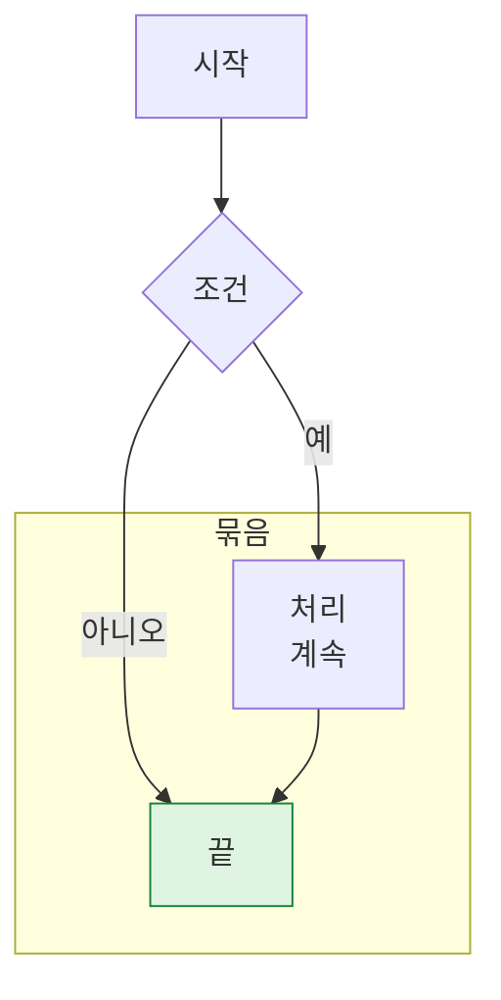
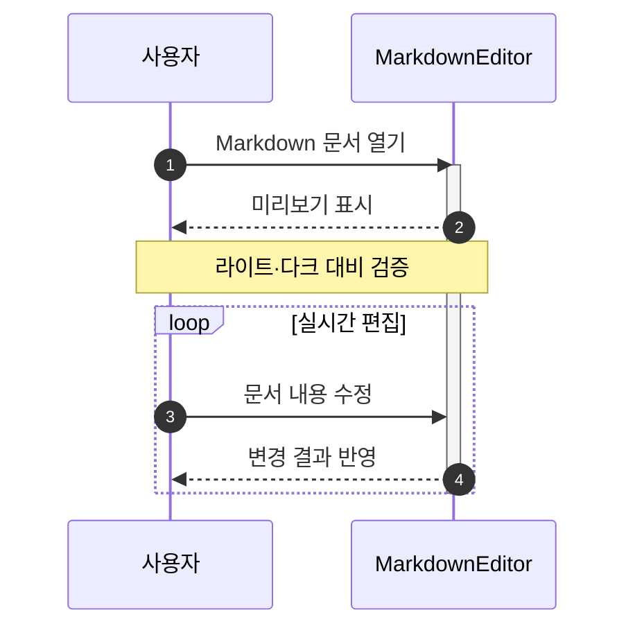
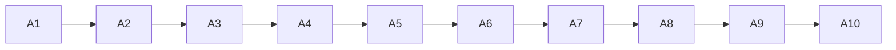

# Mermaid 검증

```mermaid
flowchart TD
    A[시작] --> B{조건}
    B -- 예 --> C[처리<br>계속]
    B -- 아니오 --> D[끝]
    subgraph 묶음
      C --> D
    end
    classDef done fill:#dff5e1,stroke:#16803a
    class D done
```

```mermaid
sequenceDiagram
    autonumber
    participant U as 사용자
    participant E as MarkdownEditor
    U->>E: Markdown 문서 열기
    activate E
    E-->>U: 미리보기 표시
    Note over U,E: 라이트·다크 대비 검증
    loop 실시간 편집
        U->>E: 문서 내용 수정
        E-->>U: 변경 결과 반영
    end
    deactivate E
```

```mermaid
flowchart LR
    A1 --> A2 --> A3 --> A4 --> A5 --> A6 --> A7 --> A8 --> A9 --> A10
```

```mermaid
flowchart TD
    A[잘못된 문법 --> B
```
